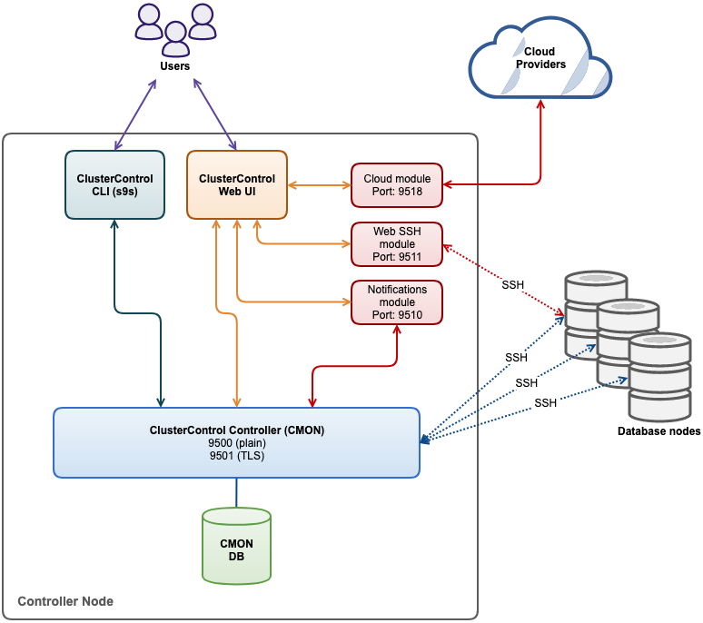
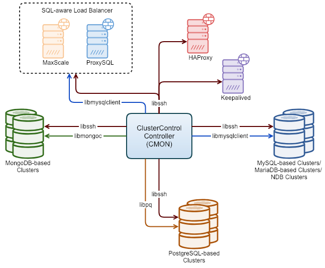
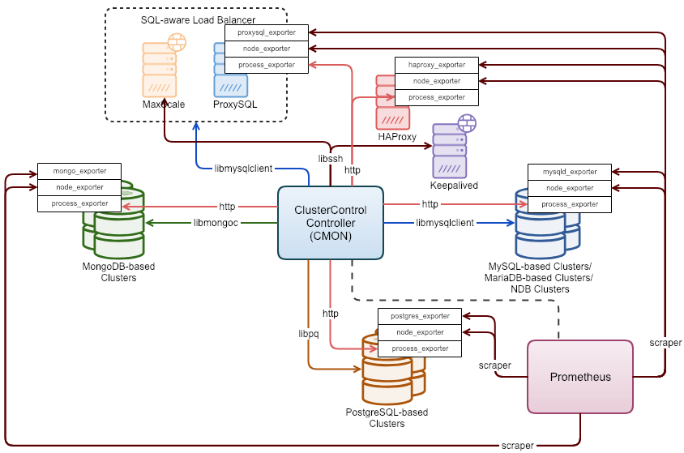

.. _Components:
.. include:: <isotech.txt>

Components
==========

ClusterControl consists of a number of components:

+------------------------------------+------------------------------+------------------------------------------------------------------------------------+
| Component                          | Package naming               | Role                                                                               |
+====================================+==============================+====================================================================================+
| ClusterControl Controller (cmon)   | clustercontrol-controller    | The brain of ClusterControl. A backend service performing automation, management,  |
|                                    |                              | monitoring and scheduling tasks. All the collected data will be stored directly    |
|                                    |                              | inside CMON database.                                                              |
+------------------------------------+------------------------------+------------------------------------------------------------------------------------+
| ClusterControl UI                  | clustercontrol               | A modern web user interface to visualize and manage the cluster. It interacts with | 
|                                    |                              | CMON controller via remote procedure call (RPC) or REST API interface.             |
+------------------------------------+------------------------------+------------------------------------------------------------------------------------+
| ClusterControl SSH                 | clustercontrol-ssh           | Optional package introduced in ClusterControl 1.4.2 for ClusterControl's           |
|                                    |                              | web SSH console. Only works with Apache 2.4+.                                      |
+------------------------------------+------------------------------+------------------------------------------------------------------------------------+
| ClusterControl Notifications       | clustercontrol-notifications | Optional package introduced in ClusterControl 1.4.2 providing a service and user   |
|                                    |                              | interface for notification services and integration with third party tools.        |
+------------------------------------+------------------------------+------------------------------------------------------------------------------------+
| ClusterControl Cloud               | clustercontrol-cloud         | Optional package introduced in ClusterControl 1.5 providing a service and user     |
|                                    |                              | interface for integration with cloud providers.                                    |
+------------------------------------+------------------------------+------------------------------------------------------------------------------------+
| ClusterControl Cloud File Manager  | clustercontrol-clud          | Optional package introduced in ClusterControl 1.5 providing a command-line         |
|                                    |                              | interface to interact with storage objects on cloud.                               |
+------------------------------------+------------------------------+------------------------------------------------------------------------------------+
| ClusterControl CLI                 | s9s-tools                    | Open-source command line tool to manage and monitor clusters provisioned by        |
|                                    |                              | ClusterControl.                                                                    |
+------------------------------------+------------------------------+------------------------------------------------------------------------------------+

ClusterControl controller exposes all functionality through remote procedure calls (RPC) on port 9500 (authenticated by a RPC token), port 9501 (RPC with TLS) and integrates with a number of modules like notifications (9510), cloud (9518) and web SSH (9511). The client components, ClusterControl UI or ClusterControl CLI interact with those interfaces to retrieve monitoring data (cluster load, host status, alarms, backup status etc.) or to send management commands (add/remove nodes, run backups, upgrade a cluster, etc.). 

The following diagram illustrates the architecture of ClusterControl:




.. _Components - ClusterControl Controller:

ClusterControl Controller (CMON)
--------------------------------

ClusterControl Controller (CMON) is the core backend process that performs all automation and management procedures. It is installed as ``/usr/sbin/cmon``. It comes with a collection of helper scripts in ``/usr/bin`` directory (prefixed with s9s\_) to complete specific tasks. However, some of the scripts have been deprecated due to the corresponding tasks are now being handled by the CMON core process.

ClusterControl Controller builds are available at :ref:`Installation - Severalnines Repository`. The packages are also available at `Severalnines download site <http://www.severalnines.com/downloads/cmon/>`_. RedHat-based systems should download and install the RPM package while Debian-based systems should download and install the DEB package. The package name is formatted as:

* RPM package (RedHat-based systems): ``clustercontrol-controller-[version]-[build number]-[architecture].rpm``
* DEB package (Debian-based systems): ``clustercontrol-controller-[version]-[build number]-[architecture].deb``

A configuration file ``/etc/cmon.cnf`` is required to initially run CMON Controller. It is possible to have several configuration files each for multiple clusters as described in the `Configuration File`_.

.. _Components - ClusterControl Controller - Command Line Arguments:

Command Line Arguments
+++++++++++++++++++++++

By default if you just run ``cmon`` (without any arguments), cmon defaults to run in the background. ClusterControl Controller (cmon) supports several command line options as shown below:

========================================= ===========
Shorthand, Option                         Description
========================================= ===========
``-h``, ``--help``                        Print the help.
``--help-config``                         Print the manual for configuration parameters. See `Configuration Options`_.
``--help-init``                           Shows the special options for ``--init``.
``-v``, ``--version``                     Prints out the version number and build info.
``--logfile=[filepath]``                  The path of the log file to be used.
``-s``, ``--syslog``                      Also log to syslog.
``-b``, ``--bind-addr='ip1,ip2..'``       Bind Remote Procedure Call (RPC) to IP addresses (default is 127.0.0.1,::1). By default cmon binds to '127.0.0.1' and '::1'. If another bind-address is needed, then it is possible to define the bind addresses in the file ``/etc/default/cmon``. See `Startup File`_.
``-c``, ``--cloud-service=URL``           A custom clustercontrol-cloud service URL.
``-d``, ``--nodaemon``                    Run in foreground. Ctrl + C to exit.
``-e``, ``--events-client=URL``           Additional RPC URL where backend sends events.
``-g``, ``--grant``                       Create grants.
``-i``, ``--init``                        Creates configuration file and database.
``--log-rpc``                             Log every RPC call (very verbose).
``--no-safety-checks``                    Do not check if other cmon is connected.
``-p``, ``--rpc-port=[integer]``          Listen on RPC port. Default is 9500.
``-r``, ``--directory=[directory]``       Running directory.
``-u``, ``--upgrade-schema``              Try to upgrade the CMON schema (Supported from CMON version 1.2.12 and later).
========================================= ===========

.. _Components - ClusterControl Controller - Startup File:

Startup File
++++++++++++

To customize the cmon startup process, you can define the `Command Line Arguments`_ in a custom file, instead of hacking up the init script directly. The CMON init script (or systemd) will append all configuration options defined inside ``/etc/default/cmon`` when starting up the cmon process and translates those options into command line arguments. For example:

.. code-block:: bash

	$ cat /etc/default/cmon
	RPC_PORT=9500
	RPC_BIND_ADDRESSES="10.10.10.13,192.168.33.1,127.0.0.1"
	EVENTS_CLIENT=http://127.0.0.1:9510
	CLOUD_SERVICE=http://127.0.0.1:9518

In the example above, cmon will bind into those IP addresses and listen to port 9500 once started. If you filter out the ``ps`` output from the server, you should get the following:

.. code-block:: bash

	/usr/sbin/cmon --rpc-port=9500 --bind-addr='10.10.10.13,192.168.33.1,127.0.0.1' --events-client='http://127.0.0.1:9510' --cloud-service='http://127.0.0.1:9518'

.. _Components - ClusterControl Controller - Configuration File:

Configuration File
+++++++++++++++++++

A single CMON Controller process is able to monitor one or more database clusters. Each of the cluster requires one exclusive configuration file residing in the ``/etc/cmon.d/`` directory. For instance, the default CMON configuration file is located at ``/etc/cmon.cnf``, and commonly used to store the default (minimal) configuration for CMON process to run. 

Example of the CMON main configuration file located at ``/etc/cmon.cnf``:

.. code-block:: bash

	mysql_port=3306
	mysql_hostname=127.0.0.1
	mysql_password=cm0nP4ss
	mysql_basedir=/usr
	hostname=10.0.0.196
	logfile=/var/log/cmon.log
	rpc_key=390faeffb8166277a4f25336a69efa50915635a7


For the first cluster (cluster_id=1), the configuration options should be stored inside ``/etc/cmon.d/cmon_1.cnf``. For the second cluster, it would be ``/etc/cmon.d/cmon_2.cnf`` with ``cluster_id=2`` respectively, and so on. The following shows example content of CMON cluster's configuration file located at ``/etc/cmon.d/cmon_4.cnf``:

.. code-block:: bash
	
	cluster_id=4
	cmon_user=cmon
	created_by_job=1
	db_stats_collection_interval=30
	enable_query_monitor=1
	galera_vendor=percona
	galera_version=3.x
	group_owner=1
	host_stats_collection_interval=60
	hostname=10.0.0.196
	logfile=/var/log/cmon_4.log
	mode=controller
	monitored_mountpoints=/var/lib/mysql/
	monitored_mysql_port=3306
	monitored_mysql_root_password='7XU@Wy4nqL9'
	mysql_bindir=/usr/bin/
	mysql_hostname=127.0.0.1
	mysql_password='cm0nP4ss'
	mysql_port=3306
	mysql_server_addresses=10.0.0.99:3306,10.0.0.253:3306,10.0.0.181:3306
	mysql_version=5.6
	name='Galera Cluster'
	os=redhat
	osuser=root
	owner=1
	pidfile=/var/run
	basedir=/usr
	repl_password='9hHRgQLSsZz3Vd4a'
	repl_user=rpl_user
	rpc_key=3V0RaV6dE8KSyClE
	ssh_identity=/root/.ssh/id_rsa
	ssh_port=22
	type=galera
	vendor=percona

An example of CMON configuration file hierarchy is as follows:

+----------------------------+------------------------+--------------+-----------------------------+
| Example cluster            | Configuration file     | Cluster      | Log file location           |
|                            |                        | identifier   |                             |
+============================+========================+==============+=============================+
| Default configuration      | /etc/cmon.cnf          | N/A          | logfile=/var/log/cmon.log   |
+----------------------------+------------------------+--------------+-----------------------------+
| Cluster #1 (Galera)        | /etc/cmon.d/cmon_1.cnf | cluster_id=1 | logfile=/var/log/cmon_1.log |
+----------------------------+------------------------+--------------+-----------------------------+
| Cluster #2 (MongoDB)       | /etc/cmon.d/cmon_2.cnf | cluster_id=2 | logfile=/var/log/cmon_2.log |
+----------------------------+------------------------+--------------+-----------------------------+
| Cluster #N (cluster type)  | /etc/cmon.d/cmon_N.cnf | cluster_id=N | logfile=/var/log/cmon_N.log |
+----------------------------+------------------------+--------------+-----------------------------+
 
.. Note:: It's highly recommended to separate CMON logging for each cluster to its own log file. In the above example, we can see that ``cluster_id`` and ``logfile`` are two important configuration options to distinguish the cluster.

The CMON Controller will import the configuration options defined in each configuration file into the CMON database during process starts up. Once loaded, CMON then use all the loaded information to manage clusters based on the ``cluster_id`` value.

.. _Components - ClusterControl Controller - Configuration Options:

Configuration Options
+++++++++++++++++++++++

Values that consists of special characters must be enclosed with single-quote. Any changes to the CMON configuration file requires a service restart before they are applied. The configuration options can be divided into the following categories:

1. `General Cluster`_
2. `CMON`_
3. `Operating System`_
4. `SSH`_
5. `ClusterControl Recovery`_
6. `Monitoring and Thresholds`_
7. `Query Monitor`_
8. `Backup`_
9. `MySQL/MariaDB Nodes`_
10. `MongoDB Nodes`_
11. `PostgreSQL/TimescaleDB Nodes`_

Following is the list of configuration options inside CMON configuration file. You can also see them by using ``--help-config`` parameter in the terminal:

.. code-block:: bash

	$ cmon --help-config

General Cluster
````````````````

========================================= ===========
Option                                    Description
========================================= ===========
``cluster_id=<integer>``                  Cluster identifier. This will be used by CMON to indicate which cluster to provision. It must be unique, two clusters can not share the same ID. Example: ``cluster_id=1``.
``name=<string>``                         Cluster name. The cluster name configured under *ClusterControl > DB cluster > Settings > CMON Settings > Cluster Name* precedes this. Example: ``name='Galera Cluster'``. Other alias: ``cluster_name``.
``type=<string>``                         Cluster type. Supported values are "galera", "mysql_single", "mysqlcluster", "mongodb", "postgresql_single", "replication", "group_replication". Example: ``type=galera``. Other alias: ``cluster_type``.
``created_by_job=<integer>``              The ID of the job created this cluster. This is usually automatically generated by ClusterControl. Example: ``created_by_job=13``.
``vendor=<string>``                       Database vendor name. ClusterControl needs to know this in order to distinguish the vendor's relevant naming convention especially for package name, daemon name, deployment steps, recovery procedures and lots more. Supported value at the moment is oracle, percona, codership, mariadb, 10gen. Example: ``vendor=percona``.
``use_internal_repos=<boolean integer>``  Setting which disabled the 3rd party repository to be set up. Default is 0 (false).
``cmon_use_mail=<boolean integer>``       Setting to use the 'mail' command for e-mailing. Default is 0 (false).
``enable_html_emails=<boolean integer>``  Enables sending of HTML e-mails. Default is 1 (true).
``cmon_mail_sender=<email>``              The sender email address when sending out emails.
``frontend_url=<url>``                    The ClusterControl URL to be embedded inside e-mail notifications. Example ``frontend_url='https://monitor.domain.com/clustercontrol'``
``acl=<string>``                          The Access Control List as a string controlling the access to the cluster object.
========================================= ===========

CMON
````

====================================== ===========
Option                                 Description
====================================== ===========
``hostname=<string>``                  Hostname or IP address of the controller host. Example: ``hostname=192.168.0.10``.
``controller_id=<integer>``            An arbitrary identifier string of this controller instance. Example: ``controller_id=1``. 
``mode=<string>``                      CMON role. Supported values are "controller", "dual", "hostonly". Example: ``mode=controller``.
``agentless=<boolean integer>``        CMON controller mode (deprecated). Agents are no longer supported. 0 for agent-based or 1 for agentless (default). Example: ``agentless=1``.
``logfile=<path>``                     CMON log file location. This is where CMON logs its activity. The file will be automatically generated if it doesn't exist. CMON will write to syslog by default. Example: ``logfile=/var/log/cmon.log``.
``pidfile=<path>``                     CMON process identifier file directory. Keep the default value is recommended. Example: ``pidfile=/var/run``.
``mysql_hostname=<string>``            The MySQL hostname or IP address where CMON database resides. Using IP address is recommended. Default is 127.0.0.1. Example: ``mysql_hostname=192.168.0.5``. Other aliases: ``cmon_mysql_hostname``, ``cmondb_hostname``, ``local_mysql_hostname``, ``cmon_local_mysql_hostname``.
``mysql_password=<string>``            The MySQL password for user cmon to connect to CMON database. Example: ``mysql_password='cM%^nP4ss'``. Other aliases: ``cmon_mysql_password``, ``cmondb_password``.
``mysql_port=<integer>``               The MySQL port used by CMON to connect to CMON database. Example: ``mysql_port=3306``. Other aliases: ``cmon_mysql_port``, ``cmondb_port``.
``mysql_basedir=<path>``               The MySQL base directory used by CMON to find MySQL client related binaries. Example: ``mysql_basedir=/usr``. Other alias: ``basedir``.
``mysql_bindir=<path>``                The MySQL binary directory used by CMON to find MySQL client related binaries. Example: ``mysql_bindir=/usr/bin``.
``config_file_path=<path>``            The config file path (read-only) for CMON instance.
``cmon_db=<string>``                   CMON database name. Default to "cmon". Example: ``cmon_db=cmon``. Other alias: ``cmondb_database``.
``cmon_user=<string>``                 The username for CMON database. Default to "cmon". Example: ``cmon_user=cmon``. Other alias: ``cmondb_user``.
``cmondb_ssl_key=<path>``              Path to SSL key, for SSL encryption between CMON process and the CMON database. Example: ``cmondb_ssl_key=/etc/ssl/mysql/client-key.pem``.
``cmondb_ssl_cert=<path>``             Path to SSL certificate, for SSL encryption between CMON process and the CMON database. Example: ``cmondb_ssl_cert=/etc/ssl/mysql/client-cert.pem``.
``cmondb_ssl_ca=<path>``               Path to SSL CA, for SSL encryption between CMON process and the CMON database. Example: ``cmondb_ssl_ca=/etc/ssl/mysql/ca-cert.pem``.
``cluster_ssl_key=<path>``             Path to SSL key, for SSL encryption between CMON process and managed MySQL Servers. Example: ``cluster_ssl_key=/etc/ssl/mysql/client-key.pem``.
``cluster_ssl_cert=<path>``            Path to SSL certificate, for SSL encryption between CMON process and managed MySQL Servers. Example: ``cluster_ssl_cert=/etc/ssl/mysql/client-cert.pem``.
``cluster_ssl_ca=<path>``              Path to SSL CA, for SSL encryption between CMON and managed MySQL Servers. Example: ``cluster_ssl_ca=/etc/ssl/mysql/ca-cert.pem``.
``cluster_certs_store=<path>``         Directory path to store SSL related files. This is required when you want to add new node in an encrypted Galera cluster. Example: ``cluster_certs_store=/etc/ssl/galera/cluster_1``.
``rpc_key=<string>``                   Unique secret token for authentication. To interact with individual cluster via CMON RPC interface (port 9500), one must use this key or else you would get 'HTTP/1.1 403 Access denied'. `ClusterControl UI`_ needs this key stored as RPC API Token to communicate with CMON RPC interface. Each cluster should be configured with different ``rpc_key`` value. This value is automatically generated when new cluster/server is created or added into ClusterControl. Example: ``rpc_key=VJZKhr5CvEGI32dP``. Other alias: ``rpc_api_key``.
``net_read_timeout=<integer>``         Network read timeout value in seconds (DB connections). Default is 10.
``net_write_timeout=<integer>``        Network write timeout value in seconds (DB connections). Default is 10.
``connect_timeout=<integer>``          Network connect timeout value in seconds (DB connections). Default is 10.
``owner=<integer>``                    The Cmon user ID of the owner.
``group_owner=<integer>``              The Cmon group ID of the group owner.
``cdt_path=<string>``                  The location in the Cmon Directory Tree.
``acl=<string>``                       The Access Control List as a string.
``stagingdir=<path>``                  Staging path for temporary files. Example: ``stagingdir=/home/ubuntu/s9s_tmp``. Other alias: ``staging_dir``.
``plugin_dir=<path>``                  Directory path for CMON plugins. Default to ``/var/cmon/plugins``. Other alias: ``plugin_path``.
====================================== ===========

Operating System
`````````````````

====================================== ===========
Option                                 Description
====================================== ===========
``os=<string>``                        Operating system runs across the cluster, including ClusterControl host. 'redhat' for RedHat-based distributions (CentOS/Red Hat Enterprise Linux/Oracle Linux) or 'debian' for Debian-based distributions (Debian/Ubuntu). Example: ``os=redhat``.
``osuser=<string>``                    Operating system user that will be used by CMON to perform automation tasks like cluster recovery, backups and upgrades. This user must be able to perform super-user activities. Using root is recommended. Example: ``os_user=root``. Other aliases: ``os_user``, ``ssh_user``.
``sudo=<command>``                     The command used to obtain superuser permissions. If sudo user requires password, specify the sudo command with sudo password here. The sudo command must be trimmed by redirecting stderr to somewhere else. Therefore, it is compulsory to have ``-S 2>/dev/null`` appended in the sudo command. Example: ``sudo="echo 'My5ud0' | sudo -S 2>/dev/null"``. Other alias: ``sudo_opts``.
``osuser_home=<path>``                 The home directory of the user used on nodes. Example: ``osuser_home=/home/ubuntu/``. Other aliases: ``os_user_home``, ``ssh_user_home``.
``software_packagedir=<path>``         This is the storage location of software packages, i.e, all necessary files to successfully install a node, if there is no yum/apt repository available, must be placed here. Applies mainly to MySQL Cluster or older Codership/Galera installations.
``local_repo_name=<string>``           The used local repository names for cluster deployment. Example: ``local_repo_name=epel``.
``init_name=<string>``                 The OS service name used for starting/stopping the database servers. Example: ``init_service_name=postgresql-9.6``.
``disable_numa=<boolean integer>``     Not to use NUMA support dependent features. Default is 1 (enabled).
====================================== ===========

SSH
````

====================================== ===========
Option                                 Description
====================================== ===========
``ssh_identify=<path>``                The SSH key or key pair file that will be used by CMON to connect managed nodes (including ClusterControl node) passwordlessly. If undefined, CMON will use the home directory of ``os_user`` and look for ``.ssh/id_rsa`` file.	Example: ``ssh_identity=/root/.ssh/id_rsa``. Other aliases: ``ssh_keypath``, ``identity_file``.
``ssh_port=<integer>``                 The SSH port used by CMON to connect to managed nodes. If undefined, default to 22.	Example: ``ssh_port=22``.
``ssh_acquire_tty=<boolean integer>``  Setting for libssh - should it acquire a remote tty. Default is 1 (true). Example: ``ssh_acquire_tty=1``.
``ssh_password=<string>``              The SSH password used for connection to nodes.
``ssh_timeout=<integer>``              Network timeout value in seconds for SSH connections. Default is 30. Example: ``ssh_timeout=30``. Other alias: ``libssh_timeout=<integer>``.
``libssh_loglevel=<integer>``          Setting for libssh logging verbosity to stdout. Accepted values are 0 (NONE), 1 (WARN), 2 (INFO), 3 (DEBUG), 4 (TRACE). Example: ``libssh_loglevel=2``.
``slow_ssh_warning=<integer>``         A warning alarm will be raised if it takes longer than the specified time to setup an SSH connection (secs). Default is 6 seconds. Example: ``slow_ssh_warning=6``.
``slow_ssh_critical=<integer>``        A critical alarm will be raised if it takes longer than the specified time to setup an SSH connection (secs). Default is 12 seconds. Example: ``slow_ssh_critical=12``.
====================================== ===========


ClusterControl Recovery
````````````````````````

=================================================== ===========
Option                                              Description
=================================================== ===========
``enable_cluster_autorecovery=<boolean integer>``   If undefined, CMON defaults to 0 (false) and will NOT perform automatic recovery if it detects cluster failure. Supported value is 1 (cluster recovery is enabled) or 0 (cluster recovery is disabled).
``enable_node_autorecovery=<boolean integer>``      If undefined, CMON default to 0 (false) and will NOT perform automatic recovery if it detects node failure. Supported value is 1 (node recovery is enabled) or 0 (node recovery is disabled).
``enable_autorecovery=<boolean integer>``           If undefined, CMON defaults to 0 (false) and will NOT perform automatic recovery if it detects node or cluster failure. Supported value is 0 (cluster and node recovery are disabled) or 1 (cluster and node recovery are enabled). This setting will internally set ``enable_node_autorecovery`` and ``enable_cluster_autorecovery`` to the specified value.
``node_recovery_lock_file=<path>``                  Specify a lock file and if present on a node, the node will not recover. The administrator is responsible to create/remove the file. Example: ``node_recovery_lock_file=/root/do_not_recover``.
``node_recovery_timeout=<integer>``                 Stop the recovery process after it reaches this timeout. Default is 28800 seconds (8 hours). Other alias: ``add_node_timeout``.
``send_clear_cluster_failure=<boolean integer>``    Send notification email if a cluster failure event is cleared (meaning the cluster is recovered). Default is true. Other alias: ``send_clear_alarm``.
=================================================== ===========

Monitoring and Thresholds
``````````````````````````

======================================================= ===========
Option                                                  Description
======================================================= ===========
``monitored_mountpoints=<paths>``                       The MySQL/MongoDB/PostgreSQL data directory used by database nodes for disk performance in comma separated list. Example: ``monitored_mountpoints=/var/lib/mysql,/mnt/data/mysql``. Other alias: ``monitored_mount_points``.
``monitored_nics=<string>``                             List of network interface name to be monitored for network performance in comma separated list. Example: ``monitored_nics=eth1,eth2``.
``db_stats_collection_interval=<integer>``              Database metrics sampling interval in seconds. The lowest value is 1. Default is 30 seconds. Example: ``db_stats_collection_interval=30``.
``host_stats_collection_interval=<integer>``            Host metrics sampling interval in seconds. The lowest value is 1. Default is 30 seconds. Example: ``host_stats_collection_interval=30``.
``lb_stats_collection_interval=<integer>``              Load balancer stats collection interval. Default is 15. Example: ``lb_stats_collection_interval=30``.
``db_schema_stats_collection_interval=<integer>``       How often database growth and table checks are performed in seconds. This translates to information_schema queries. Default is 10800 seconds (3 hours). 0 means disabled. Example: ``db_schema_stats_collection_interval=10800``.
``db_proc_stats_collection_interval=<integer>``         Setting for database process stats collection interval. Default is 3 seconds. Minimum allowed value is 1 second. Example: ``db_proc_stats_collection_interval=5``.
``db_log_collection_interval=<integer>``                Database log files collection interval. Default is 600. Example: ``db_log_collection_interval=600``.
``db_deadlock_check_interval=<integer>``                How often to check for deadlocks in seconds. Deadlock detection will affect CPU usage on database nodes. Default is 0, means disabled. Example: ``db_deadlock_check_interval=600``.
``db_schema_max_objects=<integer>``                     Maximum number of database objects that ClusterControl will pull from monitored database nodes. If the number of schema objects (tables, triggers, views) are greater than this then no schema analysis will be done. Example: ``db_schema_max_objects=500``.
``db_exporter_user=<string>``                           Database user for Prometheus exporter. Default is ``db_exporter_user=cmonexporter``.
``db_exporter_password=<string>``                       Password for ``db_exporter_user``. Example: ``db_exporter_password=myS3cret``.
``db_exporter_use_nonlocal_address=<boolean integer>``  Specifies if Prometheus exporter should connect to the non-local address of the DB services, instead of 127.0.0.1. Default is 0 (false). Example: ``db_exporter_use_nonlocal_address=1``.
``db_hourly_stats_collection_interval=<integer>``       Database statistic collections interval in seconds. Default is 5. Example: ``db_hourly_stats_collection_interval=5``.
``enable_mysql_timemachine=<boolean integer>``          This determine whether ClusterControl should enable MySQL time machine status and variable collections. The status time machine allows you to select status variable for a time range and compare the values at the start and end of that range from ClusterControl UI. Default is 0, meaning it is disabled. Example: ``enable_mysql_timemachine=1``.
``swap_warning=<integer>``                              Warning alarm threshold for swap usage. Default is 5. Also configurable at *ClusterControl > {cluster_id} > Settings > Thresholds*. Example: ``swap_warning=20``.
``swap_critical=<integer>``                             Critical alarm threshold for swap usage. Default is 20. Also configurable at *ClusterControl > {cluster_id} > Settings > Thresholds*. Example: ``swap_critical=40``.
``swap_inout_period=<integer>``                         The interval for swap I/O alarms in seconds. 0 means disabled. Default is 600 (10 minutes). Example: ``swap_inout_period=120``.
``swap_inout_warning=<integer>``                        The number of pages swapped I/O for warning in the specified ``swap_inout_period``. Default is 10240. To determine the page size for the host, use ``getconf PAGESIZE``. Example: ``swap_inout_warning=51200``.
``swap_inout_critical=<integer>``                       The number of pages swapped I/O for critical in the specified ``swap_inout_period``. Default is 102400. To determine the page size for the host, use ``getconf PAGESIZE``. Example: ``swap_inout_critical=102400``.
``save_history_days=<integer>``                         How many days controller shall keep data. Default is 7. 0 means disabled.
``mysqlmemory_warning=<integer>``                       Warning alarm threshold for MySQL memory. Default is 80.
``mysqlmemory_critical=<integer>``                      Critical alarm threshold for MySQL memory. Default is 90.
``ram_warning=<integer>``                               Warning alarm threshold for RAM usage. Default is 80.
``ram_critical=<integer>``                              Critical alarm threshold for RAM usage. Default is 90.
``diskspace_warning=<integer>``                         Warning alarm threshold for disk usage. Default is 80.
``diskspace_critical=<integer>``                        Critical alarm threshold for disk usage. Default is 90.
``cpu_warning=<integer>``                               Warning alarm threshold for CPU usage. Default is 80.
``cpu_critical=<integer>``                              Critical alarm threshold for CPU usage. Default is 90.
``cpu_steal_warning=<integer>``                         Warning alarm threshold for CPU steal. Default is 10.
``cpu_steal_critical=<integer>``                        Critical alarm threshold for CPU steal. Default is 20.
``cpu_iowait_warning=<integer>``                        Warning alarm threshold for CPU IO Wait. Default is 50.
``cpu_iowait_critical=<integer>``                       Critical alarm threshold for CPU IO Wait. Default is 60.
``monitor_cpu_temperature=<boolean integer>``           Whether to monitor CPU temperature. Default is 0 (false).
``redobuffer_warning=<integer>``                        Warning alarm threshold for redo buffer usage. Default is 80.
``redobuffer_critical=<integer>``                       Critical alarm threshold for redo buffer usage. Default is 90.
``indexmemory_warning=<integer>``                       Warning alarm threshold for index memory usage. Default is 80.
``indexmemory_critical=<integer>``                      Critical alarm threshold for index memory usage. Default is 90.
``datamemory_warning=<integer>``                        Warning alarm threshold for data memory usage. Default is 80.
``datamemory_critical=<integer>``                       Critical alarm threshold for data memory usage. Default is 90.
``tablespace_warning=<integer>``                        Warning alarm threshold for table space buffer memory usage. Default is 80.
``tablespace_critical=<integer>``                       Critical alarm threshold for table space buffer memory usage. Default is 90.
``redolog_warning=<integer>``                           Warning alarm threshold for redo log usage. Default is 80.
``redolog_critical=<integer>``                          Critical alarm threshold for redo log usage. Default is 90.
``enable_is_queries=<boolean integer>``                 Specifies whether queries to the *information_schema* will be executed or not. Queries to the information_schema may not be suitable when having many schema objects (100s of databases, 100s of tables in each database, triggers, users, events, sprocs). If disabled, the query that would be executed will be logged so it can be determined if the query is suitable in your environment. Default is 1 (enabled). Disable with 0.
``max_replication_lag=<integer>``                       Max allowed replication lag in seconds before sending an Alarm. Default is 10.
``enable_icmp_ping=<boolean integer>``                  Toggles if controller shall measure the ICMP ping times to the host. Default is 1 (true).
======================================================= ===========

Query Monitor
``````````````

======================================================================= ===========
Option                                                                  Description
======================================================================= ===========
``long_query_time=<float>``                                             Threshold value for slow query checking. Default 0.5. Example: ``long_query_time=0.0003``.
``log_queries_not_using_indexes=<boolean integer>``                     Set query monitor to detect queries not using indexes. Default is 0 (false).
``query_monitor_use_local_settings=<boolean integer>``                  Don't override the local settings of MySQL's ``long_query_time`` and ``log_queries_not_using_indexes``. Default is 0 (false).
``db_long_query_time_alarm=<integer>``                                  If a query takes longer than ``db_long_query_time_alarm`` to execute, an alarm will be raised containing detailed information about blocked and long running transactions. Default is 10 seconds. Example: ``db_long_query_time_alarm=5``.
``enable_query_monitor=<integer>``                                      Setting for query monitor interval in seconds. Default is 1 means enabled. -1 means disable. Other alias: ``query_monitor_enabled``.
``enable_query_monitor_auto_purge_ps=<boolean integer>``                If enabled the *Performance_Schema* table *events_statements_summary_by_digest* will be auto-purged (using ``TRUNCATE TABLE``) every hour. By default this is disabled ('false'). Enable by setting it to '1' (true). Other alias: ``query_monitor_auto_purge_ps``.
``query_monitor_long_running_query_ms=<integer>``                       Raises an alarm if a query executes for longer than this value in milliseconds. Default is 10000. Minimum value is 1000.
``query_monitor_alert_long_running_query=<boolean integer>``            Raises an alarm if a query executes for longer than ``query_monitor_long_running_query_ms``. Default is 0 (disabled). Enable with 1.
``query_monitor_kill_long_running_query=<boolean integer>``             Kill the query if the query executes for longer than query_monitor_long_running_query_ms. Default is 0 (Disabled). Enable with 1.
``query_monitor_long_running_query_matching_info=<regex>``              Match only queries with a 'Info' only matching this regex. No default value, means match any Info.
``query_monitor_long_running_query_matching_host=<regex>``              Match only queries with a 'Host' only matching this regex. No default value, means match any Host.
``query_monitor_long_running_query_matching_db=<regex>``                Match only queries with a 'Db' only matching this regex. No default value, means match any Database.
``query_monitor_long_running_query_matching_user=<regex>``              Match only queries with a 'User' only matching this regex. No default value, means match any User.
``query_monitor_long_running_query_matching_command=<regex>``           Match only queries with a 'Command' only matching this regex. Defaults to 'Query'.
======================================================================= ===========

Backup
``````

============================================ ===========
Option                                       Description
============================================ ===========
``netcat_port=<string>``                     List of netcat/socat ports and port ranges used to stream backups. The first value before a comma is the preferred port. The next value is a port range where ClusterControl should pick on. Defaults to '9999,9990-9998' which means port 9999 will be preferred if available, otherwise pick the next available port in the defined range. Example: ``netcat_port=9999,9990-9998``.
``backup_user=<string>``                     The database username for backups. Example ``backup_user=backupuser``.
``backup_user_password=<string>``            The database password for backup user. Example ``backup_user_password=MyS3cret``.
``backup_encryption_key=<string>``           The AES encryption key used for backups in base64. See :ref:`MySQL - Backup - Backup Encryption and Decryption` for details.
``backupdir=<path>``                         The default backup directory, to be pre-filled in ClusterControl UI. Example: ``backupdir=/storage/backup``.
``backup_subdir=<string>``                   Set the name of the backup subdirectory. For more details on the formatting, see `Backup Subdirectory Variables`_. Default is "BACKUP-%I". Example: ``backup_subdir=BACKUP-%I-%D``.
``backup_retention=<integer>``               How many days to keep the backups. Backups matching retention period are removed. Default is 31. Example: ``backup_retention=15``.
``backup_cloud_retention=<integer>``         How many days to keep the uploaded backups to cloud. Backups matching retention period are removed. Default is 180. Example=``backup_cloud_retention=90``.
``backup_n_safety_copies=<integer>``         How many completed full backups will be kept regardless of their retention status. Default is 1. Example: ``backup_n_safety_copies=3``.
``datadir_backup_path=<path>``               During restore/rebuild operations a backup (filesystem copy) of the existing data directory (datadur) maybe performed (user decides). Unless specified, the default data directory backup location is DATADIR_bak, e.g ``/var/lib/mysql_bak`` if the datadir is ``/var/lib/mysql``.
``disable_backup_email=<boolean integer>``   This setting controls if emails are sent or not if a backup finished or failed. This feature is disabled by default, meaning backup emails are sent. Other alias: ``disable_backup_emails``.
============================================ ===========

MySQL/MariaDB Nodes
````````````````````

======================================================================= ===========
Option                                                                  Description
======================================================================= ===========
``mysql_server_addresses=<string>``                                     Comma separated list of MySQL hostnames or IP addresses (with or without port is supported). For MySQL Cluster, this should be the list of MySQL API node IP addresses.	In case of Galera Cluster, you can add ``?slave`` or ``?bvs`` (backup verification server) to the URL so ClusterControl will register the node accordingly. Example: ``mysql_server_addresses=192.168.0.11:3306,192.168.0.12:3306,192.168.0.13:3306,192.168.0.14:3306?slave``.
``monitored_mysql_port=<integer>``                                      MySQL port for the managed cluster. ClusterControl assumes all DB nodes are listening on the same port. Default is 3306. Example: ``monitored_mysql_port=3306``. Other aliases: ``cmon_local_mysql_port``, ``local_mysql_port``.
``monitored_mysql_root_user=<string>``                                  MySQL root user for the managed cluster. ClusterControl assumes all DB nodes are using the same root user. The user must have same privileges as root (SUPER with GRANT OPTION). This is required when you want to scale your cluster by adding a new DB node or replication slave. Default is "root". Example: ``monitored_mysql_root_user=dbadmin``.
``monitored_mysql_root_password=<string>``                              MySQL root password for the managed cluster. ClusterControl assumes all DB nodes are using the same root password. This is required when you want to scale your cluster by adding a new DB node or replication slave. Example: ``monitored_mysql_root_password='r00tP$@^%sw0rd'``.
``skip_name_resolve=<boolean integer>``                                 Setting to disable name resolution. Default is 1 means ``skip_name_resolve`` is enabled.
``mysql_version=<string>``                                              The MySQL/MariaDB major version. Example: ``mysql_version=5.7``. Other alias: ``server_version``.
``galera_port=<integer>``                                               Exclusive for Galera Cluster. The Galera communication port to be used. Default is 4567.
``galera_version=<string>``                                             Exclusive for Galera Cluster. The Galera API major version number. Example: ``galera_version=3.x``.
``galera_vendor=<string>``                                              Exclusive for Galera Cluster. The database vendor name. Supported values are "percona", "codership" and "mariadb". Example: ``galera_vendor=mariadb``.
``repl_user=<string>``                                                  The MySQL replication user. Example: ``repl_user=repluser``.
``repl_password=<string>``                                              Password for ``repl_user``. Example: ``repl_password='ZG04Z2Jnk0MUWAZK'``.
``replication_failover_whitelist=<string>``                             Comma separated list of MySQL slaves which should be used as potential master candidates. If no server on the whitelist is available (up/connected) the failover will fail. If this variable is set, only those hosts will be considered. This parameter takes precedence over ``replication_failover_blacklist``. Example: ``replication_failover_whitelist=192.168.1.11,192.168.1.12``.
``replication_failover_blacklist=<string>``                             Comma separated list of MySQL slaves which will never be considered a master candidate. You can use it to list slaves that are used for backups or analytical queries. If the hardware varies between slaves, you may want to put here the slaves which use slower hardware. ``replication_failover_whitelist`` takes precedence over this parameter if it is set. Example: ``replication_failover_blacklist=192.168.1.101,192.168.1.102``.
``replication_skip_apply_missing_txs=<boolean integer>``                Default is 0. Skip the check process for additional missing transactions before promoting a slave to a master and just use the most advanced slave. Such process may result in a serious problem though - if an errant transaction is found, replication may be broken. Example: ``replication_skip_apply_missing_txs=1``.
``replication_stop_on_error=<boolean integer>``                         Default is 1. ClusterControl will perform the MySQL master switch only once and will be aborted immediately if the switchover fails, unless the controller is restarted or you specify this variable to 0. Example: ``replication_stop_on_error=0``.
``replication_failover_wait_to_apply_timeout=<integer>``                Candidate waits up to this many seconds to apply outstanding relay log (``retrieved_gtids``) before failing over. Default is -1, which means ClusterControl will wait indefinitely for it to apply all missing transactions from its relay logs. This is safe, but, if for some reason, the most up-to-date slave is lagging badly, failover may takes hours to complete. If set to 0, failover happens immediately, no matter if the master candidate is lagging or not. Default -1 seconds (wait forever). Value higher than 0 means ClusterControl will wait for the specified seconds before failover happens. Example: ``replication_failover_wait_to_apply_timeout=0``.
``replication_stop_on_error=<boolean integer>``                         Failover/switchover procedures will fail if errors are encountered that may cause data loss. Enabled by default. 0 means disable, default is 1 (true). Example: ``replication_stop_on_error=0``.
``replication_auto_rebuild_slave=<boolean integer>``                    If the SQL THREAD is stopped and error code is non-zero then the slave will be automatically rebuilt. 1 means enable, default is 0 (false). Example: ``replication_auto_rebuild_slave=1``.
``replication_onfail_failover_script=<path>``                           Path to the failover script on ClusterControl node. This script executes as soon as it has been discovered that a failover is needed. If the script returns non-zero it will force the failover to abort. If the script is defined but not found, the failover will be aborted. Four arguments are supplied to the script: arg1='all servers'  arg2='old master' arg3='candidate', arg4='slaves of old master' and passed like this: ``scriptname arg1 arg2 arg3 arg4``. The script must be accessible on the controller and executable. Example: ``replication_onfail_failover_script=/usr/local/bin/failover_script.sh``
``replication_pre_failover_script=<path>``                              Path to the failover script on ClusterControl node. This script executes before the failover happens, but after a candidate has been elected and it is possible to continue the failover process. If the script returns non-zero it will force the failover to abort. If the script is defined but not found, the failover will be aborted. The script must be accessible on the controller and executable. Example: ``replication_pre_failover_script=/usr/local/bin/pre_failover_script.sh``.
``replication_post_failover_script=<path>``                             Path to the failover script on ClusterControl node. This script executes after the failover happened. If the script returns non-zero a Warning will be written in the job log. The script must be accessible on the controller and executable. Example: ``replication_post_failover_script=/usr/local/bin/post_failover_script.sh``.
``replication_post_unsuccessful_failover_script=<path>``                Path to the script on ClusterControl node. This script is executed after the failover attempt failed. If the script returns non-zero a Warning will be written in the job log. The script must be accessible on the controller and executable. Example: ``replication_post_unsuccessful_failover_script=post_fail_failover_script.sh``.
``replication_failed_reslave_failover_script=<path>``                   Path to the script on ClusterControl node. This script is executed after that a new master has been promoted and if the reslaving of the slaves to the new master fails. If the script returns non-zero a Warning will be written in the job log. The script must be accessible on the controller and executable. Example: ``replication_failed_reslave_failover_script=/usr/local/bin/fail_reslave_failover_script.sh``.
``replication_pre_switchover_script=<path>``                            Path to the switchover script on ClusterControl node. This script executes before the switchover happens. If the script returns non-zero it will force the switchover to fail. If the script is defined but not found, the switchover will be aborted. The script must be accessible on the controller and executable. Example: ``replication_pre_switchover_script=/usr/local/bin/pre_switchover_failover_script.sh``.
``replication_post_switchover_script=<path>``                           Path to the switchover script on ClusterControl node. This script executes after the switchover happened. If the script returns non-zero a Warning will be written in the job log. The script must be accessible on the controller and executable. Example: ``replication_post_switchover_script=/usr/local/bin/post_switchover_failover_script.sh``.
``replication_check_external_bf_failover=<boolean integer>``            Before attempting a failover, perform extended checks by checking the slave status to detect if the master is truly down, and also check if ProxySQL (if installed) can still see the master. If the master is detected to be functioning, then no failover will be performed. Default is 0 (false) meaning the checks are disabled. 1 means enable. Example: ``replication_check_external_bf_failover=0``.
``replication_check_binlog_filtration_bf_failover=<boolean integer>``   Before attempting a failover, verify filtration (binlog_do/ignore_db) and replication_* are identically configured on the candidate and the slaves. Default is 0 (false) meaning the checks are disabled. 1 means enable. Example: ``replication_check_binlog_filtration_bf_failover=1``.
``replication_failover_events=<boolean integer>``                       Automatically failover events (SLAVESIDE_DISABLED) and enable the ``event_scheduler`` after a replication failover/switchover action. Default is disabled. Enabled by setting it to 1. Example: ``replication_failover_events=1``.
``auto_manage_readonly=<boolean integer>``                              Enable/Disable automatic management of the MySQL server ``read_only`` variable. Default is 1 (true), which means ClusterControl will set the ``read_only=ON`` if the MySQL replication role is slave. Default is 1 (enabled). Example: ``auto_manage_readonly=0``.
``schema_change_detection_address=<string>``                            This option must be defined to use "Operational Report for Schema Change". Creating a report of thousands of database objects (schemas, tables etc) will take some time (about 5-10 minutes) depending on the hardware. It's recommended to configure a specific host to run this job for example on a replication slave or an asynchronous slave connected to e.g a Galera or Group Replication Cluster. For NDB this option should be set to a MySQL server used for admin purposes. Example: ``schema_change_detection_address=192.168.111.53``.
``schema_change_detection_pause_time_ms=<integer>``                     Throttle the detection process by pausing every this value, in milliseconds. For example, if defined as 3000, ClusterControl will pause the operation for every 3 seconds. Example: ``schema_change_detection_pause_time_ms=3000``.
``schema_change_detection_databases=<string>``                          Comma separated string of database names and also supports wildcards. For example 'DB%', will evaluate all database starting with "DB". Example: ``schema_change_detection_databases=mydb%,shops_db,mymonitoring``.
``datanode_addresses=<string>``                                         Exclusive for MySQL Cluster. Comma separated list of data node hostnames or IP addresses. Example: ``datanode_addresses=192.168.0.41,192.168.0.42``.
``mgmnode_addresses=<string>``                                          Exclusive for MySQL Cluster. Comma separated list of management node hostnames or IP addresses. Example: ``mgmnode_addresses=192.168.0.51,192.168.0.52``.
``ndb_connectstring=<string>``                                          Exclusive for MySQL Cluster. NDB connection string for the cluster. Example: ``ndb_connectstring=192.168.0.51:1186,192.168.0.52:1186``.
``ndb_binary=<string>``                                                 Exclusive for MySQL Cluster. NDB binary for data node. Supported values are ndbd or ndbmtd. Example: ``ndb_binary=ndbmtd``.
``ndbd_datadir=<path>``                                                 Exclusive for MySQL Cluster. The datadir of the NDBD nodes. Example: ``ndbd_datadir=/var/lib/mysqlcluster``.
``mgmd_datadir=<path>``                                                 Exclusive for MySQL Cluster. The datadir of the NDB MGMD nodes. Example: ``mgmd_datadir=/var/lib/mysql``.
``db_configdir=<string>``                                               Exclusive for MySQL Cluster. Directory where configuration files (``my.cnf``/``config.ini``) of the cluster are stored. Example: ``db_configdir=/etc/mysql``.
======================================================================= ===========

MongoDB Nodes
``````````````

=================================================== ===========
Option                                              Description
=================================================== ===========
``mongodb_server_addresses=<string>``               Comma separated list of MongoDB shard or replica IP addresses with port. Example: ``mongodb_server_addresses=192.168.0.11:27017,192.168.0.12:27017,192.168.0.13:27017``.
``mongoarbiter_server_addresses=<string>``          Comma separated list of MongoDB arbiter IP addresses with port.	Example: `mongoarbiter_server_addresses=192.168.0.11:27019,192.168.0.12:27019,192.168.0.13:27019`.
``mongocfg_server_addresses=<string>``              Comma separated list of MongoDB config server IP addresses with port.	Example: ``mongocfg_server_addresses=192.168.0.11:27019,192.168.0.12:27019,192.168.0.13:27019``.
``mongos_server_addresses=<string>``                Comma separated list of MongoDB mongos IP addresses with port. Example: ``mongos_server_addresses=192.168.0.11:27017,192.168.0.12:27017,192.168.0.13:27017``.
``mongodb_basedir=<path>``                          Location MongoDB base directory to find mongodb client related binaries. Example: ``mongodb_basedir=/usr``.
``mongodb_user=<string>``                           MongoDB admin/root username. Example: ``mongodb_user=root``.
``mongodb_password=<string>``                       Password for ``mongodb_user``. Example: ``mongodb_password='kPo123^^#*'``.
``mongodb_authdb=<string>``                         The database containing user information to use for authentication. Default is admin. Example: ``mongodb_authdb=admin``.
``mongodb_cluster_key=<path>``                      The cluster's nodes authenticating to each other using this key. Example: ``mongodb_cluster_key=/etc/repl.key``.
=================================================== ===========

PostgreSQL/TimescaleDB Nodes
````````````````````````````

===================================================== ===========
Option                                                Description
===================================================== ===========
``postgresql_server_addresses=<string>``              Comma separated list of PostgreSQL instances with port. Example: ``postgresql_server_addresses=192.168.10.100:5432,192.168.10.101:5432``. Other alias: ``postgre_server_addresses``.
``postgresql_user=<string>``                          The PostgreSQL admin user name. Default is postgres. Example: ``postgresql_user=postgres``. Other alias: ``postgre_user``.
``postgresql_password=<string>``                      The PostgreSQL admin password. Example: ``postgresql_password='p4s$^#0rd123'``. Other alias: ``postgre_password``.
``wal_retention_hours=<boolean integer>``             Retention hours to erase old WAL archive logs for PITR. Default is 0, means WAL archive logs are kept forever. Other alias: ``pitr_retention_hours``.
``auto_manage_readonly=<boolean integer>``            Enable/Disable automatic management of the PostgreSQL server ``transaction_read_only`` variable. Default is 1 (true), which means ClusterControl will set the ``transaction_read_only=ON`` if the PostgreSQL replication role is slave. Default is 1 (enabled). Example: ``auto_manage_readonly=0``.
``replication_auto_rebuild_slave=<boolean integer>``  If the SQL THREAD is stopped and error code is non-zero then the slave will be automatically rebuilt. 1 means enable, default is 0 (false). Example: ``replication_auto_rebuild_slave=1``.
``repl_user=<string>``                                The PostgreSQL replication user. Example: ``repl_user=repluser``.
``repl_password=<string>``                            Password for ``repl_user``. Example: ``repl_password='ZG04Z2Jnk0MUWAZK'``.
``replication_failover_whitelist=<string>``           Comma separated list of PostgreSQL slaves which should be used as potential master candidates. If no server on the whitelist is available (up/connected) the failover will fail. If this variable is set, only those hosts will be considered. This parameter takes precedence over ``replication_failover_blacklist``. Example: ``replication_failover_whitelist=192.168.1.11,192.168.1.12``.
``replication_failover_blacklist=<string>``           Comma separated list of PostgreSQL slaves which will never be considered a master candidate. You can use it to list slaves that are used for backups or analytical queries. If the hardware varies between slaves, you may want to put here the slaves which use slower hardware. ``replication_failover_whitelist`` takes precedence over this parameter if it is set. Example: ``replication_failover_blacklist=192.168.1.101,192.168.1.102``.
===================================================== ===========

.. _Components - ClusterControl Controller - Management and Deployment Operations:

Management and Deployment Operations
++++++++++++++++++++++++++++++++++++

For management and deployment jobs, ClusterControl performs these jobs by pushing remote commands via SSH to the target node. Users only need to install the CMON controller package on the ClusterControl host, and make sure that passwordless SSH and the CMON database user GRANTs are properly set up on each of the managed hosts. This mechanism requires no agent which simplifies the setup of the whole infrastructure. Agent-based mode of operation is only supported for monitoring jobs, as described in the next section.

.. _Components - ClusterControl Controller - Monitoring Operations:

Monitoring Operations
++++++++++++++++++++++

Generally, ClusterControl performs its monitoring, alerting and trending duties by using the following 4 ways:

1) **SSH** - Host metrics collection using SSH library.
2) **Prometheus** - Host and database metrics collection using :term:`Prometheus` server and exporters.
3) **Database client** - Database metrics collection using the CMON database client library.
4) **Advisor** - Mini programs written using :ref:`ClusterControl DSL` and running within ClusterControl itself, for monitoring, tuning and alerting purposes.

Starting from version 1.7.0, ClusterControl supports two methods of monitoring operation:

1) Agentless monitoring (default).
2) Agent-based monitoring with :term:`Prometheus`.

Monitoring operation method is a non-global configuration and bounded per cluster. This allows you to have two different database clusters configured with two different monitoring methods simultaneously. For example, Cluster A uses SSH sampling while Cluster B uses Prometheus agent-based setup to gather host monitoring data. 

Regardless of the monitoring method chosen, database and load balancer (except HAProxy) metrics are still being sampled by CMON's database client library agentlessly and store inside `CMON Database`_ for reporting (alarms, notifications, operational reports) and accurate management decision for critical operations like failover and recovery. Having said that, with agent-based monitoring, ClusterControl does not use SSH to sample host metrics which can be very excessive in some environments.

.. Caution:: ClusterControl allows you to switch between agentless and agent-based monitoring per cluster. However, you will lose the monitoring data each time you are doing this.

.. _Components - ClusterControl Controller - Agentless Monitoring:

Agentless Monitoring
````````````````````

For host and load balancer stats collection, ClusterControl executes this task via SSH with super-user privilege. Therefore, passwordless SSH with super-user privilege is vital, to allow ClusterControl to run the necessary commands remotely with proper escalation. With this pull approach, there are a couple of advantages as compared to agent-based monitoring method:

* Agentless - There is no need for agent to be installed, configured and maintained.
* Unifying the management and monitoring configuration - SSH can be used to pull monitoring metrics or push management jobs on the target nodes.
* Simplify the deployment - The only requirement is proper passwordless SSH setup and that's it. SSH is also very secure and encrypted.
* Centralized setup - One ClusterControl server can manage multiple servers and clusters, provided it has sufficient resources.

However, there are also drawbacks with the agentless monitoring approach, a.k.a pull mechanism:

* The monitoring data is accurate only from ClusterControl perspective. For example, if there is a network glitch and ClusterControl loses communication to the monitored host, the sampling will be skipped until the next available cycle.
* For high granularity monitoring, there will be network overhead due to increase sampling rate where ClusterControl needs to establish more connections to every target hosts.
* ClusterControl will keep on attempting to re-establish connection to the target node, because it has no agent to do this on its behalf.
* Redundant data sampling if you have more than one ClusterControl server monitoring a cluster, since each ClusterControl server has to pull the monitoring data for itself.

The above points are the reasons we introduced agent-based monitoring, as described in the next section.

.. _Components - ClusterControl Controller - Agent-based Monitoring:

Agent-based Monitoring
``````````````````````

Starting from version 1.7.0, ClusterControl introduced an agent-based monitoring integration with :term:`Prometheus`. Other operations like management, scaling and deployment are still performed through agentless approach as described in the `Management and Deployment Operations`_. Agent-based monitoring can eliminate excessive SSH connections to the monitored hosts and offload the monitoring jobs to another dedicated monitoring system like Prometheus.

With agent-based configuration, you can use a set of new dashboards that use Prometheus as the data source and give access to its flexible query language and multi-dimensional data model with time series data identified by metric name and key/value pairs. Simply said, in this configuration, ClusterControl integrates with Prometheus to retrieve the collected monitoring data and visualize them in the ClusterControl UI, just like a GUI client for Prometheus. ClusterControl also connects to the exporter via HTTP GET and POST methods to determine the process state for process management purposes. For the list of Prometheus exporters, see `Monitoring Tools`_.

One Prometheus data source can be shared among multiple clusters within ClusterControl. You have the options to deploy a new Prometheus server or import an existing Prometheus server, under *ClusterControl > Dashboards > Enable Agent Based Monitoring*. 

.. Attention:: Importing external Prometheus host (which was not deployed by ClusterControl) is not supported at the moment due to possibility of incompatible data structures exposed by Prometheus exporters.

Monitoring Tools
````````````````

Agentless
''''''''''

For agentless monitoring mode, ClusterControl monitoring duty only requires OpenSSH server package on the monitored hosts. ClusterControl uses *libssh* client library to collect host metrics for the monitored hosts - CPU, memory, disk usage, network, disk IO, process, etc. OpenSSH client package is required on the ClusterControl host only for setting up passwordless SSH and debugging purposes. Other SSH implementations like Dropbear and TinySSH are not supported.

Agent-based
''''''''''''

For agent-based monitoring mode, ClusterControl requires a :term:`Prometheus` server on port 9090 to be running, and all monitored nodes to be configured with at least three exporters (depending on the node's role):

1) `Process exporter <https://github.com/ncabatoff/process-exporter>`_ (port 9011)
2) `Node/system metrics exporter <https://github.com/prometheus/node_exporter>`_ (port 9100)
3) Database or application exporters:
	* `MySQL exporter <https://github.com/prometheus/mysqld_exporter>`_ (port 9104)
	* `MongoDB exporter <https://github.com/percona/mongodb_exporter>`_ (port 9216)
	* `PostgreSQL/TimescaleDB exporter <https://github.com/wrouesnel/postgres_exporter>`_ (port 9187)
	* `ProxySQL exporter <https://github.com/percona/proxysql_exporter>`_ (port 42004)
	* `HAProxy exporter <https://github.com/prometheus/haproxy_exporter>`_ (port 9101)

On every monitored host, ClusterControl will configure and daemonize exporter process using a program called :term:`daemon`. Thus, ClusterControl host is recommended to have an Internet connection to install necessary packages and automate the Prometheus deployment. For offline installation, the packages must be pre-downloaded into ``/var/cache/cmon/packages`` on ClusterControl node. For the list of required packages and links, please refer to ``/usr/share/cmon/templates/packages.conf``. Apart from Prometheus scrape process, ClusterControl also connects to the process exporter via HTTP calls directly to determine the process state of the node. No sampling via SSH is involved in this process.

.. Note:: With agent-based monitoring, ClusterControl depends on a working Prometheus for accurate reporting on management and monitoring data. Therefore, Prometheus and exporter processes are managed by internal process manager thread. A non-working Prometheus will have a significant impact on CMON process.

Since ClusterControl 1.7.3 allows multi-instance per single host, it will automatically configure a different exporter port if there are more than one same processes to monitor to avoid port conflict by incrementing the port number for every instance. Supposed you have two ProxySQL instances deployed by ClusterControl, and you would like to monitor them both via Prometheus. ClusterControl will configure the first ProxySQL's exporter to be running on the default port, 42004 while the second ProxySQL's exporter port will be configured with port 42005, incremented by 1.

The collector flags are configured based on the node's role, as shown in the following table (some exporters do not use collector flags):

+--------------------+------------------------------------------------+
| Exporter           |  Collector Flags                               |
+====================+================================================+
| mysqld_exporter    | * collect.info_schema.processlist              |
|                    | * collect.info_schema.tables                   |
|                    | * collect.info_schema.innodb_metrics           |
|                    | * collect.global_status                        |
|                    | * collect.global_variables                     |
|                    | * collect.slave_status                         |
|                    | * collect.perf_schema.tablelocks               |
|                    | * collect.perf_schema.eventswaits              |
|                    | * collect.perf_schema.file_events              |
|                    | * collect.perf_schema.file_instances           |
|                    | * collect.binlog_size                          |
|                    | * collect.perf_schema.tableiowaits             |
|                    | * collect.perf_schema.indexiowaits             |
|                    | * collect.info_schema.tablestats               |
+--------------------+------------------------------------------------+
| node_exporter      | arp, bcache, bonding, conntrack, cpu,          |
|                    | diskstats, edac, entropy, filefd, filesystem,  |
|                    | hwmon, infiniband, ipvs, loadavg, mdadm,       |
|                    | meminfo, netdev, netstat, nfs, nfsd, sockstat, |
|                    | stat, textfile, time, timex, uname, vmstat,    |
|                    | wifi, xfs, zfs                                 |
+--------------------+------------------------------------------------+

Database Client Libraries
'''''''''''''''''''''''''

When gathering the database stats and metrics, regardless of the monitoring operation method, ClusterControl Controller (CMON) connects to the database server directly via database client libraries - *libmysqlclient* (MySQL/MariaDB and ProxySQL), *libpq* (PostgreSQL) and *libmongoc* (MongoDB). That is why it's crucial to setup proper privileges for ClusterControl server from database servers perspective. For MySQL-based clusters, ClusterControl requires database user "cmon" while for other databases, any username can be used for monitoring, as long as it is granted with super-user privileges. Most of the time, ClusterControl will setup the required privileges (or use the specified database user) automatically during the cluster import or cluster deployment stage.

Load Balancers
''''''''''''''

For load balancers, ClusterControl requires the following additional tools:

* Maxadmin on the MariaDB MaxScale server.
* netcat and/or socat on the HAProxy server to connect to HAProxy socket file.
* ProxySQL requires mysql client on the ProxySQL server.

Agentless vs Agent-based Architecture 
`````````````````````````````````````

The following diagram summarizes both host and database monitoring processes executed by ClusterControl using *libssh* and database client libraries (agentless approach):



The following diagram summarizes both host and database monitoring processes executed by ClusterControl using :term:`Prometheus` and database client libraries (agent-based approach):



Timeouts and Intervals
``````````````````````

ClusterControl Controller (CMON) is a multi-threaded process. For agentless monitoring, ClusterControl Controller sampling thread connects via SSH to each monitored host once and maintain persistent connection (hence, no timeout) until the host drops or disconnects it when sampling host stats. It may establish more connections depending on the jobs assigned to the host, since most of the management jobs run in their own thread. For example, cluster recovery runs on the recovery thread, Advisor execution runs on a cron-thread, as well as process monitoring which runs on process collector thread.

For agent-based monitoring, the *Scrape Interval* and *Data Retention* period are depending on the Prometheus settings.

ClusterControl monitoring thread performs the following sampling operations in the following interval:

======================================= ========
Metrics                                 Interval
======================================= ========
MySQL query/status/variables            Every second
Process collection (``/proc``)          Every 10 seconds
Server detection                        Every 10 seconds
Host (``/proc``, ``/sys``)              Every 30 seconds (configurable via ``host_stats_collection_interval``)
Database (PostgreSQL and MongoDB only)  Every 30 seconds (configurable via ``db_stats_collection_interval``)
Database schema                         Every 3 hours (configurable via ``db_schema_stats_collection_interval``)
Load balancer                           Every 15 seconds (configurable via ``lb_stats_collection_interval``)
======================================= ========

The Advisors (imperative scripts), which can be created, compiled, tested and scheduled directly from ClusterControl UI, under *Manage -> Developer Studio*, can make use of SSH and database client libraries for monitoring, data processing and alerting within ClusterControl domain with the following restrictions:

* 5 seconds of hard time limit for SSH execution,
* 10 seconds of default time limit for database connection, configurable via ``net_read_timeout``, ``net_write_timeout``, ``connect_timeout`` in CMON configuration file,
* 60 seconds of total script execution time limit before CMON ungracefully aborts it.

For short-interval monitoring data like MySQL queries and status, data are stored directly into CMON database. While for long-interval monitoring data like weekly/monthly/yearly data points are aggregated every 60 seconds and stored in memory for 10 minutes. These behaviours are not configurable due to the architecture design.


.. _Components - ClusterControl Controller - CMON Database:

CMON Database
++++++++++++++

The CMON database is the persistent store for all monitoring data collected from the managed nodes, as well as all ClusterControl meta data (e.g. what jobs there are in the queue, backup schedules, backup statuses, etc.). The CMON Controller requires a MySQL database running on ``mysql_hostname`` as defined in CMON configuration file. The database name and user is 'cmon' and is immutable. The CMON database dump files are shipped together with the CMON Controller package and can be found under ``/usr/share/cmon`` once it is installed. 

MySQL user 'cmon' needs to have proper access to CMON database by performing following grant:

Grant all privileges to 'cmon' at ``hostname`` value (as defined in CMON configuration file) on ClusterControl host: 

.. code-block:: mysql

	GRANT ALL PRIVILEGES ON *.* TO 'cmon'@'{hostname}' IDENTIFIED BY '{mysql_password}' WITH GRANT OPTION;

Grant all privileges for 'cmon' at 127.0.0.1 on ClusterControl host:

.. code-block:: mysql

	GRANT ALL PRIVILEGES ON *.* TO 'cmon'@'127.0.0.1' IDENTIFIED BY '{mysql_password}' WITH GRANT OPTION;

On every managed database server, grant all privileges to cmon at controller's ``hostname`` value (as defined in CMON configuration file) on each of the managed database host:

.. code-block:: mysql

	GRANT ALL PRIVILEGES ON *.* TO 'cmon'@'{hostname}' IDENTIFIED BY '{mysql_password}' WITH GRANT OPTION;

If one deploys a cluster using ClusterControl deployment wizard, the above GRANTs will be configured automatically.

.. _Components - ClusterControl UI:

ClusterControl UI
-----------------

ClusterControl UI provides a modern web user interface to visualize the cluster and perform tasks like backup scheduling, configuration changes, adding nodes, rolling upgrades, etc. It requires a MySQL database called 'dcps', to store cluster information, users, roles and settings. It interacts with CMON controller via remote procedure call (RPC) on port 9500 and 9501 for TLS (default).

ClusterControl UI page can be accessed through following URL: 

:samp:`https://{ClusterControl IP address or hostname}/clustercontrol`

The ClusterControl UI is running on Apache and located under ``/var/www/html/clustercontrol`` (RedHat/CentOS/Ubuntu >14.04) or ``/var/www/clustercontrol`` (Debian <8/Ubuntu <14.04). The web server must support rule-based rewrite engine and must be able to follow symlinks. 

Please refer to :ref:`UserGuide` for the functionalities available in the ClusterControl UI.

.. _Components - ClusterControl SSH:

ClusterControl SSH
-------------------

This optional package is introduced in ClusterControl v1.4.2. This module provides the ability to connect to SSH console to any of your cluster hosts directly via ClusterControl UI. This can be very useful if you need to quickly log into a database server and access the command line. The package installs a binary called ``cmon-ssh`` located under ``/usr/sbin`` directory and by default listens to port 9511 on the ClusterControl node. It interacts directly with the target host via SSH protocol using the credential (``os_user`` and ``ssh_identity``) configured when deploying or importing the cluster into ClusterControl.

The SSH module need to be enabled in order to use the feature. If the package is installed directly via package manager, the required steps are configured automatically. The steps are:

1) Enable the SSH module inside ``clustercontrol/bootstrap.php`` file:

.. code-block:: php

	define('SSH_ENABLED', true);

2) Set up the RewriteRule inside Apache configuration file (above the ``<Directory/>`` definitions):

.. code-block:: bash

	# ClusterControl SSH
	RewriteEngine On
	RewriteRule ^/clustercontrol/ssh/term$ /clustercontrol/ssh/term/ [R=301]
	RewriteRule ^/clustercontrol/ssh/term/ws/(.*)$ ws://127.0.0.1:9511/ws/$1 [P,L]
	RewriteRule ^/clustercontrol/ssh/term/(.*)$ http://127.0.0.1:9511/$1 [P]

3) Enable the following Apache modules:

.. code-block:: bash

	a2enmod proxy proxy_http proxy_wstunnel

Communication is based on HTTPS, so it is possible to access your servers from behind a firewall that restricts Internet access to only port 443. Access to WebSSH is configurable by the ClusterControl admin through the GUI.

.. Warning:: ClusterControl does not provide extra layers of authentication and authorization when accessing the cluster from web-based SSH terminal. User who has access to the cluster in the ClusterControl UI may capable of accessing the terminal as a privileged user. Use `Access Control <user-guide/index.html#access-control>`_ to limit them.


.. _Components - ClusterControl Notifications:

ClusterControl Notifications
----------------------------

This optional package is introduced in ClusterControl v1.4.2, deprecating the previous version of ClusterControl NodeJS package (which served the same purpose). Alarms and events can now easily be sent to incident management services like PagerDuty, VictorOps and OpsGenie. You can also run any command available in the `ClusterControl CLI`_ from your CCBot-enabled chat services like Slack and Telegram. Additionally, it provides a generic web hook if you want to integrate with other services to act on status changes in your clusters. The direct connections with these popular incident communication services allow you to customize how you are alerted from ClusterControl when something goes wrong with your database environments.

The package installs a binary called ``cmon-events`` located under ``/usr/sbin`` directory and by default listens to port 9510 on the ClusterControl node.

Additional resources on setting up integration with third-party tools are listed below:
	* Blogs:
		* `Introducing the ClusterControl Alerting Integrations <https://severalnines.com/blog/introducing-clustercontrol-alerting-integrations>`_
		* `Video: ClusterControl ChatOps Integrations - Product Demonstration <https://severalnines.com/blog/video-clustercontrol-chatops-integrations-product-demonstration>`_
	* Documentation:
		* `Integrations <user-guide/index.html#integrations>`_

.. _Components - ClusterControl Cloud:

ClusterControl Cloud
--------------------

This optional package is introduced in ClusterControl v1.5. The package name is ``clustercontrol-cloud`` and it provides an UI extension in ClusterControl under `Integrations <user-guide/index.html#integrations>`_. After adding the cloud provider credentials, you can do basic instance operations directly from ClusterControl UI like listing, starting, stopping and deleting the existing instances. See `Integrations <user-guide/index.html#integrations>`_ for details.

This package installs the following new files:
	* ``/etc/cron.d/cmon-cloud`` - Cron job to monitor ``cmon-cloud`` process.
	* ``/etc/rc.d/init.d/cmon-cloud`` - Sysvinit script.
	* ``/etc/systemd/system/cmon-cloud.service`` - Systemd unit file.
	* ``/usr/sbin/cmon-cloud`` - The executable binary file.

By default, this service will use port 9518 on localhost interface. Cloud credentials are stored under ``/var/lib/cmon/`` with permission set to root only.

.. Note:: ClusterControl Cloud is a reintroduction of a feature called 'Service Providers', available in ClusterControl 1.4 and older.

.. _Components - ClusterControl Cloud File Manager:

ClusterControl Cloud File Manager (CLUD)
-----------------------------------------

This optional package is a complementary of `ClusterControl Cloud`_ and is introduced in ClusterControl v1.5. The package name is ``clustercontrol-clud`` (abbreviation of CLoud Upload Download) and is the command line interface for ClusterControl to interact with the cloud providers when uploading and downloading backups. You can think of it as a cloud file manager. No extra configuration is required.

This package installs the following file:
	* ``/usr/sbin/clud`` - The executable binary file.

Usage
+++++

The general synopsis to execute commands using ``clud`` is:

.. code-block:: bash

	clud {global options} command {command option} {arguments...}
	
**Command**

================== ===========
Name, shorthand    Description
================== ===========
upload             Upload a file to the cloud.
download           Download a file from the cloud.
rm                 Delete a file on the cloud.
clouds             List supported cloud providers.
help, h            Shows a list of commands or help for one command.
================== ===========

**Global Options**

=============================================== ===========
Name, shorthand                                 Description
=============================================== ===========
|minus|\ |minus|\ cloud                         Use this cloud for the action.
|minus|\ |minus|\ service                       Use this service within the cloud.
|minus|\ |minus|\ credentials                   Raw credentials JSON.
|minus|\ |minus|\ credentials-file              Take credentials from this file instead of using STDIN input.
|minus|\ |minus|\ auto-create-bucket            Use this flag if the bucket should be auto-created if not exists.
|minus|\ |minus|\ help, -h                      Show help.
|minus|\ |minus|\ version                       Print the version.
=============================================== ===========

.. _Components - ClusterControl CLI:

ClusterControl CLI
------------------

Also known as **s9s-tools**, this optional package is introduced in ClusterControl version 1.4.1, which contains a binary called ``s9s``. It is a command line tool to interact, control and manage database clusters using the ClusterControl Database Platform. Starting from version 1.4.1, the installer script will automatically install this package on the ClusterControl node. You can also install it on another computer or workstation to manage the database cluster remotely. Communication between this client and CMON controller is encrypted and secure through TLS. This command line project is open source and publicly available at `GitHub <https://github.com/severalnines/s9s-tools>`_.

ClusterControl CLI opens a new door for cluster automation where you can easily integrate it with existing deployment automation tools like Ansible, Puppet, Chef or Salt. The following list shows the supported features at the moment:

* Deploy and manage database clusters:
	- MySQL
	- PostgreSQL
	- MongoDB (Replica Set)
* Basic monitoring features:
	- Status of nodes and clusters.
	- Cluster properties can be extracted.
	- Gives detailed enough information about your clusters.
* Management features:
	- Create clusters.
	- Add existing clusters.
	- Stop or start clusters.
	- Add or remove nodes.
	- Restart nodes in the cluster.
	- Create database users (CREATE USER, GRANT privileges to user).
	- Create load balancers (HAProxy and ProxySQL are supported)
	- Create and restore backups.
	- Maintenance mode.
	- Configuration changes of db nodes.

The command line tool is invoked by executing a binary called ``s9s``. The commands are basically JSON messages being sent over to the ClusterControl Controller (CMON) RPC interface. Communication between the s9s (the command line tool) and the cmon process (ClusterControl Controller) is encrypted using TLS and requires the port 9501 to be opened on controller and the client host.

.. _Components - ClusterControl CLI - Installation:

Installation
+++++++++++++

We have built an installer script for s9s-tools available at `http://repo.severalnines.com/s9s-tools/install-s9s-tools.sh <http://repo.severalnines.com/s9s-tools/install-s9s-tools.sh>`_. 

On ClusterControl host (or any client host):

.. code-block:: bash

	$ wget http://repo.severalnines.com/s9s-tools/install-s9s-tools.sh
	$ chmod 755 install-s9s-tools.sh
	$ ./install-s9s-tools.sh

If you would like to install it manually, please refer to the next section, `Package Manager (yum/apt)`_.

Package Manager (yum/apt)
``````````````````````````

The package list is available at `s9s-tools repository page <http://repo.severalnines.com/s9s-tools/>`_. 

.. _Components - ClusterControl CLI - Installation - YUM:

RHEL/CentOS
'''''''''''

The repository file for each distribution can be downloaded directly from:

* CentOS 6: http://repo.severalnines.com/s9s-tools/CentOS_6/s9s-tools.repo
* CentOS 7: http://repo.severalnines.com/s9s-tools/CentOS_7/s9s-tools.repo
* RHEL 6: http://repo.severalnines.com/s9s-tools/RHEL_6/s9s-tools.repo
* RHEL 7: http://repo.severalnines.com/s9s-tools/RHEL_7/s9s-tools.repo

Installation steps are straight-forward:

.. code-block:: bash
	
	# CentOS 7
	$ wget http://repo.severalnines.com/s9s-tools/CentOS_7/s9s-tools.repo -P /etc/yum.repos.d
	$ yum install s9s-tools
	$ s9s --help

.. _Components - ClusterControl CLI - Installation - APT:

Debian/Ubuntu DEB Repositories
'''''''''''''''''''''''''''''''

The repository file for each distribution can be downloaded directly from:

* Debian 7 (Wheezy): http://repo.severalnines.com/s9s-tools/wheezy/
* Debian 8 (Jessie): http://repo.severalnines.com/s9s-tools/jessie/
* Debian 9 (Stretch): http://repo.severalnines.com/s9s-tools/stretch/
* Ubuntu 14.04 (Trusty): http://repo.severalnines.com/s9s-tools/trusty/
* Ubuntu 16.04 (Xenial): http://repo.severalnines.com/s9s-tools/xenial/
* Ubuntu 16.10 (Yakkety): http://repo.severalnines.com/s9s-tools/yakkety/
* Ubuntu 17.04 (Zesty): http://repo.severalnines.com/s9s-tools/zesty/
* Ubuntu 18.04 (Bionic): http://repo.severalnines.com/s9s-tools/bionic/
* Ubuntu 18.10 (Cosmic): http://repo.severalnines.com/s9s-tools/cosmic/
* Ubuntu 19.04 (Disco): http://repo.severalnines.com/s9s-tools/disco/

To install, one would do:

.. code-block:: bash

	$ wget -qO - http://repo.severalnines.com/s9s-tools/$(lsb_release -sc)/Release.key | sudo apt-key add -
	$ echo "deb http://repo.severalnines.com/s9s-tools/$(lsb_release -sc)/ ./" | sudo tee /etc/apt/sources.list.d/s9s-tools.list
	$ sudo apt-get update
	$ sudo apt-get install s9s-tools
	$ s9s --help


Compile From Source
````````````````````

To build from source, you may require additional packages and tools to be installed:

1. Get the source code from Github:

.. code-block:: bash

	$ git clone https://github.com/severalnines/s9s-tools.git

2. Navigate to the source code directory:

.. code-block:: bash

	$ cd s9s-tools

3. You may need to install development packages such as C/C++ compiler, autotools, openssl-devel etc:

.. code-block:: bash

	# RHEL/CentOS
	$ yum groupinstall "Development Tools"
	$ yum install automake git openssl-devel
	
	# Ubuntu/Debian
	$ sudo apt-get install build-essential automake git libssl-dev byacc flex bison

4. Compile the source code:

.. code-block:: bash

	$ ./autogen.sh
	$ ./configure
	$ make
	$ make install
	$ s9s --help

It is possible to build the s9s command line client on Linux and Mac OS/X.

.. _Components - ClusterControl CLI - Configuration:

Configuration
++++++++++++++

The first thing that must be done is to create a user that is allowed to connect to and use the controller. Communication between the s9s command line client and the controller (the cmon process) is encrypted using TLS on port 9501. A public and private RSA key pair associated with a username is used to encrypt the communication. The s9s command line client is responsible to setup the user and the required private and public key.

The command line client can be located on the same server as the controller (localhost communication) or on a remote server. The configuration differs depending on the location - localhost or remote access, and both cases are covered below.

Localhost Access
``````````````````

SSH into the controller and then let us create a user called 'dba' that is allowed to access the controller. This will create the first user. 

.. Important:: All users have the rights to perform all operations on the managed clusters. There is no access control or roles implemented at the moment. However, the user must be an authenticated user to be able to access the controller.

.. code-block:: bash

	$ s9s user --create --generate-key --controller="https://localhost:9501" --group=admins dba
	Grant user 'dba' succeeded.

If this is the first time you use the s9s client, then a new directory has been created in ``$HOME/.s9s/`` storing the private/public key and a configuration file.

Let us see what has been created:

.. code-block:: bash

	$ ls $HOME/.s9s/
	dba.key  dba.pub  s9s.conf

Viewing the configuration file we will see:

.. code-block:: bash

	[global]
	cmon_user              = dba
	# controller_host_name = localhost
	# controller_port      = 9500
	# rpc_tls              = false

Now we need to set the ``controller_host_name`` and ``controller_port``, and the ``rpc_tls`` so the file looks:

.. code-block:: bash

	[global]
	cmon_user            = dba
	controller_host_name = localhost
	controller_port      = 9501
	rpc_tls              = true
	# controller = "https://localhost:9501"

In order to verify it is working you can list the available clusters:

.. code-block:: bash

	$ s9s cluster --list
	cluster_1 cluster_2 cluster_3

If the authentication fails you will see messages like:

.. code-block:: bash

	Authentication failed: User 'dba' is not found.

The above means that the user has not been created. Or if there is a problem connecting to cmon:

.. code-block:: bash

	Authentication failed: Connect to localhost:9501 failed: "{{ Failure message }}".

In this case, double check the ``~/.s9s/s9s.conf`` file and check that cmon is started with TLS:

.. code-block:: bash

	$ sudo grep -i tls /var/log/cmon.log
	2016-11-28 15:00:31 : (INFO) Server started at tls://127.0.0.1:9501

And also:

.. code-block:: bash

	$ sudo netstat -atp | grep 9501
	tcp        0      0 localhost:9501          *:*                     LISTEN      22096/cmon

To view the users, and list which is the currently used user (marked with an "A" - a short form of "Authenticated"):

.. code-block:: bash

	$ s9s user --list --long
	A ID UNAME      GNAME  EMAIL REALNAME
	-  1 system     admins -     System User
	-  2 nobody     nobody -     -
	A  3 dba        users  -     -
	-  4 remote_dba users  -     -

The 'nobody' user is a legacy user. No one should ever see a job issued by the user 'nobody'. The 'system' user is the ClusterControl server itself creating internal jobs (e.g internal cron jobs).

Remote Access
``````````````

The steps to setup the s9s command line client for remote access is similar as for localhost, except:

* The s9s command line client must exist on the remote server
* The controller (cmon) must be accepting TLS connections from the remote server.
* The remote server can connect to the controller with key-based authentication (no password). This is required only during the user creation private/public key setup.

1. Setup the bind address from cmon process as follow:

.. code-block:: bash

	$ vi /etc/init.d/cmon

Locate the line:

.. code-block:: bash

	RPC_BIND_ADDRESSES=""

And change to:

.. code-block:: bash

	RPC_BIND_ADDRESSES="127.0.0.1,10.0.1.12"

Here we assume the public IP address of the controller is 10.0.1.12. 

.. Attention:: Naturally, you should lock down this IP with firewall rules only allowing access from the remote servers you wish to access the controller from.

2. Restart the controller and check the log:

.. code-block:: bash

	$ service cmon restart # sysvinit
	$ systemctl restart cmon # systemd

3. Verify the ClusterControl Controller is listening to the configured IP address on port 9501:

.. code-block:: bash

	$ cat /var/log/cmon.log | grep -i tls
	2016-11-29 12:34:04 : (INFO) Server started at tls://127.0.0.1:9501
	2016-11-29 12:34:04 : (INFO) Server started at tls://10.0.1.12:9501

4. On the remote server/computer, we have to enable key-based authentication and create a user called 'remote_dba'. Create a system user called 'remote_dba':

.. code-block:: bash

	$ useradd -m remote_dba

5. As the current user (root or sudoer for example) in the remote server, setup a passwordless SSH to the ClusterControl host. Generate one SSH key if you don't have one:

.. code-block:: bash

	$ ssh-keygen -t rsa # press 'Enter' for all prompts

Copy the SSH public key to the ClusterControl Controller host, for example 10.0.1.12:

.. code-block:: bash

	$ ssh-copy-id root@10.0.1.12

6. Create the s9s client user:

.. code-block:: bash

	$ s9s user --generate-key --create --group=admins --controller="https://10.0.1.12:9501" remote_dba
	Warning: Permanently added '10.0.1.12' (ECDSA) to the list of known hosts.
	Connection to 10.0.1.12 closed.
	Grant user 'remote_dba' succeeded.

7. Ensure the config file located at ``~/.s9s/s9s.conf`` looks like this (take note the IP of the controller may be different):

.. code-block:: bash

	[global]
	cmon_user            = remote_dba
	controller_host_name = 10.0.1.12
	controller_port      = 9501
	rpc_tls              = true

8. Finally, test the connection:

.. code-block:: bash

	$ s9s cluster --list
	cluster_1 cluster_2 cluster_3

.. _Components - ClusterControl CLI - Usage:

Usage 
++++++

The command line client installs manual pages and can be viewed by entering the command:

.. code-block:: bash

	$ man s9s-{command group}

For example:

.. code-block:: bash

	$ man s9s
	$ man s9s-cluster
	$ man s9s-user
	$ man s9s-job
	$ man s9s-backup
	$ man s9s-node
	$ man s9s-maintenance
	$ man s9s-process
	$ man s9s-script
	$ man s9s-account
	$ man s9s-server
	$ man s9s-container
	$ man s9s-metatype

The general synopsis to execute commands using ``s9s`` is:

.. code-block:: bash

	s9s {command group} {options}

s9s cluster
````````````

Create, list and manipulate clusters.

**Usage**

.. code-block:: bash

	s9s cluster {command} {options}

**Command**

====================================== ===========
Name, shorthand                        Description
====================================== ===========
|minus|\ |minus|\ list, -L             List the clusters.
|minus|\ |minus|\ stat                 Print the details of one or more clusters.
|minus|\ |minus|\ create               Create a new cluster. When this command line option is provided the program will contact the controller and register a new job that will eventually create a new cluster.
|minus|\ |minus|\ ping                 Check the connection to the controller.
|minus|\ |minus|\ register             Registers an existing cluster in the controller. This option is very similar to the ``--create`` option, but it of course will not install a new cluster, it just registers one.
|minus|\ |minus|\ rolling-restart      Restart the nodes without stopping the cluster.
|minus|\ |minus|\ add-node             Adds a new node (server) to the cluster or to be more precise creates a new job that will eventually add a new node to the cluster. The name (or IP address) of the node should be specified using the ``--nodes`` command line option. See `Node List`_.
|minus|\ |minus|\ remove-node          Removes a node from the cluster (creates a new job that will remove the node from the cluster). The name (or IP address) of the node should be specified using  the  ``--nodes`` command line option. See `Node List`_.
|minus|\ |minus|\ drop                 Drop cluster from the controller.
|minus|\ |minus|\ stop                 Creates and registers and a new job that will stop the cluster when executed.
|minus|\ |minus|\ start                Creates a new job to start the cluster.
|minus|\ |minus|\ check-hosts          Check the hosts before installing a cluster.
|minus|\ |minus|\ create-account       Create a new account to be used on the cluster to access the database(s).
|minus|\ |minus|\ delete-account       Delete an existing account from the cluster.
|minus|\ |minus|\ create-database      Create a database on the cluster.
|minus|\ |minus|\ list-databases       List  the  databases  found on the cluster. Please note that if the cluster has a lot of databases, this option might not show some of them. Sampling a huge number of databases would generate high load and so the controller has an upper limit built into it.
|minus|\ |minus|\ create-report        When this command line option is provided a new job will be started that will create a report. After the job is executed the report will be  available  on  the controller. If the ``--output-dir`` command line option is provided the report will be created in the given directory on the controller host.
====================================== ===========

**Options**

=============================================== ===========
Name, shorthand                                 Description
=============================================== ===========
|minus|\ |minus|\ cluster-id=ID, -i             The ID of the cluster to manipulate.
|minus|\ |minus|\ cluster-name=NAME, -n         Sets the cluster name. If the operation creates a new cluster this will be the name of the new cluster.
|minus|\ |minus|\ image=NAME                    The name of the image from which the new container will be created. This option is not mandatory, when a new container is created the controller can choose an image if it is needed. To find out what images are supported by the registered container severs please issue the s9s server ``--list-images`` command.
|minus|\ |minus|\ cluster-format[=FORMATSTRING] The string that controls the format of the printed information about clusters. See `Cluster Format`_.
|minus|\ |minus|\ cloud=PROVIDER                This option can be used when new container(s) created. The name of the cloud provider where the new container will be created. This command line option can also be used to filter the list of the containers when used together with one of the ``--list`` or ``--stat`` options.
|minus|\ |minus|\ containers=LIST               A list of containers to be created and used by the created job. This command line option can be used to create container (virtual machines) and then install clusters on them or just add them to an existing cluster as nodes. Please check `s9s container`_ for details.
|minus|\ |minus|\ cluster-type=TYPE             The type of the cluster to install. Currently the following types are supported: galera, mysqlreplication, groupreplication (or group_replication), ndb (or ndbcluster), mongodb (MongoDB ReplicaSet only) and postgresql.
|minus|\ |minus|\ nodes=NODE_LIST               List of nodes to work with. See `Node List`_.
|minus|\ |minus|\ vendor=VENDOR                 The name of the software vendor to be installed.
|minus|\ |minus|\ provider-version=VER          The version string of the software to be installed.
|minus|\ |minus|\ os-user=USERNAME              The name of the remote user that is used to gain SSH access on the remote nodes. If this command line option is omitted the name of the local user will be used on the remote host too.
|minus|\ |minus|\ os-key-file=PATH              The path of the SSH key to install on a new container to allow the user to log in. This command line option can be passed when a new container is created, the argument of the option should be the path of the private key stored on the controller. Although the path of the private key file is passed only the public key will be uploaded to the new container.
|minus|\ |minus|\ os-password=PASSWORD          This command line option can be passed when creating new containers to set the password for the user that will be created on the container. Please note that some virtualization backend might not support passwords, only keys.
|minus|\ |minus|\ subnet-id=ID                  This option can be used when new containers are created to set the subnet ID for the container. To find out what subnets are supported by the registered container severs please issue the s9s server ``--list-subnets`` command.
|minus|\ |minus|\ use-internal-repos            Use internal repositories when installing software packages. Using this command line option it is possible to deploy clusters and add nodes off-line, without a working internet connection. The internal repositories has to be set up in advance.
|minus|\ |minus|\ volumes=LIST                  When a new container is created this command line option can be used to pass a list of volumes that will be created for the container. The list can contain one or more volumes separated by the ``;`` character. Every volume consists three properties separated by the ``:`` character, a volume name, the volume size in gigabytes and a volume type that is either "hdd" or "ssd".  The string ``vol1:5:hdd;vol2:10:hdd`` for example defines two hard-disk volumes, one 5GByte and one 10GByte. For convenience the volume name and the type can be omitted, so that automatically generated volume names are used.
|minus|\ |minus|\ vpc-id=ID                     This option can be used when new containers are created to set the VPC ID for the container. To find out what VPCs are supported by the registered container severs please issue the ``s9s server --list-subnets --long`` command.
|minus|\ |minus|\ db-admin=USERNAME             The user name of the database administrator (e.g. 'root').
|minus|\ |minus|\ db-admin-passwd=PASSWD        The password for the database admin.
|minus|\ |minus|\ account=NAME[:PASSWD][@HOST]  Account to be created on the cluster.
|minus|\ |minus|\ with-database                 Create a database for the user too.
|minus|\ |minus|\ db-name=NAME                  The name of the database.
|minus|\ |minus|\ opt-group=NAME                The option group for configuration.
|minus|\ |minus|\ opt-name=NAME                 The name of the configuration item.
|minus|\ |minus|\ opt-value=VALUE               The value for the configuration item.
|minus|\ |minus|\ output-dir=DIR                The directory where the files are created.
|minus|\ |minus|\ wait                          Wait until the job ends.
|minus|\ |minus|\ long, -l                      Print the detailed list.
|minus|\ |minus|\ donor=ADDRESS                 Currently this option is used when starting a cluster. It can be used to control which node will be started first and used for the others as donor.
=============================================== ===========

Node List
''''''''''

The list of nodes or hosts enumerated in a special string using a semicolon as field separator (e.g. ``192.168.1.1;192.168.1.2``). The strings in the node list are URLs that can have the following protocols:

=================== ======================
URI                 Description
=================== ======================
``mysql://``        The protocol to install and handle MySQL servers.
``ndbd://``         The protocol for MySQL Cluster (NDB) data node servers.
``ndb_mgmd://``     The protocol for MySQL Cluster (NDB) management node servers. The ``mgmd://`` notation is also accepted.
``haproxy://``      Used to create and manipulate HaProxy servers.
``proxysql://``     Use this to install and handle ProxySql servers.
``maxscale://``     The protocol to install and handle MaxScale servers.
``mongos://``       The protocol to install and handle mongo router servers.
``mongocfg://``     The protocol to install and handle mongo config servers.
``mongodb://``      The protocol to install and handle mongo data servers.
=================== ======================

Cluster Format
''''''''''''''

The string that controls the format of the printed information about clusters. When this command line option is used, the specified information will be  printed instead of the default columns. The format string uses the ``%`` character to mark variable fields and flag characters as they are specified in the standard printf() C library functions. The ``%`` specifiers are ended by field name letters to refer to various properties of the clusters.

The "%+12I" format string for example has the ``+12`` flag characters in it with the standard meaning: the field will be 12 character wide and the ``+``  or ``-``  sign  will always be printed with the number. The properties of the message are encoded by letters. The in the ``%-5I`` for example the letter ``I`` encodes the "cluster ID" field, so the numerical ID of the cluster will be substituted. Standard ``\`` notation is also available, ``\n`` for example encodes a new-line character.

The s9s-tools support the following fields:

============= ===========
Field         Description
============= ===========
a             The number of active alarms on the cluster.
C             The configuration file for the cluster.
c             The total number of CPU cores in the cluster. Please note that this number may be affected by hyper-threading. When a computer has 2 identical CPUs, with four cores each and uses 2x hyper-threading it will count as 2x4x2 = 16.
D             The domain name of the controller of the cluster. This is the string one would get if executed the "domain name" command on the controller host.
G             The name of the group owner of the cluster.
H             The host name of the controller of the cluster. This is the string one would get if executed the "hostname" command on the controller host.
h             The number of the hosts in the cluster including the controller itself.
I             The numerical ID of the cluster.
i             The total number of monitored disk devices (partitions) in the cluster.
k             The  total  number of disk bytes found on the monitored devices in the cluster. This is a double precision floating point number measured in Terabytes. With the ``f`` modifier (e.g. ``%6.2fk``) this will report the free disk space in TeraBytes.
L             The log file of the cluster.
M             A human readable short message that discribes the state of the cluster.
m             The size of memory of all the hosts in the cluster added together, measured in GBytes. This value is represented by a double precision floating pointer number, so formatting it with precision (e.g. ``%6.2m``) is possible. When used with the ``f`` modifier (e.g. ``%6.2fm``) this reports the free memory, the memory that available for allocation, used for cache or used for buffers.
N             The name of the cluster.
n             The total number of monitored network interfaces in the cluster.
O             The name of the owner of the cluster.
S             The state of the cluster.
T             The type of the cluster.
t             The total network traffic (both received and transmitted) measured in MBytes/seconds found in the cluster.
V             The vendor and the version of the main software (e.g. the MySQL server) on the node.
U             The number of physical CPUs on the host.
u             The CPU usage percent found on the cluster.
w             The total swap space found in the cluster measured in GigaBytes. With the ``f`` modifier (e.g. ``%6.2fk``) this reports the free swap space in GigaBytes.
%             The '%' character itself.
============= ===========

**Examples**

Create a three-node Percona XtraDB Cluster 5.7 cluster, with OS user vagrant:

.. code-block:: bash

	$ s9s cluster --create \
		--cluster-type=galera \
		--nodes="10.10.10.10;10.10.10.11;10.10.10.12" \
		--vendor=percona \
		--provider-version=5.7 \
		--db-admin-passwd='pa$$word' \
		--os-user=vagrant \
		--cluster-name='Percona XtraDB Cluster 5.7'

Create a three-node MongoDB Replica Set 3.2 by MongoDB Inc (formerly 10gen), and let the deployment job running in foreground:

.. code-block:: bash

	$ s9s cluster --create \
		--cluster-type=mongodb \
		--nodes="10.0.0.148;10.0.0.189;10.0.0.219" \
		--vendor=10gen \
		--provider-version='3.2' \
		--os-user=root \
		--db-admin='admin' \
		--db-admin-passwd='MyS3cr3tPass' \
		--cluster-name='MongoDB ReplicaSet 3.2' \
		--wait


An example for creating a MongoDB Sharded Cluster with 3 mongos, 3 mongo config and one shard consists of a three-node replicaset called 'replset2':

.. code-block:: bash

	$ s9s cluster --create \
		--cluster-type=mongodb \
		--vendor=10gen \
		--provider-version=3.2 \
		--db-admin=adminuser \
		--db-admin-passwd=adminpwd \
		--nodes="mongos://192.168.1.11;mongos://192.168.1.12;mongos://192.168.1.12;mongocfg://192.168.1.11;mongocfg://192.168.1.12;mongocfg://192.168.1.13;192.168.1.14?priority=5.0;192.168.1.15?arbiter_only=true;192.168.1.16?priority=2;192.168.1.17?rs=replset2;192.168.1.18?rs=replset2&arbiter_only=yes;192.168.1.19?rs=replset2&slave_delay=3&priority=0"


Import and existing Percona XtraDB Cluster 5.7 and let the deployment job running in foreground (provided passwordless SSH from ClusterControl node to all database nodes have been setup correctly):

.. code-block:: bash

	$ s9s cluster --register \
		--cluster-type=galera \
		--nodes="192.168.100.34;192.168.100.35;192.168.100.36" \
		--vendor=percona \
		--provider-version=5.7 \
		--db-admin="root" \
		--db-admin-passwd="root123" \
		--os-user=root \
		--cluster-name="My DB Cluster" \
		--wait


Create a MySQL 5.7 replication cluster by Oracle with multiple master and slaves (note the ``?`` sign to identify the node's role in the ``--nodes`` parameter):

.. code-block:: bash

	$ s9s cluster --create \
		--cluster-type=mysqlreplication \
		--nodes=192.168.1.117?master;192.168.1.113?slave;192.168.1.115?slave;192.168.1.116?master;192.168.1.118?slave;192.168.1.119?slave; \
		--vendor=oracle \
		--cluster-name=ft_replication_23986 \
		--provider-version=5.7 \
		--log

List all clusters with more details:

.. code-block:: bash

	$ s9s cluster --list --long

Delete a cluster with cluster ID 1:

.. code-block:: bash

	$ s9s cluster --delete --cluster-id=1
	
Add a new database node on Cluster ID 1:

.. code-block:: bash

	$ s9s cluster --add-node \
		--nodes=10.10.10.14 \
		--cluster-id=1 \
		--wait

Add a data node to an existing MongoDB Sharded Cluster with cluster ID 12 having replicaset name 'replset2':

.. code-block:: bash

	$ s9s cluster --add-node \
		--cluster-id=12 \
		--nodes=mongodb://192.168.1.20?rs=replset2

Create an HAProxy load balancer, 192.168.55.198 on cluster ID 1:

.. code-block:: bash

	$ s9s cluster --add-node \
		--cluster-id=1 \
		--nodes="haproxy://192.168.55.198" \
		--wait

Remove a database node from cluster ID 1 as a background job:

.. code-block:: bash

	$ s9s cluster --remove-node \
		--nodes=10.10.10.13 \
		--cluster-id=1

Check if the hosts are part of other cluster and accessible from ClusterControl:

.. code-block:: bash

	$ s9s cluster --check-hosts \
		--nodes="10.0.0.148;10.0.0.189;10.0.0.219"

Schedule a rolling restart of the cluster 20 minutes from now:

.. code-block:: bash

	$ s9s cluster --rolling-restart \
		--cluster-id=1 \
		--schedule="$(date -d 'now + 20 min')"

Create a database on the cluster with the given name:

.. code-block:: bash

	$ s9s cluster --create-database \
		--cluster-id=2 \
		--db-name=my_shopping_db

Create a database account on the cluster and also create a new database to be used by the new user. Grant all access on the new database for the new user:

.. code-block:: bash

	$ s9s cluster --create-account \
		--cluster-id=1 \
		--account=john:passwd@10.10.1.100 \
		--with-database

s9s node
``````````

View and handle nodes.

**Usage**

.. code-block:: bash

	s9s node {command} {options}

**Command**

====================================== ===================
Name, shorthand                        Description
====================================== ===================
|minus|\ |minus|\ list, -L             List nodes. Default to all clusters.
|minus|\ |minus|\ restart              Restart the node. This means the process that provides the main functionality on the node (e.g. the MySQL daemon on a Galera node) will be stopped then start again.
|minus|\ |minus|\ start                Start the node. This means the process that provides the main functionality on the node (e.g. the MySQL daemon on a Galera node) will be start.
|minus|\ |minus|\ stop                 Stop the node. This means the process that provides the main functionality on the node (e.g. the MySQL daemon on a Galera node) will be stopped.
|minus|\ |minus|\ stat                 Print detailed node information. It can be used in conjunction with ``--graph`` to produce statistical data. See `Graph Options`_.
|minus|\ |minus|\ set                  Sets various properties of the specified node/host.
|minus|\ |minus|\ set-config           Change configuration values for the given node.
|minus|\ |minus|\ list-config          List the configuration values for the given node.
|minus|\ |minus|\ pull-config          Copy the configuration file(s) from the node to the local computer. Use the ``--output-dir`` to control where the files will be created.
|minus|\ |minus|\ unregister           Unregister the node from ClusterControl.
====================================== ===================

**Options**

============================================== ===========
Name, shorthand                                Description
============================================== ===========
|minus|\ |minus|\ cluster-id=ID, -i            The ID of the cluster in which the node is.
|minus|\ |minus|\ cluster-name=NAME, -n        Name of the cluster to list.
|minus|\ |minus|\ nodes=NODE_LIST              The nodes to list or manipulate. See `Node List`_.
|minus|\ |minus|\ node-format=FORMAT           The format string used to print nodes.
|minus|\ |minus|\ opt-group=GROUP              The configuration option group.
|minus|\ |minus|\ opt-name=NAME                The name of the configuration option.
|minus|\ |minus|\ opt-value=VALUE              The value of the configuration option.
|minus|\ |minus|\ output-dir=DIR               The directory where the files are created.
|minus|\ |minus|\ graph=NAME                   The name of the graph to show. See `Graph Options`_.
|minus|\ |minus|\ begin=TIMESTAMP              The start of the graph interval.
|minus|\ |minus|\ end=TIMESTAMP                The end of the graph interval.
|minus|\ |minus|\ force                        Force to execute dangerous operations.
|minus|\ |minus|\ begin=TIMESTAMP              The start time of the graph (the X axis).
|minus|\ |minus|\ density                      If this option is provided will be a probability density function (or histogram) instead of a timeline. The X axis shows the measured values (e.g. MByte/s) while the Y axis hows how many percent of the measurements contain the value. If for example the CPU usage is between 0% and 1% at the 90% of the time the graph will show a 90% bump at the lower end.
|minus|\ |minus|\ end=TIMESTAMP                The end of the graph.
|minus|\ |minus|\ node-format[=FORMATSTRING]   The string that controls the format of the printed information about the nodes. See `Node Format`_.
|minus|\ |minus|\ properties=ASSIGNMENT        One or more assignments specifying property names and values. The assignment operator is the ``=`` character (e.g. ``--properties='alias="newname"'``), multiple assignments are separated by the semicolon ``;``.
|minus|\ |minus|\ output-dir=DIRECTORY         The directory where the output files will be created on the local computer.
============================================== ===========

Graph Options
'''''''''''''

When providing a valid graph name together with the ``--stat`` option a graph will be printed with statistical data. Currently the following graphs are available:

==================== ===========
Option               Description
==================== ===========
cpughz               The graph will show the CPU clock frequency measured in GHz.
cpuload              Shows the average CPU load of the host computer.
cpusys               Percent of time the CPU spent in kernel mode.
cpuidle              Percent of time the CPU is idle on the host.
cpuiowait            Percent of time the CPU is waiting for IO operations.
cputemp              The temperature of the CPU measured in degree Celsius. Please note that to measure the CPU temperature some kernel module might be needed (e.g. it might be necessary to run ``sudo modprobe coretemp``). On multiprocessor systems the graph might show only the first processor.
cpuuser              Percent of time the CPU is running user space programs.
diskfree             The amount of free disk space measured in GBytes.
diskreadspeed        Disk read speed measured in MBytes/sec.
diskreadwritespeed   Disk read and write speed measured in MBytes/sec.
diskwritespeed       Disk write speed measured in MBytes/sec.
diskutilization      The bandwidth utilization for the device in percent.
memfree              The amount of the free memory measure in GBytes.
memutil              The memory utilization of the host measured in percent.
neterrors            The number of receive and transmit errors on the network interface.
netreceivedspeed     Network read speed in MByte/sec.
netreceiveerrors     The number of packets received with error on the given network interface.
nettransmiterrors    The number of packets failed to transmit.
netsentspeed         Network write speed in MByte/sec.
netspeed             Network read and write speed in MByte/sec.
sqlcommands          Shows the number of SQL commands executed measured in 1/s.
sqlcommits           The number of commits measured in 1/s.
sqlconnections       Shows the number of SQL connections.
sqlopentables        The number of open tables in any given moment.
sqlqueries           The number of SQL queries in 1/s.
sqlreplicationlag    Replication lag on the SQL server.
sqlslowqueries       The number of slow queries in 1/s.
swapfree             The size of the free swap space measured in GBytes.
==================== ===========

Node Format
''''''''''''

The string that controls the format of the printed information about the nodes. When this command line option is used the specified information will be printed instead of the default columns. The format string uses the ``%`` character to mark variable fields and flag characters as they are specified in the standard printf() C library functions. The ``%`` specifiers are ended by field name letters to refer to various properties of the nodes.

The ``%+12i`` format string for example has the ``+12`` flag characters in it with the standard meaning the field will be 12 character-wide and the ``+`` or ``-`` sign will always be printed with the number. The properties of the node are encoded by letters. In the ``%16D`` for example, the letter ``D`` encodes the "data directory" field, so the full path of the data directory on the node will be substituted. Standard ``\`` notation is also available, ``\n`` for example encodes a new-line character.

The s9s-tools support the following fields:

============= ===========
Field         Description
============= ===========
A             The IP address of the node.
a             Maintenance mode flag. If the node is in maintenance mode a letter ``M``, otherwise ``-``.
C             The configuration file for the most important process on the node (e.g. the configuration file of the MySQL daemon on a Galera node).
c             The total number of CPU cores in the host. Please note that this number may be affected by hyper-threading. When a computer has 2 identical CPUs, with four cores each and uses 2x hyper-threading it will count as 2x4x2 = 16.
D             The data directory of the node. This is usually the data directory of the SQL server.
d             The PID file on the node.
g             The log file on the node.
I             The numerical ID of the node.
i             The total number of monitored disk devices (partitions) in the cluster.
k             The total number of disk bytes found on the monitored devices in the node. This is a double precision floating point number measured in Terabytes.
L             The replay location. This field currently only has valid value in PostgreSQL clusters.
l             The received location. This field currently only has valid value in PostgreSQL clusters.
M             A message, describing the node's status un human readable format.
m             The total memory size found in the host, measured in GBytes. This value is represented by a double precision floating pointer number, so formatting it  with precision (e.g. ``%6.2m``) is possible. When used with the ``f`` modifier (e.g. ``%6.2fm``) this reports the free memory, the memory that available for allocation, used for cache or used for buffers.
N             The name of the node. If the node has an alias that is used, otherwise the name of the node is used. If the node is registered using the IP address, the IP address is the name.
n             The total number of monitored network interfaces in the host.
P             The port on which the most important service is awaiting for requests.
p             The PID (process ID) on the node that presents the service (e.g. the PID of the MySQL daemon on a Galera node).
O             The user name of the owner of the cluster that holds the node.
o             The name and version of the operating system together with the codename.
R             The role of the node (e.g. "controller", "master", "slave" or "none").
r             The work read-only or read-write indicating if the server is in read only mode or not.
S             The status of the host (e.g. CmonHostUnknown, CmonHostOnline, CmonHostOffLine, CmonHostFailed, CmonHostRecovery, CmonHostShutDown).
s             The list of slaves of the given host in one string.
T             The type of the node, e.g. "controller", "galera", "postgres".
t             The total network traffic (both received and transmitted) measured in MBytes/seconds.
U             The number of physical CPUs on the host.
u             The CPU usage percent found on the host.
V             The version string of the most important software (e.g. the version of the PostgreSQL installed on a PostgreSQL node).
v             The ID of the container/VM in "CLOUD/ID" format. The ``-`` string if no container ID is set for the node.
w             The total swap space found in the host measured in GigaBytes. With the ``f`` modifier (e.g. ``%6.2fw``) this reports the free swap space in GigaBytes.
Z             The name of the CPU model. Should the host have multiple CPUs, this will return the model name of the first CPU.
%             The ``%`` character itself.
============= ===========

**Examples**

List all nodes:

.. code-block:: bash

	$ s9s node --list --long
	ST  VERSION                  CID CLUSTER        HOST       PORT COMMENT
	go- 10.1.22-MariaDB-1~xenial   1 MariaDB Galera 10.0.0.185 3306 Up and running
	co- 1.4.1.1856                 1 MariaDB Galera 10.0.0.205 9500 Up and running
	go- 10.1.22-MariaDB-1~xenial   1 MariaDB Galera 10.0.0.209 3306 Up and running
	go- 10.1.22-MariaDB-1~xenial   1 MariaDB Galera 10.0.0.82  3306 Up and running
	Total: 4
	
Print the configuration for a node:

.. code-block:: bash

	$ s9s node --list-config --nodes=10.0.0.3
	...
	mysqldump   max_allowed_packet                     512M
	mysqldump   user                                   backupuser
	mysqldump   password                               nWC6NSm7PnnF8zQ9
	xtrabackup  user                                   backupuser
	xtrabackup  password                               nWC6NSm7PnnF8zQ9
	MYSQLD_SAFE pid-file                               /var/lib/mysql/mysql.pid
	MYSQLD_SAFE basedir                                /usr/
	Total: 71


The following example shows how a node in a given cluster can be restarted. When this command executed a new job will be created to restart a node. The command line tool will stop and show the job messages until the job is finished:

.. code-block:: bash

	$ s9s node \
		--restart \
		--cluster-id=1 \
		--nodes=192.168.1.117 \
		--log

Change a configuration value for a PostgreSQL server:

.. code-block:: bash

	$ s9s node \
		--change-config \
		--nodes=192.168.1.115 \
		--opt-name=log_line_prefix \
		--opt-value='%m '

Push a configuration option inside my.cnf (max_connections=500) on node 10.0.0.3:

.. code-block:: bash

	$ s9s node --change-config \
		--nodes=10.0.0.3 \
		--opt-group=mysqld \
		--opt-name=max_connections \
		--opt-value=500

Listing the Galera hosts. This can be done by filtering the list of nodes by their properties:

.. code-block:: bash

	$ s9s node \
		--list \
		--long \
		--properties="class_name=CmonGaleraHost"

Create a set of graphs, one for each node shown in the terminal about the load on the hosts. If the terminal is wide enough the graphs will be shown side by side for a compact view:

.. code-block:: bash

	$ s9s node \
		--stat \
		--cluster-id=1 \
		--begin="08:00" \
		--end="14:00" \
		--graph=load


Density function can also be printed to show what were the typical values for the given statistical data. The following example shows what was the typical values for the user mode CPU usage percent:

.. code-block:: bash

	$ s9s node \
		--stat \
		--cluster-id=2 \
		--begin=00:00 \
		--end=16:00 \
		--density \
		--graph=cpuuser

The following example shows how a custom list can be created to show some information about the CPU(s) in some specific hosts:

.. code-block:: bash

	$ s9s node \
	--list \
	--node-format="%N %U CPU %c Cores %6.2u%% %Z\n" 192.168.1.191 192.168.1.195
	192.168.1.191 2 CPU 16 Cores  22.54% Intel(R) Xeon(R) CPU L5520 @ 2.27GHz
	192.168.1.195 2 CPU 16 Cores  23.12% Intel(R) Xeon(R) CPU L5520 @ 2.27GHz

The following list shows some information about the memory, the total memory and the memory available for the applications to allocate (including cache and buffer with the free memory):

.. code-block:: bash

	$ s9s node \
		--list \
		--node-format="%4.2m GBytes %4.2fm GBytes %N\n"
		16.00 GBytes 15.53 GBytes 192.168.1.191
		47.16 GBytes 38.83 GBytes 192.168.1.127


s9s backup
````````````

View and create database backups. Three backup methods are supported:
	* mysqldump
	* xtrabackup (full)
	* xtrabackup (incremental)
	* mariabackup (full)
	* mariabackup (incremental)
	* mongodump
	* pg_dump

The s9s client also needs to know:
	* The cluster ID (or cluster name) of the cluster to backup.
	* The node to backup.
	* The databases that should be included (default all databases).
	
By default, the backups will be stored on the controller node. If you wish to store the backup on the data node, you can set the flag ``--on-node``.
	
.. Note:: If you are using Percona Xtrabackup, an incremental backup requires that there is already a full backup made of the same databases (all or individually specified). Otherwise, the incremental backup will be upgraded to a full backup.

**Usage**

.. code-block:: bash

	s9s backup {command} {options}

**Command**

====================================== ===========
Name, shorthand                        Description
====================================== ===========
|minus|\ |minus|\ list                 List the backups.
|minus|\ |minus|\ create               Create a new backup.
|minus|\ |minus|\ restore              Restore an existing backup.
|minus|\ |minus|\ delete               Delete an existing backup.
|minus|\ |minus|\ list-databases       List the backups in database view format. This format is designed to show the archived databases in the backups.
|minus|\ |minus|\ list-files           List the backups in file view format. This format is designed to show the archive files of the backups.
|minus|\ |minus|\ verify               Creates a job to verify a backup. When this main option is used the ``--backup-id``  option  has  to  be  used to identify a backup and the ``--test-server`` is also necessary to provide a server where the backup will be tested.
====================================== ===========

**Options**

============================================= ===========
Name, shorthand                               Description
============================================= ===========
|minus|\ |minus|\ cluster-id=ID               The ID of the cluster.
|minus|\ |minus|\ backup-id=ID                The ID of the backup.
|minus|\ |minus|\ title=STRING                A short human readable string that helps the user to identify the backup later.
|minus|\ |minus|\ backup-format               The format string used while printing backups.
|minus|\ |minus|\ nodes=NODELIST              The list of nodes involved in the backup. See `Node List`_.
|minus|\ |minus|\ databases=LIST              A comma separated list of database names. This argument controls which databases are going to be archived into the backup file. By default all the databases are going to be archived.
|minus|\ |minus|\ backup-method=METHOD        Controls what backup software is going to be used to create the backup. The controller currently supports the following methods: ndb, mysqldump, xtrabackupfull, xtrabackupincr, mariabackupfull, mariabackupincr, mongodump, pg_dump, pg_basebackup, mysqlpump.
|minus|\ |minus|\ backup-directory=DIR        The directory where the backup is placed.
|minus|\ |minus|\ subdirectory=MARKUPSTRING   Sets  the  name of the subdirectory that holds the newly created backup files.  The command line option argument is considered to be a subpath that may contain the field specifiers using the usual "%X" format. See `Backup Subdirectory Variables`_.
|minus|\ |minus|\ backup-user=USERNAME        The username for the SQL account that will create the backup.
|minus|\ |minus|\ backup-password=PASSWORD    The password for the SQL account that will create the backup. This command line option is not mandatory.
--backup-retention=DAYS                       Controls a custom retention period for the backup, otherwise the default global setting will be used. Specifying a positive number value here can control how long (in days) the taken backups will be preserved, -1 has a special meaning, it means the backup will be kept forever, while value 0 is the default, means prefer the global setting (configurable on UI).
|minus|\ |minus|\ recurrence=STRING           Schedule time and frequency in cron format.
|minus|\ |minus|\ parallelism=N               Controls how many threads are used while creating backup. Please note that not all the backup methods support multi-thread operations.
|minus|\ |minus|\ no-compression              Do not compress the archive file.
|minus|\ |minus|\ use-pigz                    Use the pigz program to compress archive.
|minus|\ |minus|\ on-node                     Do not copy the created archive file to the controller, store it on the node where it was created.
|minus|\ |minus|\ on-controller               Stream and store the created backup files on the controller.
|minus|\ |minus|\ full-path                   Print the full path of the files.
|minus|\ |minus|\ encrypt-backup              When this option is specified ClusterControl will attempt to encrypt the backup files using AES-256 encryption (the key will be auto-generated if not exists yet and stored in cluster configuration file).
|minus|\ |minus|\ test-server=HOSTNAME        Use the given server to verify the backup. If this option is provided while creating a new backup after the backup is created a new job is going to be created to verify the backup. During the verification the SQL software will be installed on the test server and the backup will be restored on this server. The verification job will be successful if the backup is successfully restored.
|minus|\ |minus|\ to-individual-files         Archive every database into individual files. Currently only the mysqldump backup method supports this option.
============================================= ===========

Backup Subdirectory Variables
'''''''''''''''''''''''''''''

========= ===================
Variable  Description
========= ===================
B         The date and time when the backup creation was beginning.
H         The name of the backup host, the host that created the backup.
i         The numerical ID of the cluster.
I         The numerical ID of the backup.
J         The numerical ID of the job that created the backup.
M         The backup method (e.g. "mysqldump").
O         The name of the user who initiated the backup job.
S         The name of the storage host, the host that stores the backup files.
%         The percent sign itself. Use two percent signs, ``%%`` the same way the standard ``printf()`` function interprets it as one percent sign.
========= ===================

**Examples**

Assume we have a data node on 10.10.10.20 (port 3306) on cluster id 2, and we want to backup all databases:

.. code-block:: bash

	$ s9s backup --create \
		--backup-method=mysqldump \
		--cluster-id=2 \
		--nodes=10.10.10.20:3306 \
		--backup-directory=/storage/backups

Create a mongodump backup on 10.0.0.148 for cluster named 'MongoDB ReplicaSet 3.2':

.. code-block:: bash

	$ s9s backup --create \
		--backup-method=mongodump \
		--cluster-name='MongoDB ReplicaSet 3.2' \
		--nodes=10.0.0.148 \
		--backup-directory=/storage/backups

Schedule a full backup using MariaDB backup every midnight at 12:00 AM:

.. code-block:: bash

	$ s9s backup --create \
		--backup-method=mariabackupfull \
		--nodes=10.10.10.19:3306 \
		--cluster-name=MDB101 \
		--backup-dir=/home/vagrant/backups \
		--recurrence='0 0 * * *'

Schedule an incremental backup using MariaDB backup everyday at 12:30 AM:

.. code-block:: bash

	$ s9s backup --create \
		--backup-method=mariabackupincr \
		--nodes=10.10.10.19:3306 \
		--cluster-name=MDB101 \
		--backup-dir=/home/vagrant/backups  \
		--recurrence='30 0 * * *'

List all backups for cluster ID 2:

.. code-block:: bash

	$ s9s backup --list \
		--cluster-id=2 \
		--long \
		--human-readable

.. Note:: Omit the ``--cluster-id=2`` to see the backup records for all clusters.

Restore backup ID 3 on cluster ID 2:

.. code-block:: bash
	
	$ s9s backup --restore \
		--cluster-id=2 \
		--backup-id=3 \
		--wait

.. Note:: If the backup is encrypted, it will be decrypted automatically when restoring.

Create a job to verify the given backup identified by the backup ID. The job will attempt to install MySQL on the test server using the same  settings as for the given cluster, then restore the backup on this test server. The job returns OK only if the backup is successfully restored on the test server:

.. code-block:: bash

	$ s9s backup --verify \
		--log \
		--backup-id=1 \
		--test-server=192.168.0.55 \
		--cluster-id=1

s9s job
````````

View jobs.

**Usage**

.. code-block:: bash

	s9s job {command} {options}

**Command**

====================================== ===================
Name, shorthand                        Description
====================================== ===================
|minus|\ |minus|\ list                 List the jobs. See `Job List`_.
|minus|\ |minus|\ log                  Inspect the job messages.
|minus|\ |minus|\ wait                 Attach to a job and see the progress and status.
|minus|\ |minus|\ success              Create a job that does nothing and succeeds.
|minus|\ |minus|\ fail                 Create a job that does nothing and fails.
|minus|\ |minus|\ delete               Delete the job referenced by the job ID.
====================================== ===================

**Options**

============================================= ===========
Name, shorthand                               Description
============================================= ===========
|minus|\ |minus|\ job-id=ID                   The ID of the job.
|minus|\ |minus|\ cluster-id=ID               The ID of the cluster.
|minus|\ |minus|\ cluster-name=NAME           Name of the cluster.
|minus|\ |minus|\ date-format=FORMAT          The format of the dates printed.
|minus|\ |minus|\ from=DATE&TIME              The start of the interval to be printed.
|minus|\ |minus|\ until=DATE&TIME             The end of the interval to be printed.
|minus|\ |minus|\ schedule=DATE&TIME          Run the job at the specified time.
|minus|\ |minus|\ offset=NUMBER               Controls the index of the first item printed.
|minus|\ |minus|\ limit=NUMBER                Controls how many jobs are printed max.
|minus|\ |minus|\ timeout=SECONDS             Sets the timeout for the created job. If the execution of the job is not done before the timeout counted from the start time of the job expires the job will fail. Some jobs might not support the timeout feature, the controller might ignore this value.
|minus|\ |minus|\ log-format[=FORMATSTRING]   The string that controls the format of the printed log and job messages. The format string uses the '%' character to  mark variable fields, flag characters as they are specified in the standard ``printf()`` C library functions and its own field name letters to refer to the various properties of the messages. See `Log Format Variables`_.
============================================= ===========

Job List
''''''''

Using the ``--list`` command line option a detailed list of jobs can be printed (the ``--long`` option results in even more details). Here is an example of such a list:

.. code-block:: bash

	 $ s9s job --list
	 ID CID STATE    OWNER  GROUP  CREATED             RDY  TITLE
	 1   0 FINISHED pipas  users  2017-04-25 14:12:31 100% Create MySQL Cluster
	 2   1 FINISHED system admins 03:00:15            100% Removing Old Backups
	 Total: 2

The list contains the following fields:

========= ===================
Field     Description
========= ===================
ID        The numerical ID of the job. The ``--job-id`` command line option can be used to pass such ID numbers.
CID       The cluster ID. Most of the jobs are related to one specific cluster so those have a cluster ID in this field. Some of the jobs are not related to any cluster, so they are shown with cluster ID 0.
STATE     The state of the job. The possible values are DEFINED, DEQUEUED, RUNNING, SCHEDULED, ABORTED, FINISHED and FAILED.
OWNER     The user name of the user who owns the job.
GROUP     The name of the group owner.
CREATED   The  date  and time showing when the job was created. The format of this timestamp can be set using the ``--date-format`` command line option.
RDY       A progress indicator showing how many percent of the job was done. Please note that some jobs has no estimation available and so this value remains 0% for the entire execution time.
TITLE     A short, human readable description of the job.
========= ===================

Log Format Variables
'''''''''''''''''''''

========= ===================
Variable  Description
========= ===================
B         The base name of the source file that produced the message.
C         The creation date and time that marks the exact moment when the message was created. The format of the date&time substituted can be set using the ``--date-format`` command line option.
F         The name  of the source file that created the message. This is similar to the B fields, but instead of the base name the entire file name will be substituted.
I         The ID of the message, a numerical ID that can be used as a unique identifier for the message.
J         The Job ID.
L         The line number in the source file where the message was created. This property is implemented mostly for debugging purposes.
M         The message text.
S         The severity of the message in text format. This field can be "MESSAGE", "WARNING" or "FAILURE".
T         The creation time of the message. This is similar to the C field, but shows only hours, minutes and seconds instead of the full date and time.
%         The ``%`` character itself.
========= ===================

**Examples**


List jobs:

.. code-block:: bash

	$ s9s job --list
	10235 RUNNING  dba     2017-01-09 10:10:17   2% Create Galera Cluster
	10233 FAILED   dba     2017-01-09 10:09:41   0% Create Galera Cluster

The s9s client will send a job that will be executed in the background by cmon. It will printout the job ID, for example:
"Job with ID 57 registered."

It is then possible to attach to the job to find out the progress:

.. code-block:: bash

	$ s9s job --wait --job-id=57

View job log messages of job ID 10235:

.. code-block:: bash

	$ s9s job --log  --job-id=10235
	
Delete the job that has the job ID 41:

.. code-block:: bash

	$ s9s job --delete --job-id=42

Create a job that runs in every 5 minutes and does nothing at all. This can be used for testing and demonstrating the recurring jobs without doing any significant or dangerous operations.

.. code-block:: bash

	$ s9s job --success --recurrence="*/5 * * * *"

s9s maintenance
````````````````

View and manipulate maintenance periods.

**Usage**

.. code-block:: bash

	s9s maintenance {command} {options}

**Command**

====================================== ===========
Name, shorthand                        Description
====================================== ===========
|minus|\ |minus|\ list                 List the maintenance period. See `Maintenance List`_.
|minus|\ |minus|\ create               Create a new maintenance period.
|minus|\ |minus|\ delete               Delete an existing maintenance period.
====================================== ===========

**Options**

====================================== ===========
Name, shorthand                        Description
====================================== ===========
|minus|\ |minus|\ cluster-id=ID        The cluster for cluster maintenance.
|minus|\ |minus|\ nodes=NODELIST       The nodes for the node maintenances. See `Node List`_.
|minus|\ |minus|\ full-uuid            Print the full UUID.
|minus|\ |minus|\ start=DATE&TIME      The start of the maintenance period.
|minus|\ |minus|\ end=DATE&TIME        The end of the maintenance period.
|minus|\ |minus|\ reason=STRING        The reason for the maintenance.
|minus|\ |minus|\ date-format=FORMAT   Set the date and time format for the output of the program. The format string is as it is specified for  the ``strftime()`` standard C library function.
|minus|\ |minus|\ uuid=UUID            The UUID to identify the maintenance period.
====================================== ===========

Maintenance List
''''''''''''''''

Using the ``--list`` and ``--long`` command line options a detailed list of the registered maintenance periods can be printed:

.. code-block:: bash

	 $ s9s maintenance --list --long
	 ST UUID    OWNER  GROUP  START    END      HOST/CLUSTER  REASON
	 Ah a7e037a system admins 11:21:24 11:41:24 192.168.1.113 Rolling restart.
	 Total: 1

The list contains the following fields:

============= =============
Field         Description
============= =============
ST            The  short status information, where at the first character position 'A' stands for 'active' and '-' stands for 'inactive'. At the second character position 'h' stands for 'host related maintenance' and 'c' stands for 'cluster related maintenance'.
UUID          The unique string that identifies the maintenance period. Normally only the first few characters of the UUID is shown, but if the ``--full-uuid`` command line option is provided the full length string will be printed.
OWNER         The name of the owner of the given maintenance period.
GROUP         The name of the group owner of the maintenance period.
START         The date and time when the maintenance period starts.
END           The date and time when the maintenance period expires.
HOST/CLUSTER  The name of the cluster or host under maintenance.
REASON        A short human readable description showing why the maintenance is required.
============= =============

**Examples**

Create a maintenance period for PostgreSQL node 10.35.112.21, starting on 05:44:55 AM for one day:

.. code-block:: bash

	$ s9s maintenance \
	  --create \
	  --nodes=10.35.112.21:5432 \
    --start=2018-05-19T05:44:55.000Z \
		--end=2018-05-20T05:44:55.000Z \
	  --reason='Upgrading RAM' \
	  --batch

create a new maintenance period for 192.168.1.121 where it starts tomorrow and finishes an hour later:

.. code-block:: bash

	$ s9s maintenance --create \
		--nodes=192.168.1.121 \
		--start="$(date -d 'now + 1 day' '+%Y-%m-%d %H:%M:%S')" \
		--end="$(date -d 'now + 1 day + 1 hour' '+%Y-%m-%d %H:%M:%S')" \
		--reason="Upgrading software."

List out all nodes that are under maintenance period:

.. code-block:: bash

	$ s9s maintenance --list --long
	ST UUID    OWNER GROUP START    END      HOST/CLUSTER REASON
	-h 70346c3 dba   admin 07:42:18 08:42:18 10.0.0.209   Upgrading RAM
	Total: 1

Delete a maintenance period for UUID 70346c3:

.. code-block:: bash

	$ s9s maintenance --delete --uuid=70346c3

s9s process
````````````

View processes running on nodes.

**Usage**

.. code-block:: bash

	s9s process {command} {options}

**Command**

====================================== ===========
Name, shorthand                        Description
====================================== ===========
|minus|\ |minus|\ list, -L             List the processes.
|minus|\ |minus|\ top                  Continuously print top processes.
====================================== ===========

**Options**

====================================== ===========
Name, shorthand                        Description
====================================== ===========
|minus|\ |minus|\ cluster-id=ID        The ID of the cluster to show.
|minus|\ |minus|\ update-freq=INTEGER  Update frequency for screen refresh in seconds.
====================================== ===========

**Examples**

Continuously print aggregated view of processes (similar to ``top`` output) of all nodes for cluster ID 1:

.. code-block:: bash

	$ s9s process --top --cluster-id=1

List aggregated view of processes (similar to ``ps`` output) of all nodes for cluster ID 1:

.. code-block:: bash

	$ s9s process --list --cluster-id=1

s9s user
``````````

Manage users.

**Usage**

.. code-block:: bash

	s9s user {command} {options}

**Command**

====================================== ===========
Name, shorthand                        Description
====================================== ===========
|minus|\ |minus|\ create               Create a user.
|minus|\ |minus|\ whoami               List the current user only.
|minus|\ |minus|\ list                 List users.
====================================== ===========

**Options**

====================================== ===========
Name, shorthand                        Description
====================================== ===========
|minus|\ |minus|\ cmon-user, -u        Username on the CMON system.
|minus|\ |minus|\ generate-key, -g     Generate an RSA keypair for the user.
|minus|\ |minus|\ group                The primary group of the new user.
|minus|\ |minus|\ create-group         Create the group if it does not exist.
|minus|\ |minus|\ first-name           The first name of the user.
|minus|\ |minus|\ last-name            The last name of the user.
|minus|\ |minus|\ title                The prefix title of the user.
|minus|\ |minus|\ email-address        The email address of the user.
====================================== ===========

**Examples**

Create a remote s9s user and generate a SSH key for the user:

.. code-block:: bash

	$ s9s user --create --generate-key --cmon-user=dba --controller="https://10.0.1.12:9501"

List out all users:

.. code-block:: bash

	$ s9s user --list --long
	A ID UNAME      GNAME  EMAIL REALNAME
	-  1 system     admins -     System User
	-  2 nobody     nobody -     -
	A  3 dba        users  -     -
	-  4 remote_dba users  -     -

s9s script
````````````

Manage and execute Advisor scripts available in the `Developer Studio <user-guide/mysql/manage.html#developer-studio>`_.

**Usage**

.. code-block:: bash

	s9s script {command} {options}

**Command**

====================================== ===========
Name, shorthand                        Description
====================================== ===========
|minus|\ |minus|\ tree                 Print the scripts available on the controller.
|minus|\ |minus|\ execute              Execute a script.
====================================== ===========

**Options**

====================================== ===========
Name, shorthand                        Description
====================================== ===========
|minus|\ |minus|\ cluster-id=ID        The cluster for cluster maintenance.
====================================== ===========

**Examples**

Print the scripts available for cluster ID 1:

.. code-block:: bash

	$ s9s script --tree --cluster-id=1

s9s account
````````````

Manage database users and accounts for MySQL and PostgreSQL databases.

**Usage**

.. code-block:: bash

	s9s account {command} {options}

**Command**

========================================== ===========
Name, shorthand                            Description
========================================== ===========
|minus|\ |minus|\ create                   Create a new account on the cluster.
|minus|\ |minus|\ delete                   Remove the account from the cluster.
|minus|\ |minus|\ grant                    Grant privileges for the account.
|minus|\ |minus|\ list                     List the accounts on the cluster.
|minus|\ |minus|\ privileges=PRIVILEGES    The privileges for the account, in ``DATABASE.[TABLE]:[PRIVILEGES]`` format.
|minus|\ |minus|\ account=ACCOUNT          The account itself, in ``USERNAME[:PASSWORD][@HOSTNAME]`` format.
========================================== ===========

**Options**

====================================== ===========
Name, shorthand                        Description
====================================== ===========
|minus|\ |minus|\ cluster-id=ID        The cluster for cluster maintenance.
|minus|\ |minus|\ batch                No colors on output, no human readable, pure data.
====================================== ===========

**Examples**

Print all database users for cluster ID 1:

.. code-block:: bash

	$ s9s account --list --cluster-id=1


Create a new account with a password and a same database name on the cluster for cluster ID 1:

.. code-block:: bash

	$ s9s account --create --cluster-id=1 --account="myapp:password@localhost" --with-database
	Account 'myapp' created.
	Database 'myapp' created.
	Access for 'myapp' to 'myapp' granted.
	
Create a new account and granting certain access rights on the specified database that can be found on the cluster.

.. code-block:: bash

	$ s9s account \
		--create \
		--cluster-id=1 \
		--account="myapp:password" \
		--privileges="mydatabase.*:INSERT,UPDATE" \
		--batch

Delete an account named joe from the cluster:

.. code-block:: bash

	$ s9s account --delete --cluster-id=1 --account="joe"


s9s server
``````````

Provisions and manages virtualization host to be used to host database containers.

.. Note:: The supported virtualization platforms are LXC/LXD and Amazon Web Service EC2 instances. Docker is not supported at the moment.

LXC Containers
''''''''''''''

Handling lxc containers is a new feature added to the CMON Controller and the s9s command line tool. The basic functionality is available and tested, containers can created, started, stopped, deleted, even creating containers on the fly while installing clusters or cluster nodes is possible.

For the lxc containers one needs a container server, a computer that has the lxc software installed and configured and of course needs a proper account to access the container server from the CMON Controller. One can set up an lxc container server in two easy and one not so easy steps:

1. Install a Linux server and set it up so that the root user can ssh in from the Cmon Controller with a key, without a password.  Creating  such an access for the superuser is of course not the only way, it is just the easiest.
2. Register the server as a container server on the CMON Controller by issuing the s9s server ``--register --servers="lxc://IP_ADDRESS"`` command. This will install the necessary software and register the server as a container server to be used later.
3. The hard part is the network configuration on the container server. Most of the distributions by default have a network configuration that provides local (host only) IP address for the newly created containers. In order to provide public IP address for the containers, the container server must have some sort of bridging or NAT configured.

A possible way to configure the network for public IP is described in this blog, `Converting eth0 to br0 and getting all your LXC or LXD onto your LAN <https://insights.ubuntu.com/2015/11/10/converting-eth0-to-br0-and-getting-all-your-lxc-or-lxd-onto-your-lan>`_.

CMON-cloud Virtualization
'''''''''''''''''''''''''

The cmon-cloud containers are an experimental virtualization backend currently added to the CMON Controller as a brand new feature.

**Usage**

.. code-block:: bash

	s9s server {command} {options}

**Command**

========================================== ===========
Name, shorthand                            Description
========================================== ===========
|minus|\ |minus|\ add-acl                  Adds a new ACL entry to the server or modifies an existing ACL entry.
|minus|\ |minus|\ create                   Creates a new server. If this option is provided the controller will use SSH to discover the server and install the necessary software packages, modify the configuration if needed so that the server can host containers.
|minus|\ |minus|\ get-acl                  List the ACL of a server.
|minus|\ |minus|\ list-disks               List disks found in one or more servers.
|minus|\ |minus|\ list-images              List the images available on one or more servers. With the ``--long`` command line option a more detailed list is available.
|minus|\ |minus|\ list-memory              List memory modules from one or more servers.
|minus|\ |minus|\ list-nics                List network controllers from one or more servers.
|minus|\ |minus|\ list-partitions          List partitions from multiple servers.
|minus|\ |minus|\ list-processors          List processors from one or more servers.
|minus|\ |minus|\ list-subnets             List all the subnets exists on one or more servers.
|minus|\ |minus|\ register                 Register an existing container server. If this command line option is provided the controller will register the server to be used as container server later. No software packages are installed or configuration changed.
|minus|\ |minus|\ start                    Boot up a server. This option will try to start up a server that is physically turned off (using e.g. the wake-on-lan feature).
|minus|\ |minus|\ stat                     Print details about one or more servers.
|minus|\ |minus|\ stop                     Shut down and power off a server. When this command line option is provided the controller will run the shutdown program on the server.
|minus|\ |minus|\ unregister               Unregister a container server, simply removes it from the controller.
========================================== ===========

**Options**

=========================================== ===========
Name, shorthand                             Description
=========================================== ===========
|minus|\ |minus|\ log                       If the s9s application created a job and this command line option is provided it will wait until the job is executed. While waiting the job logs will be shown unless the silent mode is set.
|minus|\ |minus|\ recurrence=CRONTABSTRING  This option can be used to create recurring jobs, jobs that are repeated over and over again until they are manually deleted. Every time the job is repeated a new job will be instantiated by copying the original recurring job and starting the copy. The option argument is a crontab style string defining the recurrence of the job. See `Crontab`_.
|minus|\ |minus|\ schedule=DATETIME         The job will not be executed now but it is scheduled to execute later. The datetime string is sent to the backend, so all the formats are supported that is supported by the controller.
|minus|\ |minus|\ timeout=SECONDS           Sets the timeout for the created job. If the execution of the job is not done before the timeout counted from the start time of the job expires the job will fail. Some jobs might not support the timeout feature, the controller might ignore this value.
|minus|\ |minus|\ wait                      If the application created a job (e.g. to create a new cluster) and this command line option is provided the s9s program will wait until the job is executed. While waiting a progress bar will be shown unless the silent mode is set.
|minus|\ |minus|\ acl=ACLSTRING             The ACL entry to set.
|minus|\ |minus|\ os-key-file=PATH          The SSH key file to authenticate on the server. If none of the operating system authentication options are provided (``--os-key-file``, ``--os-password``, ``--os-user``) the controller will try top log in with the default settings.
|minus|\ |minus|\ os-password=PASSWORD      The SSH password to authenticate on the server. If none of the operating system authentication options are provided (``--os-key-file``, ``--os-password``, ``--os-user``) the controller will try top log in with the default settings.
|minus|\ |minus|\ os-user=USERNAME          The SSH username to authenticate on the server. If none of the operating system authentication options are provided (``--os-key-file``, ``--os-password``, ``--os-user``) the controller will try top log in with the default settings.
|minus|\ |minus|\ refresh                   Do not use cached data, collect information.
|minus|\ |minus|\ servers=LIST              List of servers.
=========================================== ===========

Crontab
''''''''

The crontab string must have exactly five space separated fields as follows:

================= =========
Field             Value
================= =========
minute            0 - 59
hour              0 - 23
day of the month  1 - 31
month             1 - 12
day of the week   0 -  7
================= =========

All the fields may be a simple expression or a list of simple expression separated by a comma (,). The simple expression is either a star (*) representing "all the possible values", an integer number representing the given minute, hour, day or month (e.g. 5 for the fifth day of the month), or two numbers separated by a dash representing an interval (e.g. 8-16 representing every hour from 8 to 16). The simple expression can also define a "step" value, so for example ``*/2`` might stand for "every other hour" or ``8-16/2`` might stand for "every other hour between 8 and 16.

**Examples**

Register a virtualization host:

.. code-block:: bash

	$ s9s server --register --servers=lxc://storage01

Check the list of virtualization hosts:

.. code-block:: bash

	$ s9s server --list --long

Create a virtualization server with operating system username and password to be used to host containers. The controller will try to access the server using the specified credentials:

.. code-block:: bash

	$ s9s server \
		--create \
		--os-user=testuser \
		--os-password=passw0rd \
		--servers=lxc://192.168.0.250 \
		--log


s9s container
``````````````

Manage cloud and container virtualization. Multiple technologies (multiple virtualization backends) are supported (e.g. Linux LXC and AWS) providing various levels of virtualization. Throughout this documentation (and in fact in the command line options) s9s uses the word "container" to identify virtualized servers. The actual virtualization backend might use the term "virtual machine" or "Linux container" but s9s provides a high level generic interface to interact with them, so the generic "container" term is used. So please note, the term "container" does not necessarily mean "Linux container", it means "a server that is running in some kind of virtualized environment".

In order to utilize the s9s command line tool and the CMON Controller to manage virtualization, a virtualization host (container server) has to be installed first. The installation of such a container environment is documented in the `s9s server`_.

**Usage**

.. code-block:: bash

	s9s container {command} {options}

**Command**

========================================== ===========
Name, shorthand                            Description
========================================== ===========
|minus|\ |minus|\ create                   Create and start a new container or virtual machine. If this option is provided, the controller will create a new job that creates a container. By default the container will also be started, an account will be created, passwordless sudo granted and the controller  will  wait  the  controller to obtain an IP address.
|minus|\ |minus|\ delete                   Stop and delete the container or virtual machine.
|minus|\ |minus|\ list, -L                 List the containers. See `Container List`_.
|minus|\ |minus|\ start                    Start an existing container.
|minus|\ |minus|\ stat                     Print the details of a container.
|minus|\ |minus|\ stop                     Stop the container. This will not remove the container by default, but it will stop it. If the container is set to be deleted on stop (temporary) it will be deleted.
========================================== ===========

**Options**

============================================ ===========
Name, shorthand                              Description
============================================ ===========
|minus|\ |minus|\ log                        If the s9s application created a job and this command line option is provided it will wait until the job is executed. While waiting the job logs will be shown unless the silent mode is set.
|minus|\ |minus|\ recurrence=CRONTABSTRING   This option can be used to create recurring jobs, jobs that are repeated over and over again until they are manually deleted. Every time the job is repeated a new job will be instantiated by copying the original recurring job and starting the copy. The option argument is a crontab style string defining the recurrence of the job. See `Crontab`_.
|minus|\ |minus|\ schedule=DATETIME          The job will not be executed now but it is scheduled to execute later. The datetime string is sent to the backend, so all the formats are supported that is supported by the controller.
|minus|\ |minus|\ timeout=SECONDS            Sets the timeout for the created job. If the execution of the job is not done before the timeout counted from the start time of the job expires the job will fail. Some jobs might not support the timeout feature, the controller might ignore this value.
|minus|\ |minus|\ wait                       If the application created a job (e.g. to create a new cluster) and this command line option is provided the s9s program will wait until the job is executed. While waiting a progress bar will be shown unless the silent mode is set.
|minus|\ |minus|\ cloud=PROVIDER             This option can be used when new container(s) created. The name of the cloud provider where the new container will be created. This command line option can also be used to filter the list of the containers when used together with one of the ``--list`` or ``--stat`` options.
|minus|\ |minus|\ containers=LIST            A list of containers to be created or managed. The containers can be passed as command line options (suitable for simple commands) or as an option argument for this command line option. The ``s9s container --stop node01`` and the ``s9s container --stop --containers=node01`` commands for example are equivalent. See `Create Container List`_.
|minus|\ |minus|\ image=NAME                 The name of the image from which the new container will be created. This option is not mandatory, when a new container is created the controller can choose an image if it is needed. To find out what images are supported by the registered container severs please issue the s9s server ``--list-images`` command.
|minus|\ |minus|\ os-key-file=PATH           The path of the SSH key to install on a new container to allow the user to log in. This command line option can be passed when a new container is created, the argument of the option should be the path of the private key stored on the controller. Although the path of the private key file is passed only the public key will be uploaded to the new container.
|minus|\ |minus|\ os-password=PASSWORD       This command line option can be passed when creating new containers to set the password for the user that will be created on the container. Please note that some virtualization backend might not support passwords, only keys.
|minus|\ |minus|\ os-user=USERNAME           This option may be used when creating new containers to pass the name of the user that will be created on the new container. Please note that this option is not mandatory, because the controller will create an account whose name is the same as the name of the cmon user creating the container. The public key of the cmon user will also be registered (if the user has an associated public key) so the user can actually log in.
|minus|\ |minus|\ servers=LIST               A list of servers to work with.
|minus|\ |minus|\ subnet-id=ID               This option can be used when new containers are created to set the subnet ID for the container. To find out what subnets are supported by the registered container severs please issue the s9s server ``--list-subnets`` command.
|minus|\ |minus|\ template=NAME              The name of the container template. See `Container Template`_.
|minus|\ |minus|\ volumes=LIST               When a new container is created this command line option can be used to pass a list of volumes that will be created for the container. See `Volume List`_.
|minus|\ |minus|\ vpc-id=ID                  This option can be used when new containers are created to set the VPC ID for the container. To find out what VPCs are supported by the registered container severs please issue the ``s9s server --list-subnets --long`` command.
============================================ ===========

Container List
'''''''''''''''

Using the ``--list`` and ``--long`` command line options a detailed list of the containers can be printed. Here is an example of such a list:

.. code-block:: bash

	$ s9s container --list --long
	S TYPE TEMPLATE OWNER GROUP     NAME                IP ADDRESS    SERVER
	- lxc  -        pipas testgroup bestw_controller    -             core1
	u lxc  -        pipas testgroup dns1                192.168.0.2   core1
	u lxc  ubuntu   pipas testgroup ft_containers_35698 192.168.0.228 core1
	u lxc  -        pipas testgroup mqtt                192.168.0.5   core1
	- lxc  -        pipas testgroup ubuntu              -             core1
	u lxc  -        pipas testgroup www                 192.168.0.19  core1
	Total: 6 containers, 4 running.

The list contains the following fields:

=============== ===========
Field           Description
=============== ===========
S               The abbreviated status information. This is ``u`` for a container that is up and running and ``-`` otherwise.
TYPE            Shows what kind of container or virtual machine shown in this line, the type of the software that provides the virtualization.
TEMPLATE        The name of the template that is used to create the container.
OWNER           The owner of the server object.
GROUP           The group owner of the server object.
NAME            The name of the container. This is not necessarily the hostname, this is a unique name to identify the container on the host.
IP ADDRESS      The IP address of the container or the ``-`` character if the container has no IP address.
SERVER          The server on which the container can be found.
=============== ===========

Create Container List
''''''''''''''''''''''

The command line option argument is one or more containers separated by the ``;`` character. Each container is an URL defining the container name (an alias for the container) and zero or more properties. The string ``container05?parent_server=core1;container06?parent_server=core2`` for example defines two containers one on one server and the other is on an other server.

To see what properties are supported in the controller for the containers, one may use the following command:

.. code-block:: bash

	$ s9s metatype --list-properties --type=CmonContainer --long
	ST NAME            UNIT DESCRIPTION
	r- acl             -    The access control list.
	r- alias           -    The name of the container.
	r- architecture    -    The processor architecture.
	
See `Property List`_ for details.

Container Template
''''''''''''''''''

Defining a template is an easy way to set a number of complex properties without actually enumerating them in the command line one by one. The actual interpretation of the template name is up to the virtualization backend that is the protocol of the container server. The lxc backend  for example considers the template to be an already created container, it simply creates the new container by copying the template container so the new container inherits everything.

The template name can also be provided as a property name for the container, so the command ``s9s container --create --containers="node02?template=ubuntu;node03" --log`` for example will create two containers, one using a template, the other using the default settings.

Note that the ``--template`` command line option is not mandatory, if emitted suitable default values will be chosen, but if the template is provided and the template is not found the creation of the new container will fail.

Volume List
''''''''''''

The list can contain one or more volumes separated by the ``;`` character. Every volume consists three properties separated by the ``:`` character, a volume name, the volume size in gigabytes and a volume type that is either "hdd" or "ssd". The string ``vol1:5:hdd;vol2:10:hdd`` for example defines two hard-disk volumes, one 5GByte and one 10GByte.

For convenience, the volume name and the type can be omitted, so that automatically generated volume names are used.

**Examples**

Create a container no special information needed, every settings will use the default values. For this of course, at least one container server has to be pre-registered and properly working:

.. code-block:: bash

	$ s9s container --create --wait

Using the default, automatically chosen container names might not be the easiest way, so here is an example that provides a container name:

.. code-block:: bash

	$ s9s container --create --wait node01

This is equivalent with the following example that provides the container name through a command line option:

.. code-block:: bash

	$ s9s container --create --wait --containers="node01"


s9s metatype
````````````

Lists meta-types supported by the controller.

**Usage**

.. code-block:: bash

	s9s metatype {command} {options}

**Command**

====================================== ===========
Name, shorthand                        Description
====================================== ===========
|minus|\ |minus|\ list, -L             List the names of the types the controller supports. See `Property List`_.
|minus|\ |minus|\ list-properties      List the properties the given metatype has. Use the ``--type`` command line option to pass the name of the metatype.
====================================== ===========

**Options**

====================================== ===========
Name, shorthand                        Description
====================================== ===========
|minus|\ |minus|\ type=TYPENAME        The name of the type.
====================================== ===========

Property List
''''''''''''''

Using the ``--list-properties`` and ``--long`` command line options a detailed list of the metatype properties can be printed:

.. code-block:: bash

	$ s9s metatype --list-properties --type=CmonUser --long
	ST NAME               UNIT DESCRIPTION
	rw email_address      -    The email address of the user.
	rw first_name         -    The first name of the user.
	rw groups             -    The list of groups for the user.
	rw job_title          -    The job title of the user.
	r- last_login         -    The date&time of the last successful login.

The list contains the following fields:

============================ ===========
Field                        Description
============================ ===========
ST                           The short status information, where at the first character position ``r`` stands for 'readable' and ``-`` shows that the property is not readable by the client program. At the second character position ``w`` stands for 'writable' and ``-`` shows that the property is not writable by the client.
NAME                         The name of the property.
UNIT                         The unit in which the given property is measured (e.g. 'byte'). This field shows a single ``-`` character if the unit is not applicable.
DESCRIPTION                  The short human readable description of the property.
============================ ===========

**Examples**

List the metatypes the controller supports:

.. code-block:: bash

	$ s9s metatype --list

List a detailed list of the properties the CmonUser type has:

.. code-block:: bash

	$ s9s metatype \
		--list-properties \
		--type=CmonUser \
		--long

.. _Components - ClusterControl CLI - Limitations:

Limitations
+++++++++++

Currently the s9s command line tool has a user management module that is not yet fully integrated with ClusterControl UI and ClusterControl Controller. For example, there is no RBAC (Role-Based Access Control) for a user (see Setup and Configuration how to create a user). This means that any user created to be used with the s9s command line tool has a full access to all clusters managed by the ClusterControl server.

Users created by the command line client will be shown in Job Messages, but it is not possible to use this user to authenticate and login from the UI. Thus, the users created from the command line client are all super admins.

.. _Components - ClusterControl CLI - Reporting Issues:

Reporting Issues
++++++++++++++++++

If you encounter issues, have questions, or have any features you would like to see included, please create an issue on https://github.com/severalnines/s9s-tools/issues .
