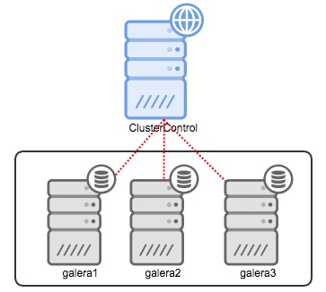
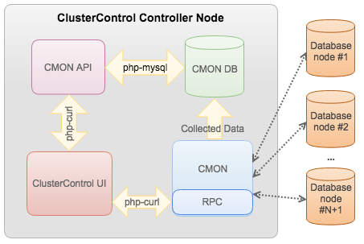

.. _intro:

Introduction
============

This documentation covers ClusterControl version 1.2.10.

What is ClusterControl?
-----------------------

ClusterControl is an agentless management and automation software for database clusters. It helps deploy, monitor, manage and scale your database server/cluster directly from ClusterControl user interface.

ClusterControl consists of three components:

+----------------------------------+---------------------------+-----------------------------------------------------------------------------------+
| Component                        | Package naming            | Role                                                                              |
+==================================+===========================+===================================================================================+
| ClusterControl controller (cmon) | clustercontrol-controller | The brain of ClusterControl. A backend service performing automation, management, |
|                                  |                           | monitoring and scheduling tasks. All the collected data will be stored directly   |
|                                  |                           | inside CMON database                                                              |
+----------------------------------+---------------------------+-----------------------------------------------------------------------------------+
| ClusterControl REST API [#f1]_   | clustercontrol-cmonapi    | Interprets request and response data between ClusterControl UI and CMON database  |
+----------------------------------+---------------------------+-----------------------------------------------------------------------------------+
| ClusterControl UI                | clustercontrol            | A modern web user interface to visualize and manage the cluster. It interacts with| 
|                                  |                           | CMON controller via remote procedure call (RPC) or REST API interface             |
+----------------------------------+---------------------------+-----------------------------------------------------------------------------------+

Supported Database Server/Cluster
---------------------------------

ClusterControl supports following database servers/clusters:

- Galera cluster
	- MySQL Galera Cluster (Codership)
	- Percona XtraDB Cluster (Percona)
	- MariaDB Galera Cluster (MariaDB)
- MySQL Cluster (NDB)
- MySQL replication
- MySQL single instance
- MongoDB/TokuMX
	- Replica set
	- Sharded cluster
	- Replicated sharded cluster
- PostgreSQL single instance

How does it work?
-----------------

ClusterControl components must reside on an independent node apart from your database cluster. For example, if you have a three-nodes Galera cluster, ClusterControl should be installed on the fourth node. Following is an example deployment of having a Galera cluster with ClusterControl:

Once the cmon service is started, it will load up all configuration options inside :file:`/etc/cmon.cnf` and :file:`/etc/cmon.d/cmon_*.cnf` (if exists) into CMON database. Each CMON configuration file represents a cluster with distinct cluster ID. It starts by registering hosts, collecting information and periodically perform check-ups and scheduled jobs on all managed nodes through SSH. Setting up a passwordless SSH is vital in ClusterControl. ClusterControl connects to all managed nodes as ``os_user`` using SSH key defined in ``ssh_identity`` inside CMON configuration file. Details on this is explained under `Passwordless SSH <requirements.html#passwordless-ssh>`_ section.

What user really needs to do is to access ClusterControl UI located at http://[ClusterControl_host]/clustercontrol and starts managing your database infrastructure from there. You can begin by importing existing database clusters, or create a new database server/cluster or register another cluster monitored by another ClusterControl server. ClusterControl supports monitoring multiple clusters and cluster types under single ClusterControl server as shown in the following figure:

.. image:: img/cc_deploy_multiple.png
   :alt: Example multiple cluster deployment
   :align: center

ClusterControl exposes all functionality through remote procedure calls (RPC) on port 9500 and REST API accessible at http://[ClusterControl_host]/cmonapi authenticated by an API token. The ClusterControl UI interacts with those interfaces to retrieve monitoring data (cluster load, host status, alarms, backup status etc.) or to send management commands (add/remove nodes, run backups, upgrade a cluster, etc.). The diagram below illustrates the architecture of ClusterControl:

ClusterControl has minimal performance impact due to its monitoring responsibility and will not cause any downtime to your database server/cluster even if it is down. In fact, it will perform automatic recovery if it finds a failed database node.

What it can do?
---------------

ClusterControl is able to handle most of the administration tasks required to maintain database servers or clusters. Here are some of the tasks that ClusterControl can perform on your database infrastructure:

* Monitor host statistics (CPU/RAM/disk/network)
* Provision multiple database server/cluster in a single CMON process
* Monitor database's stats, variable, log files, queries, for individual node as well as cluster-wide
* Database configuration management
* Database cluster/node recovery
* Trigger alarm and send notification
* Schedule and perform database backup (mysqldump, Xtrabackup, pgdump, mongodump)
* Database backup status
* Restore backups (MySQL)
* Upload backups to AWS S3/Glacier
* Stop/Start/Bootstrap database service
* Deploy a new database server/cluster
* Add existing MySQL/MariaDB server/cluster, MongoDB/TokuMX replica set and PostgreSQL server
* Scale your database cluster (add/remove Galera node, garbd and replication slave)
* Deploy load balancer (HAproxy) and virtual IP address (Keepalived)
* Monitor HAproxy statistics
* Manage MySQL user privileges
* Upgrade MySQL servers
* Stage/Failover replication slave from a master
* and many more..

For more details, please refer to `ClusterControl product page <http://severalnines.com/product/clustercontrol>`_. You might also want to look at the `ClusterControl changelog <http://support.severalnines.com/entries/21633407-ChangeLog>`_ for the latest development update.

.. rubric:: Footnotes

.. [#f1]

    We are gradually in the process of migrating all functionalities in REST API to RPC interface. Kindly expect the REST API to be obselete in the near future.

