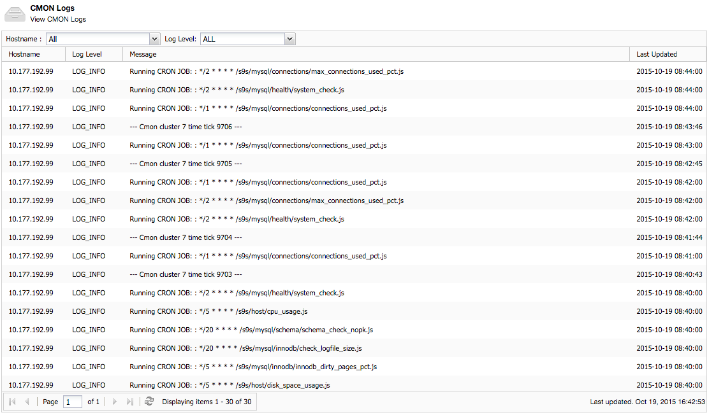

.. _troubleshooting:

Troubleshooting
===============

This troubleshooting guide provides detailed information on how to troubleshoot ClusterControl. ClusterControl is an operational management and automation software for database clusters, which aims to simplify deployment, monitoring, management and scaling of clusters. 

This document is a guide to help troubleshoot problems that commonly arise with ClusterControl. In particular, this guide addresses possible problems that may originate from ClusterControl components namely CMON controller, CMON database, ClusterControl UI and ClusterControl CMONAPI. The document provides guidance on troubleshooting steps to identify the problem, with possible solutions. Finally, the document provides instructions on what data to collect when creating error reports to be submitted to `Severalnines Support <http://support.severalnines.com>`_.

Note that this troubleshooting guide covers the latest ClusterControl version. We recommend you to stay up-to-date with the latest version of ClusterControl as it contains the latest bug fixes. To upgrade ClusterControl to the latest version, please refer to the section on `Upgrading ClusterControl <administration.html#upgrading-clustercontrol>`_.

Logging
-------

ClusterControl consists of different components which write their own logs. These files reside on the ClusterControl node. By default, CMON and ClusterControl UI run without the debug option enabled. Please refer to `Reporting and Debugging`_ section on how to get them run in debug mode.

If you encounter any problems with ClusterControl, it is highly recommended to examine the related log files:

+-------------------------------+------------------------------------------------------+------------------------------------------------------+
| Log Type                      |                                          Default Location                                                   |
|                               +------------------------------------------------------+------------------------------------------------------+
|                               | Redhat/CentOS                                        | Debian/Ubuntu                                        |
+===============================+======================================================+======================================================+
| Configurator deployment log   | [package name]/[cluster type]/scripts/install/cc.log | [package name]/[cluster type]/scripts/install/cc.log |
+-------------------------------+------------------------------------------------------+------------------------------------------------------+
| CMON process log              | /var/log/cmon.log or /var/log/cmon_[cluster_id].log  | /var/log/cmon.log or /var/log/cmon_[cluster_id].log  |
+-------------------------------+------------------------------------------------------+------------------------------------------------------+
| ClusterControl deployment log | /tmp/s9s_out_1.log                                   | /tmp/s9s_out_1.log                                   |
+-------------------------------+------------------------------------------------------+------------------------------------------------------+
| ClusterControl UI error log   | /var/www/html/clustercontrol/app/tmp/logs/error.log  | /var/www/clustercontrol/app/tmp/logs/debug.log       |
+-------------------------------+------------------------------------------------------+------------------------------------------------------+
| ClusterControl UI debug log   | /var/www/html/clustercontrol/app/tmp/logs/debug.log  | /var/www/clustercontrol/app/tmp/logs/debug.log       |
+-------------------------------+------------------------------------------------------+------------------------------------------------------+
| Apache error log              | * /var/log/httpd/ssl_error_log                       | /var/log/apache2/error.log                           |
|                               | * /var/log/httpd/error_log                           |                                                      |
+-------------------------------+------------------------------------------------------+------------------------------------------------------+
| Apache access log             | * /var/log/httpd/access_log                          | * /var/log/apache2/access.log                        |
|                               | * /var/log/httpd/ssl_access_log                      | * /var/log/apache2/ssl_access.log                    |
+-------------------------------+------------------------------------------------------+------------------------------------------------------+

Output of CMON process log is also accessible directly from *ClusterControl > Logs > CMON Logs*:

Reporting and Debugging
-----------------------

If the above does not address the issues you are having, please refer to our `knowledge base <http://support.severalnines.com/categories/20019191-Knowledge-Base>`_ or contact us via our Support Portal by creating a support request at http://support.severalnines.com/tickets/new. We encourage you to make use of our `Error Reporting`_ tool as described in the next section when creating a support ticket.

Error Reporting
'''''''''''''''

ClusterControl provides error reporting tool called ``s9s_error_reporter``. This can greatly facilitate the troubleshooting process as it collects the necessary information on the entire database cluster setup and archives it in a package. You can use this tool to generate error reports, and then attach the generated tarball package to the Support Ticket.

Run all commands below on the ClusterControl node:

.. code-block:: bash

	# If you have already cloned the s9s-admin you can omit the 'git clone ..' command below
	git clone https://github.com/severalnines/s9s-admin
	cd s9s-admin
	git pull
	cd ccadmin

To invoke it do: 

.. code-block:: bash

	# as root:
	bash ./s9s_error_reporter -i 1
	# as a non-root user:
	sudo bash ./s9s_error_reporter -i 1 

Where, 1 is the cluster ID of the corresponding cluster.

It will print out something like this:

.. code-block:: bash

	Severalnines: Copying logs 
	192.168.100.150: Executing 'cp /var/lib/mysql/error.log /tmp'[ok] 
	... 
	192.168.100.153: Executing 'rm /tmp/cmon.log'[ok]
	
	Please attach /tmp/error_report_20120301-215701.tar.gz to the support issue. 

So attach the generated log file to your Support Issue, and we will be able to help you much faster.

``s9s_error_reporter`` generates a tar.gz file containing a lot of information about the cluster (CMON logs, error logs, and the content of some important cmon tables).

.. Note:: We also recommend you take a screenshot showing the problem area, e.g, the Overview from the UI is always great to see if there are node failures, cluster issues or missing data.

Debugging ClusterControl Controller (CMON)
''''''''''''''''''''''''''''''''''''''''''

CMON can run in debug mode as foreground process by invoking -d option:

.. code-block:: bash

	$ service cmon stop
	$ cmon -d

CMON will print detailed information on the screen (stdout) as well as ``/var/log/cmon.log`` or ``/var/log/cmon_[cluster ID].log``. Press ``Ctrl + C`` to kill the process. In certain cases, the CMON debug output might be needed to get insight on the problem.

Debugging ClusterControl UI
'''''''''''''''''''''''''''

To enable ClusterControl UI debug, SSH into the ClusterControl node and adjust following values inside ``[wwwroot]l/clustercontrol/app/Config/core.php``:

.. code-block:: php

	Configure::write('debug', 0);

Where,
- 0: Production mode. All errors and warnings are suppressed.
- 1: Errors and warnings shown, model caches refreshed, flash messages halted.
- 2: As in 1, but also with full debug messages and SQL output.

Make sure ``[wwwroot]/clustercontrol/app/tmp`` has write permissions and is owned by Apache user for the debug and error log to be generated.

Deployment and Installation
---------------------------

This section covers common issues encountered during deployment of ClusterControl or of a database cluster using a Severalnines Deployment Package. This includes issues with Deployment Packages (generated from the Online Configurator), bootstrap script or ClusterControl installation script.

Deployment script stops and asks for visudo or setting up correct sudo users.
'''''''''''''''''''''''''''''''''''''''''''''''''''''''''''''''''''''''''''''

* **Description:**
	- The deployment stops at asking for visudo and setting up sudo users. This error appears even the user has set up the sudoers correctly.

* **Example error:**

.. code-block:: bash

	Starting installation. You will need to answer a few y/n questions. 
	Firewalls must accept 1186 (mysqlcluster), 2200 (mysql cluster), 3306 (mysql), 22 (ssh), ping (icmp). 
	**** firewall will be disabled! (change in .s9s/config) 
	Adding hosts to known hosts, pinging them and checking sudo/visudo exists 
	trying to ping 10.0.0.12
	trying to ssh_keyscan 10.0.0.12: [ok] 
	On 10.0.0.12: Install sudo: apt-get install sudo 
	And make sure you add, using visudo, ubuntu to /etc/sudoers 

* **Troubleshooting step:**
	- Check the value of the SSH key inside ``.s9s/config``.
	- Check the permission and ownership of the key file.
	- Manually retry the suggested failed command from the ClusterControl node, by removing -q and invoking the -v option (verbose mode):

.. code-block:: bash

	$ ssh -v [SSH options] [user]@[IP address]

* **Solution:**
	- Make sure the SSH key exists as defined inside ``.s9s/config`` file.
	- Permission of the SSH key file must be at least 600 and owned by the respective sudo user.

Deployment script stops during package download.
''''''''''''''''''''''''''''''''''''''''''''''''

* **Description:**
	- During the deployment process, the script stops during download phase.

* **Example error:**

.. code-block:: bash

	--2014-05-30 18:25:39--  (try: 5)  http://www.severalnines.com/downloads/cmon/cmon-agent-1.2.6-260-1.x86_64.rpm
	Connecting to www.severalnines.com|194.236.32.162|:80... connected.
	HTTP request sent, awaiting response... 206 Partial Content
	Length: 3434314 (3.3M), 768442 (750K) remaining [audio/x-pn-realaudio-plugin]
	Saving to: âcmon-agent-1.2.6-260-1.x86_64.rpmâ
	...
	2014-05-30 18:25:54 (43.8 KB/s) - Connection closed at byte 3300019. Giving up.
	
	download failed.

* **Troubleshooting step:**
	- Try to download the package manually using wget and see how many retries that it needs in order to get a complete package.
	- Examine the deployment log and check the package URL used whether it is available online. You can use following command to check:

.. code-block:: bash

	$ wget --spider [download URL]

* **Solution:**
	- If the package is not available or not found (wget returns ‘Remote file does not exist -- broken link’), please report it to us by creating a ticket at support.severalnines.com. Attach the deployment log to the ticket. It might be that some vendors have released a newer version, and removed the URL of the software package used by the Deployment Script. Once we have fixed this in the Configurator, you will be able to generate a new deployment package and restart the deployment.
	- If the file is available, this might due to a slow download connection from the ClusterControl host to respective vendor’s download site. The deployment script default retry value is 5. Find any occurrences of the ``wget --tries=5`` command inside the Deployment Package and change it to a higher number as shown in the following example:

.. code-block:: bash

	$ sed -i "s|tries=5|tries=20|g" `grep -lir "tries=5" *`

Deployment script stops during MySQL bootstrap or restart stage
'''''''''''''''''''''''''''''''''''''''''''''''''''''''''''''''

* **Description:**
	- During the Galera Cluster deployment, the script stops during bootstrap or restart stage.

* **Example error:**

.. code-block:: bash

	192.168.197.81: Executing 'sed -ibak 's#wsrep_cluster_address=.*#wsrep_cluster_address=gcomm://#g' /etc//my.cnf' [ok]
	Starting MySQL Server, this may take a while (doing rsync, only Galera is involved at this point)
	If it fails, check the error log on 192.168.197.81:/var/lib/mysql/error.log
	192.168.197.81: Executing 'killall -9 mysqld_safe  mysqld'[ok]
	192.168.197.81: Executing 'nohup /etc/init.d/mysql bootstrap >/tmp/mysql.out 2>/tmp/mysql.err' [ok]
	192.168.197.81: Executing 'sync' [ok]
	Setting 'root' password on 192.168.197.81
	192.168.197.81: Executing 'LD_LIBRARY_PATH=/usr/lib/:/usr/lib//mysql /usr/bin//mysqladmin --defaults-file=/etc//my.cnf -u root password 'password'' [failed: retrying 1/10]
	[failed: retrying 2/10]
	[failed: retrying 3/10]
	[failed: retrying 4/10]
	[failed: retrying 5/10]
	[failed: retrying 6/10]
	[failed: retrying 7/10]
	[failed: retrying 8/10]
	[failed: retrying 9/10]
	[failed: retrying 10/10]
	[failed]

* **Troubleshooting steps:**
	1. SSH into the DB node and check the MySQL error log. It is usually located in one of the following locations:
		- ``/var/log/mysqld.log``
		- ``/var/log/mysql.log``
		- ``[MySQL datadir]/error.log``
	2. Find any line that indicates error.
	3. If it is related to xtrabackup SST failure, check the ``innobackup.prepare.log`` or ``innobackup.backup.log`` inside the MySQL datadir.

* **Solution:**
	- If there is any socat or netcat process still running on either of the nodes, kill it first and then restart the deployment script.
	- If it is due to the buffer pool failing to initialize (InnoDB: mmap([number] bytes) failed; errno 12), increase RAM on all DB nodes. You can also reduce the buffer pool size within ``[deployment script]/mysql/config/my.cnf`` for ``innodb_buffer_pool_size=[value]``
	- If it is related to Galera cache being too big and failing to initialize (File preallocation failed), please reduce the gcache size within ``[deployment script]/mysql/config/my.cnf`` for	``wsrep_provider_options="gcache.size=[value]"``

At this point, MySQL is already installed but it failed to bootstrap. Instead of restarting the deployment from scratch, you can just proceed with following one-line command:

.. code-block:: bash

	$ ./bootstrap.sh && ./install-cmon.sh -s && cat .s9s/greetings

ClusterControl Controller (CMON)
--------------------------------

CMON always tries to recover failed database nodes during my maintenance window.
''''''''''''''''''''''''''''''''''''''''''''''''''''''''''''''''''''''''''''''''

* **Description:**
	- By default, CMON is configured to perform recovery of failed nodes or clusters. This behaviour can be overridden by disabling automatic recovery feature.

* **Solution:**
	- To disable automatic recovery temporarily, you can just click on the 'power' icon for node and cluster. Red means automatic recovery is turned off while green indicates recovery is turned on. This behaviour will not persistent if CMON is restarted.
	- To make the above change persistent, disable node or cluster auto recovery by specifying following line inside CMON configuration file:

.. code-block:: bash

	enable_autorecovery=0

CMON process dies with “Critical error (mysql error code 1)”
''''''''''''''''''''''''''''''''''''''''''''''''''''''''''''

* **Description:**
	- After starting CMON service, it stops and /var/log/cmon.log shows the following error.

* Example error:

.. code-block:: bash

	(ERROR) Critical error (mysql error code 1) occured - shutting down 

* **Troubleshooting steps:**
1. Run the following command on the ClusterControl host to check if the ClusterControl host has the ability to connect to the DB host with current credentials:

.. code-block:: bash

	$ mysql -ucmon -p -h[database node IP] -P[MySQL port] -e 'SHOW STATUS'

2. Check GRANT for cmon user on each database host:

.. code-block:: mysql

	mysql> SHOW GRANTS FOR 'cmon'@'[ClusterControl IP address]';

* **Solution:**
	- It is not recommended to mix public IP address and internal IP address. For the GRANT, try to use the IP address that your database nodes use to communicate with each other.
	- If the SHOW STATUS returns ``ERROR 1130 (HY000): Host '[ClusterControl IP address]' is not allowed to connect to this``, the database host is missing the cmon user grant. Run following command to reset the cmon user privileges:

.. code-block:: mysql

	mysql> GRANT ALL PRIVILEGES ON *.* TO 'cmon'@'[ClusterControl IP]' IDENTIFIED BY '[cmon password]' WITH GRANT OPTION; 
	mysql> FLUSH PRIVILEGES;
	
where, [ClusterControl IP] is ClusterControl IP address and [cmon password] is ``mysql_password`` value inside CMON configuration file.

Known Issues and Limitations
----------------------------

ClusterControl is not fully tested in OS-level virtualization platform (containers) like OpenVZ. This may cause some issues in reporting of host statistics since it does not use the conventional device naming and mapping. 

Known issues in ClusterControl as in v1.2.11:

* Running two simultaneous backups (storage on Controller) on two different clusters. One will most likely fail (due to netcat port conflict)
* Running two simultaneous HAProxy install on two different clusters (different load balancer hosts), one will most likely fail.

