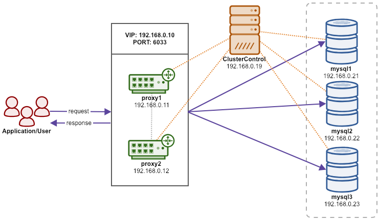

.. _Tutorials - Deployment:

MySQL
=====

Deploying a Production-Grade Percona XtraDB Cluster
---------------------------------------------------

Introduction
++++++++++++

In this example, we are going to deploy a production-grade three-node Percona XtraDB Cluster with two ProxySQL servers as load balancers sitting on top of the cluster. The ProxySQL will be configured with two types of hostgroups:

- Single writer hostgroup (writes are forwarded to one MySQL node)
- Multiple writers hostgroup (writes are distributed to multiple nodes)

A virtual IP address (provided by Keepalived) will be floating between those ProxySQL instances, providing a single endpoint for the application tier to connect.

All nodes are having similar characteristics as the following:

- OS: CentOS 7
- SSH user: root
- SSH port: 22
- SElinux: disabled

We are going to use 5 servers in this setup:

============ ============== ====
Hostname     IP address     Role
============ ============== ====
cc           192.168.0.19   ClusterControl
proxy1       192.168.0.11   ProxySQL + Keepalived + VIP: 192.168.0.10 (eth1)
proxy2       192.168.0.12   ProxySQL + Keepalived + VIP: 192.168.0.10 (eth1)
mysql1       192.168.0.21   Percona XtraDB Cluster
mysql2       192.168.0.22   Percona XtraDB Cluster
mysql3       192.168.0.23   Percona XtraDB Cluster
============ ============== ====

The following diagram illustrates the architecture:

Database Deployment
+++++++++++++++++++

1) Go to `ClusterControl download page <https://severalnines.com/download-clustercontrol-database-management-system>`_ and you will get the instructions to download ClusterControl's installer file. On ClusterControl node, follow the steps provided, for example:

.. code-block:: bash

	$ wget -O install-cc https://severalnines.com/scripts/install-cc?yAg_P9AydY-0H_PjJB3tl69pPLKUI4BwV94I6dOQg3c1
	$ chmod +x install-cc
	$ ./install-cc

2) Generate a SSH key for user root on ClusterControl node:

.. code-block:: bash

	$ whoami
	root
	$ ssh-keygen -t rsa # press Enter on all prompts

.. Note:: The SSH private and public keys will be generated under ``/root/.ssh`` directory.

3) Configure passwordless SSH for user root from ClusterControl node to all database and proxy nodes. On ClusterControl node:

.. code-block:: bash

	$ whoami
	root
	$ ssh-copy-id 192.168.0.11
	$ ssh-copy-id 192.168.0.12
	$ ssh-copy-id 192.168.0.21
	$ ssh-copy-id 192.168.0.22
	$ ssh-copy-id 192.168.0.23

4) Open ClusterControl UI in the browser, http://192.168.0.10/clustercontrol and register a super admin user.

5) Open ClusterControl deployment wizard at Deploy (top menu) and pick MySQL Galera. Specify the following details under "General & SSH Settings" section:

* SSH User: root
* SSH Key Path: /root/.ssh/id_rsa
* SSH Port: 22
* Cluster Name: Percona XtraDB Cluster 5.7
* Install Software: True
* Disable Firewall: True
* Disable AppArmor/SELinux: True

6) Proceed to the next step under "Define MySQL Servers" section. Specify the following details:

* Vendor: Percona XtraDB
* Version: 5.7
* Server Data Directory: /var/lib/mysql
* Server Port: 3306
* Configuration Template: 
* Admin/Root Password: s3cr3tP455
* Repository: Use Vendor Repositories
* Add Node: 192.168.0.21 (press enter), 192.168.0.22 (press enter), 192.168.0.23 (press enter)

7) Proceed with the deployment by clicking *Deploy* button. Monitor the job progress under *ClusterControl > Activity > Jobs > Create Cluster*. This may take a while depending on the hardware specs and internet connection. Once the deployment completes, ClusterControl will list it out in the cluster list. 

Load Balancer Deployment
++++++++++++++++++++++++

8) Next, deploy ProxySQL by clicking on the cluster, then go to *Manage > Load Balancers > ProxySQL > Deploy ProxySQL* (also accessible via *Cluster Actions* shortcut on the top right of the summary bar). You will be presented with a ProxySQL deployment wizard. Enter the following details:

* Server Address: 192.168.0.11
* Admin Port: 6032
* Listenting POrt: 6033
* Import Configuration: False

* Administration User: proxysql-admin
* Administration Password: s3cr3tP455
* Monitor User: proxysql-monitor
* Monitor Password: s3cr3tP455

* Create New DB User: True
* DB User: sakila
* DB Password: s3cr3tP455
* DB Name: sakila.*
* Type in MySQL Privileges(s): ALL PRIVILEGES

* Include: True (for all servers)
* Max Replication Lag: 10 (for all servers)
* Max Connection: 100 (for all servers)
* Weight: 1 (for all servers)

* Are you using implicit transactions: False (You use BEGIN or START TRANSACTION to create a transaction)

9) Proceed with ProxySQL deployment by clicking *Deploy ProxySQL* button. Monitor the job progress under *ClusterControl > Activity > Jobs > Installing ProxySQL*. This may take a while depending on the hardware specs and internet connection. Once the deployment completes, you will see the ProxySQL instance listed under *Nodes* tab. 

10) Repeat step 8 and 9 for the second ProxySQL instance. The only difference is the *Server Address* value which is "192.168.0.12".

Virtual IP Deployment
+++++++++++++++++++++

11) Next, deploy Keepalived by going to *Manage > Load Balancers > Keepalived > Deploy Keepalived*. You will be presented with a Keepalived deployment wizard. Enter the following details:

* Load balancer type: ProxySQL
* Keepalived 1: 192.168.0.11
* Keepalived 2: 192.168.0.12
* Virtual IP: 192.168.0.10
* Network interface: eth1

12) Proceed with Keepalived deployment by clicking *Deploy Keepalived* button. Monitor the job progress under *ClusterControl > Activity > Jobs > Deploy Keepalived*. This may take a while depending on the hardware specs and internet connection. Once the deployment completes, you will see the Keepalived instance listed under *Nodes* tab.

Deployment is now complete.

Importing Database
+++++++++++++++++++

13) In this example, we are using a MySQL sample database called `Sakila <http://downloads.mysql.com/docs/sakila-db.tar.gz>`_. On ClusterControl node, download it to the $HOME path:

.. code-block:: bash

	$ whoami
	root
	$ cd $HOME
	$ wget http://downloads.mysql.com/docs/sakila-db.tar.gz
	$ tar -xzf sakila-db.tar.gz

However, there are multiple dump files in the ``sakila-db`` directory. ClusterControl supports importing single SQL dump file and it must be in either ``.sql``, ``.sql.gz`` or ``.sql.bz2`` format. Let's merge ``sakila-data.sql`` into ``sakila-schema.sql`` so we can specify only ``sakila-schema.sql`` as the dump file path in ClusterControl UI:

.. code-block:: bash

	$ cd sakila-db
	$ cat sakila-data.sql >> sakila-schema.sql

14) From ClusterControl UI, pick the database cluster and go to *Manage > Schemas and Users > Create Database* and create a database called "sakila". 

15) Since we already created a MySQL user called "sakila" when deploying our ProxySQL servers (step 8 and 10), we don't need to create another MySQL user for this purpose. However, if you want to create a new user, you may use the *Users* tab.

16) To import the database into the cluster, go to *Manage > Schemas and Users > Import Database Dumpfile* and specify the following details:

* Import dumpfile on: 192.168.0.21 (pxc1)
* Import dumpfile to database: sakila
* Specify path to dumpfile: /root/sakila-db/sakila-schema.sql

17) Click *Import* to start importing the database. The tarball will be extracted and the mysqldump files will be copied over to the selected node and applied with the mysql client.

Connecting to the Database
++++++++++++++++++++++++++

18) To verify if the database is imported correctly, connect to either one of these endpoints as MySQL host/port combination:

* 192.168.0.10 port 6033 (Virtual IP address - recommended)
* 192.168.0.11 port 6033 (ProxySQL)
* 192.168.0.12 port 6033 (ProxySQL)
* 192.168.0.21 port 3306 (Percona XtraDB Cluster)
* 192.168.0.22 port 3306 (Percona XtraDB Cluster)
* 192.168.0.23 port 3306 (Percona XtraDB Cluster)

In the following example, we use the MySQL client to connect to the database via virtual IP address, 192.168.0.10:

.. code-block:: bash

	$ mysql -usakila -p -h192.168.0.10 -P6033 sakila -e 'show tables'
	Enter password:
	+----------------------------+
	| Tables_in_sakila           |
	+----------------------------+
	| actor                      |
	| actor_info                 |
	| address                    |
	| category                   |
	| city                       |
	| country                    |
	| customer                   |
	| customer_list              |
	| film                       |
	| film_actor                 |
	| film_category              |
	| film_list                  |
	| film_text                  |
	| inventory                  |
	| language                   |
	| nicer_but_slower_film_list |
	| payment                    |
	| rental                     |
	| sales_by_film_category     |
	| sales_by_store             |
	| staff                      |
	| staff_list                 |
	| store                      |
	+----------------------------+

Our highly-available database cluster is now ready to serve the applications.
