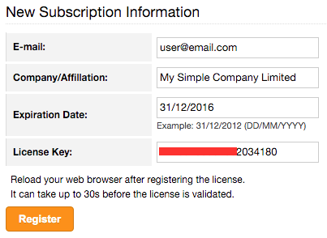

Settings
========

Admin page provides interface to manage clusters, organizations, users, roles and authentication options inside ClusterControl.

.. image:: img/admin_index.png

Clusters
--------

Manage database clusters inside ClusterControl.

* **Delete** 
	- Unregister selected database cluster from the ClusterControl UI. This action will **NOT** delete the actual database cluster.

* **Change Organization** 
	- Change organization for selected database cluster from the organization list created in *Organizations/Users* tab.

* **Create DB User** 
	- Copy an existing MySQL user (which explicitly created through ClusterControl) to other cluster or create a new MySQL user for the selected cluster. This user will be allowed to connect from the specified host to all mysql servers. 

* **Assign DB User Privileges** 
	- Assign privileges to a database user for the selected cluster.

* **Show DB Users and Privileges** 
	- Show the existing database user and privileges created by ClusterControl for the selected cluster.

.. Note:: You can retrieve the ClusterControl API Token value directly from ``[wwwroot]/cmonapi/config/bootstrap.php`` under ``CMON_TOKEN`` variable or from 'dcps.apis' table.

Cluster Jobs
------------

List of jobs that have been performed related to the cluster (e.g., deploying a new cluster, adding an existing cluster and cloning). This is different from *ClusterControl > Logs > Jobs* under each database cluster. Pick a job to see its running messages.

* **Delete**
	- Delete or kill the selected cluster job.

* **Restart**
	- Restart a failed cluster job.

* **Copy**
	- Open a new pop-up so the user can select the command's text and copy.

* **Job**
	- JSON formatted job command.

* **Status**
	+------------+--------------------------------------+
	| Job status | Description                          |
	+============+======================================+
	| FINISHED   | The job is successfully executed.    |
	+------------+--------------------------------------+
	| FAILED     | The job is executed but failed.      |
	+------------+--------------------------------------+
	| RUNNING    | The job is started and in progress.  |
	+------------+--------------------------------------+
	| ABORTED    | The job is started but terminated.   |
	+------------+--------------------------------------+
	| DEFINED    | The job is defined and yet to start. |
	+------------+--------------------------------------+

* **Time**
	- Time stamp on the reported status.

  
User Management
---------------
  
Organizations/Users
'''''''''''''''''''

Manage organization and users under ClusterControl. You can have one or more organization and each organization consists of zero or more clusters and users. You can have many roles defined under ClusterControl and a user must be assigned with one role.

As a roundup, here is how the different entities relate to each other:

.. image:: img/cc_erd.png
   :align: center

.. Note:: ClusterControl creates 'Admin' organization by default.

Users
`````

A user belongs to one organization and assigned with a role. Users created here will be able to login and see specific cluster(s), depending on their organization and the cluster they have been assigned to.

Each role is defined with specific privileges under *Access Control* tab. ClusterControl default roles are Super Admin, Admin and User:

=============== ============
Role            Description
=============== ============
**Super Admin** Able to see all clusters that are registered in the UI. The Super Admin can also create organizations and users. Only the Super Admin can transfer a cluster from one organization to another.
**Admin**       Belongs to a specific organization, and is able to see all clusters registered in that organization.
**User**        Belongs to a specific organization, and is only able to see the cluster(s) that he/she registered.
=============== ============


Access Control
''''''''''''''

ClusterControl uses Role-Based Access Control (RBAC) to restrict access to clusters and their respective deployment, management and monitoring features. This ensures that only authorised user requests are allowed. Access to functionality is fine-grained, allowing access to be defined by organisation or user. ClusterControl uses a permissions framework to define how a user may interact with the management and monitoring functionality, after they have been authorised to do so. 

You can create a custom role with its own set of access levels. Assign the role to specific user under *Organizations/Users* tab.

.. Note:: The **Super Admin** role is not listed since it is a default role and has the highest level of privileges in ClusterControl. 

Privileges
``````````

========= ===========
Privilege Description
========= ===========
Allow     Allow access without modification. Similar to read-only mode.
Deny      Deny access. The selected feature will not appear in the UI.
Manage    Allow access with modification.
Modify    Similar to manage, for certain features that required modification.
========= ===========

Feature Description
````````````````````

============================ ============
Feature                      Description
============================ ============
**Overview**                 Overview tab - *ClusterControl > Overview*
**Nodes**                    Nodes tab - *ClusterControl > Nodes*
**Configuration Management** Configuration management page - *ClusterControl > Manage > Configurations*
**Query Monitor**            Query Monitor tab - *ClusterControl > Query Monitor*
**Performance**              Performance tab - *ClusterControl > Performance*
**Backup**                   Backup tab - *ClusterControl > Backup*
**Manage**                   Manage tab - *ClusterControl > Manage*
**Alarms**                   Alarms tab - *ClusterControl > Alarms*
**Jobs**                     Jobs tab - *ClusterControl > Jobs*
**Settings**                 Settings tab - *ClusterControl > Settings*
**Add Existing Cluster**     Add Existing Cluster button and page - *ClusterControl > Add Existing Server/Cluster*
**Create Cluster**           Create Database Cluster button and page - *ClusterControl > Create Database Cluster*
**Add Load Balancer**        Add Load Balancer page - *ClusterControl > Actions > Add Load Balancer* and *ClusterControl > Manage > Load Balancer*
**Clone**                    Clone Cluster page (Galera) - *ClusterControl > Actions > Clone Cluster*
**Access All Clusters**      Access all clusters registered under the same organzation.
**Cluster Registrations**    Cluster Registrations page - *ClusterControl > Cluster Registrations*
**Service Providers**        Service Providers page - *ClusterControl > Service Providers*
**Search**                   Search button and page - *ClusterControl > Search*
**Create Database Node**     Create Database Node button and page - *ClusterControl > Create Database Node*
**Developer Studio**         Developer Studio page - *ClusterControl > Manage > Developer Studio*
**Custom Advisors**          Customer Advisors page - *ClusterControl > Manage > Custom Advisors*
============================ ============

LDAP Access
'''''''''''

ClusterControl supports :term:`Active Directory`, :term:`FreeIPA` and :term:`LDAP` authentication. This allows users to log into ClusterControl by using their corporate credentials instead of a separate password. LDAP groups can be mapped onto ClusterControl user groups to apply roles to the entire group. It supports up to LDAPv3 protocol based on `RFC2307 <https://www.ietf.org/rfc/rfc2307.txt>`_.

When authenticating, ClusterControl will first bind to the directory tree server ('LDAP Host') using the specified 'Login DN' user and password, then it will check if the username you entered exists in the form of uid, cn or sAMAccountName of the 'User DN'. If it exists, it will then use the username to bind against the LDAP server to check whether it has the configured group as in 'LDAP Group Name' in ClusterControl. If it has, ClusterControl will then map the user to the appropriate ClusterControl role and grant access to the UI.

The following flowchart summarizes the workflow:

.. image:: img/ipaad_flowchart.png
   :align: center

You can map the LDAP group to corresponding ClusterControl role created under *Access Control* tab. This would ensure that ClusterControl authorizes the logged-in user based on the role assigned.

Once the LDAP settings are verified, login into ClusterControl by using the LDAP credentials (uid, cn or sAMAccountName with respective password). User will be authenticated and redirected to ClusterControl dashboard page based on the assigned role. From this point, both ClusterControl and LDAP authentications would work.

Users and Groups
````````````````

If LDAP authentication is enabled, you need to map ClusterControl roles with their respective LDAP groups. You can configure this by clicking on ‘+’ icon to add a group:

+-----------------+-------------------------------------------------------------------------+------------------------------------+
| Field           | Description                                                             | Example                            |
+=================+=========================================================================+====================================+
| Organization    | The organization that you want the LDAP group to be assigned to.        | Admin                              |
+-----------------+-------------------------------------------------------------------------+------------------------------------+
| LDAP Group Name | The distinguished name of the LDAP group.                               | cn=Database Administrator,ou=group |
+-----------------+-------------------------------------------------------------------------+------------------------------------+
| Role            | User role in ClusterControl. Please refer to Organization/User section. | SuperAdmin                         |
+-----------------+-------------------------------------------------------------------------+------------------------------------+

Settings
````````

* **Enable LDAP Authentication**
	- Choose whether to enable or disable LDAP authentication.

* **LDAP Host**
	- The LDAP server hostname or IP address. To use LDAP over SSL/TLS, specify LDAP URI, ldaps://[hostname/IP address]

* **LDAP Port**
	- Default is 389 and 636 for LDAP over SSL. Make sure to allow connections from ClusterControl host for both TCP and UDP protocol.

* **Base DN**
	- The root LDAP node under which all other nodes exist in the directory structure.

* **Login DN**
	- The distinguished name used to bind to the LDAP server. This is often the administrator or manager user. This user needs to have read access to all LDAP users that require authentication. ClusterControl must do an LDAP search before any user can log in.

* **Password**
	- The password for the binding user specified in 'Login DN'.

* **User DN**
	- The user's distinguished name used to bind to the LDAP server.

* **Group DN**
	- The group's distinguished name used to bind to the LDAP server.
	
.. Attention:: ClusterControl does not support binding against a nested directory group. Ensure each LDAP user that authenticates to ClusterControl has direct relationship to the LDAP group.

FreeIPA
```````

ClusterControl is able to bind to a :term:`FreeIPA` server and perform lookups on compatible schema. Once the :term:`DN` for that user is retrieved, it tries to bind using the full DN (in standard tree) with the entered password to verify the LDAP group of that user.

Thus, for FreeIPA, the user’s and group’s DN should use compatible schema, ``cn=compat`` replacing the default ``cn=accounts`` in ClusterControl LDAP Settings except for the 'Login DN', as shown in following screenshot:

.. image:: img/ipaad_set_ipa.png
   :align: center

Active Directory
`````````````````

Please make sure :term:`Active Directory` runs with 'Identity Management for UNIX' enabled. You can enable this under *Server Manager > Roles > Active Directory Domain Services > Add Role Services*. Detailed instructions on how to do this is explained in `this article <http://technet.microsoft.com/en-us/library/cc731178.aspx>`_.

Once enabled, ensure that each group you want to authenticate from ClusterControl has a Group ID, and each user you want to authenticate from ClusterControl has a UID and is assigned with a GID.

.. Attention:: For Active Directory, ensure you configure the exact distinguished name (with proper capitalization) since the LDAP interchange format (LDIF) fields are returned in capital letters.

For example on how to setup OpenLDAP autentication with ClusterControl, please refer to `this blog post <http://www.severalnines.com/blog/how-setup-centralized-authentication-clustercontrol-users-ldap>`_.

For example on integrating ClusterControl with FreeIPA and Windows Active Directory, please refer to `this blog post <http://severalnines.com/blog/integrating-clustercontrol-freeipa-and-windows-active-directory-authentication>`_.

MySQL User Management
---------------------

Provides global MySQL user management interface across all MySQL-based cluster. Users and privileges can be set directly and retrieved from the cluster so ClusterControl is always in sync with the managed MySQL databases. Users can be created across more than one cluster at once.

You can choose individual node by clicking on the respective node or all nodes in the cluster by clicking on the respective cluster in the side menu.

Active Accounts
'''''''''''''''

Shows all active accounts across clusters, which are currently active or were connected since the last server restart.

Inactive Accounts
'''''''''''''''''

Shows all accounts across clusters that are not been used since the last server restart. Server must have been running for at least 8 hours to check for inactives accounts.

You can drop particular accounts by clicking at the multiple checkboxes and click 'Drop User' button to initiate the action.

Create Accounts
'''''''''''''''

Creates a new MySQL user for the chosen MySQL node or cluster. 

================== ============
Field              Description
================== ============
Server             Hostname of the user. Wildcard (%) is permitted.
Username           Specify the username.
Password           Specify the password *Username*.
Verify Password    Re-enter the same password for *Username*.
All Privileges     Allow all privileges, similar to 'ALL PRIVILEGES' option.
Database           Specify the database or table name. It can be either in '*.*', 'db_name', 'db_name.*' or 'db_name.tbl_name' format.
================== ============

Email Notifications
-------------------

Configures email notifications across clusters.

* **Save To**
	- Save the settings to individual or all clusters.

* **Set for**
	- Update the current settings to the selected cluster.

* **Send digests at**
	- Send a digested (summary) email at this time every dayf or the selected recipient.

* **Timezone**
	- Timezone for the selected recipient.

* **Daily limit for non-digest email as**
	- The maximum number of non-digest email notification should be sent per day for the selected recipient. -1 for unlimited.

* **Alarm/Event Category**
	====================== ===========
	Event                  Description
	====================== ===========
	Network                Network related messages, e.g host unreachable, SSH issues.
	CmonDatabase           Internal CMON database related messages.
	Mail                   Mail system related messages.
	Cluster                Cluster related messages, e.g cluster failed.
	ClusterConfiguration   Cluster configuration messages, e.g software configuration messages.
	ClusterRecovery        Recovery messages like cluster or node recovery failures.
	Node                   Message related to nodes, e.g node disconnected, missing GRANT, failed to start HAproxy, failed to start NDB cluster nodes.
	Host                   Host related messages, e.g CPU/disk/RAM/swap alarms.
	DbHealth               Database health related messages, e.g memory usage of mysql servers, connections.
	DbPerformance          Alarms for long running transactions and deadlocks
	SoftwareInstallation   Software installation related messages.
	Backup                 Messages about backups.
	Unknown                Other uncategorized messages.
	====================== ===========

* **Select how you wants alarms/events delivered**
	======= ===========
	Action  Description
	======= ===========
	Ignore  Ignore if an alarm raised.
	Deliver Send notification immediately via email once an alarm raised.
	Digest  Send a summary of alarms raised everyday at *Send digests at*
	======= ===========

	
Operational Report
------------------

Generate, schedule and email out operational reports. The whole idea behind creating Operational Reports is to put all of the most important data into a single document, which can be quickly reviewed to get an understanding of the state of the databases. The current default report shows a cluster's health and performance at the time it was generated compared to 1 day ago. 
 
The report provides information about:
	- Cluster Information
		- Cluster
		- Nodes
		- Backup Summary
		- Top Queries Summary
	- Node Status Overview
		- CPU Usage
		- Data Throughput
		- Load Average
		- Free Disk Space
		- RAM Usage
		- Network Throughput
		- Server Load
		- Handler

We will add more options and report types in future releases. Check out the Operational Report walkthrough with examples in `this blog post <http://severalnines.com/blog/become-clustercontrol-dba-operational-reports-mysql-and-mariadb>`_.

Operational Reports
````````````````````

Provides list of generated operational reports.

* **Create**
	- Create an operational report immediately. There are 3 types of report that you can generate:
		- Default - Detailed information about a particular cluster, a summary of different alerts, node state, graph related to OS and database metrics for each node.
		- Availability - Availability report on cluster, nodes and history changes.
		- Backup - Backup summary and latest state of created backups.
	- Specify the cluster name and operational type. Optionally, you can click on 'Add Email' button  to add recipients into the list.

* **Delete**
	- Delete the selected operational report.

* **Refresh**
	- Refresh the operational report list.

Schedules
`````````

List of scheduled operational report. Optionally, you can click on 'Add Email' button  to add recipients into the list. asdasd

* **Schedule**
	- Schedule an operational report at an interval. You can schedule it daily, weekly and monthly. Optionally, you can click on 'Add Email' button  to add recipients into the list.

* **Edit**
	- Edit the selected schedule.

* **Delete**
	- Delete the selected schedule.

* **Refresh**
	- Refresh the schedule list.
    
Key Management
--------------

Key Management allows you to manage a set of SSL certificates and keys that can be provisioned on your clusters. This feature allows you to create Certificate Authority (CA) and/or self-signed certificates and keys. Then, it can be easily enable and disable SSL encryption (by using `Enable SSL Encryption <mysql/overview.html#enable-ssl-encryption>`_) for client-server connections for MySQL and Postgres based servers/clusters.

Manage Keys
````````````

Manage existing keys and certificates generated by ClusterControl.

* **Revoke**
    - Revoke the selected certificate. This will put an end to the validity of the certificate.

* **Generate**
    - Re-generate an invalid or expired certificate. By using this, ClusterControl can generate a new key and certificate by using the same information used when it was generated for the first time.

* **Move**
    - Move the selected certificate to another location. Clicking on this will open another dialog box where you can create/delete a directory under ``/var/lib/cmon/ca``. Use this feature to organize and categorize the generated certificate per directory.


Generate Key
````````````

By default, the generated keys and cetificates will be created under default repository at ``/var/lib/cmon/ca``. 

* **New Folder**
    - Create a new directory under the default repository.

* **Delete Folder**
    - Delete the selected directory.

* **Refresh**
    - Refresh the list.

Self-signed Certificate Authority and Key
'''''''''''''''''''''''''''''''''''''''''''

Generate a self-signed Certificate Authority and Key. You can use this Certificate Authority (CA) to sign your client and server certificates.

* **Path**
    - Certification repository path. To change the path, click on the file browser left-side menu. Default value is ``/var/lib/cmon/ca``.

* **Certificate Authority and Key Name**
    - Enter a name without extension. For example MyCA, ca-cert

* **Description**
    - Put some description for the certificate authority.

* **Country**
    - Choose a country name from the dropdown menu.

* **State**
    - State or province name.

* **Locality**
    - City name.
    
* **Organization**
    - Organization name.

* **Organization unit**
    - Unit or department name.

* **Common name**
    - Specify server fully-qualified domain name (FQDN) or your name.
    - Common Name value used for the server and client certificates/keys must each differ from the Common Name value used for the CA certificate. Otherwise, the certificate and the key files will not work for the servers compiled using OpenSSL.

* **Email**
    - Email address.

* **Key length (bits)**
    - The key length in bits. 2048 and higher is recommended. The larger the public and private key length, the harder it is to crack.

* **Expiration Date (days)**
    - Certificate expiration in days.

* **Generate**
    - Generate certificate and key.
    
* **Reset**
    - Reset the form.

Client/Server Certificates and Key
'''''''''''''''''''''''''''''''''''''

Sign with an existing CA or generate a self-signed certificate. ClusterControl generates certificate and key depending on the type, server or client. The generated server's key and certificate can then be used by `Enable SSL Encryption <mysql/overview.html#enable-ssl-encryption>`_ feature.

* **Certificate Authority**
    - Select an existing CA (by clicking on any existing CA on the left-hand side menu) or leave it empty to generate a self-signed certificate.

* **Type**
    - server - Generate certificate for server usage.
    - client - Generate certificate for client usage.

* **Certificate and Key Name**
    - Enter the certificate and key name. The same name will be used by ClusterControl to generate certificate and key. For example, if you specify the name is "severalnines", ClusterControl will generate ``severalnines.key`` and ``severalnines.crt`` respectively.

* **Description**
    - Put some description for the certificate and key.

* **Country**
    - Choose a country name from the dropdown menu.

* **State**
    - State or province name.

* **Locality**
    - City name.
    
* **Organization**
    - Organization name.

* **Organization unit**
    - Unit or department name.

* **Common name**
    - Specify server fully-qualified domain name (FQDN) or your name.
    - Common Name value used for the server and client certificates/keys must each differ from the Common Name value used for the CA certificate. Otherwise, the certificate and the key files will not work for the servers compiled using OpenSSL.

* **Email**
    - Email address.

* **Key length (bits)**
    - The key length in bits. 2048 and higher is recommended.

* **Expiration Date (days)**
    - Certificate expiration in days.

* **Generate**
    - Generate certificate and key.
    
* **Reset**
    - Reset the form.

Notification Services
---------------------

Provides interface to manage notification service for Custom Advisor. At the moment, only external mail server and PagerDuty is supported. For list of supported plugin, you can find it at NPM page `here <https://www.npmjs.com/browse/keyword/s9s>`_. 

This feature requires ClusterControl NodeJS package to be installed. If you have not configure this, please run following command on ClusterControl node:

.. code-block:: bash

	/usr/local/clustercontrol-nodejs/bin/install-cc-nodejs.sh

The above command will install and configure all dependencies required including the NPM plugins. Take note that, your repository must have NPM package listed in order for the script to successfully install all the dependencies. For RHEL 7, you might need to have EPEL repository configured by using following command:

.. code-block:: bash

	rpm -Uhv http://dl.fedoraproject.org/pub/epel/7/x86_64/e/epel-release-7-5.noarch.rpm

Please refresh the ClusterControl UI after the installation finished.
	
Create Service Config
`````````````````````

* **Name**
	- The configuration name.

* **Organization**
	- Which organization that the service belongs to.
	
* **Plugin Type**
	- Choose a plugin type. Details on this is explained on the next sub sections.
	
* **Enabled**
	- Check the box if you want it available for Custom Advisors. If unchecked, you will not able to see this service when setting up Custom Advisors.
	
Mail Notifition Settings
''''''''''''''''''''''''

Forwards the alarms raised by Custom Advisors to an email address. You can add multiple email addresses to this setting and once a defined Custom Advisors exceeds the threshold, all recipients will receive it.

PagerDuty Notification Settings
'''''''''''''''''''''''''''''''

Forwards the alarms raised by Custom Advisors to PagerDuty notification service. ClusterControl connects through PagerDuty API via NodeJS.

* **PagerDuty Token**
	- Log into your PagerDuty account and create a service for ClusterControl Custom Advisors. Go to *PagerDuty > Services > Add New Service*. Specify a service name and choose "Use our API" directly on "Integration Type". Note the "Service API Key" from the Service summary page and specify it in this field.

* **PagerDuty Domain**
	- PagerDuty domain name. For example, severalnines.pagerduty.com.


Repositories
------------

Manages provider's repository for database servers and clusters. You can have three types of repository when deploying database server/cluster using ClusterControl:

1. Use Vendor Repositories
	- Provision software by setting up and using the database vendor's preferred software repository. ClusterControl will always install the latest version of what is provided by database vendor repository.
2. Do Not Setup Vendor Repositories
	- Provision software by using the pre-existing software repository already setup on the nodes. User has to set up the software repository manually on each database node and ClusterControl will use this repository for deployment. This is good if  the database nodes are running without internet connections.
3. Use Mirrored Repositories (Create new repository)
	- Create and mirror the current database vendor's repository and then deploy using the local mirrored repository.
	- This allows you to "freeze" the current versions of the software packages used to provision a database cluster for a specific vendor and you can later use that mirrored repository to provision the same set of versions when adding more nodes or deploying other clusters.
	- ClusterControl sets up the mirrored repository under [Apache Document root]/cmon-repos/, which is accessible via HTTP at http://[ClusterControl IP address]/cmon-repos/

Only Local Mirrored Repository will be listed and manageable here. 

* **Remove Repositories**
	- Remove the selected repository.

* **Filter by cluster type**
	- Filter the repository list by cluster type.

For reference purpose, following is an example of yum definition if Local Mirrored Repository is configured on the database nodes:

.. code-block:: bash

	$ cat /etc/yum.repos.d/clustercontrol-percona-5.6-yum-el7.repo
	[percona-5.6-yum-el7]
	name = percona-5.6-yum-el7
	baseurl = http://10.0.0.10/cmon-repos/percona-5.6-yum-el7
	enabled = 1
	gpgcheck = 0
	gpgkey = http://10.0.0.10/cmon-repos/percona-5.6-yum-el7/localrepo-gpg-pubkey.asc

	
Cluster Registrations
---------------------

From a ClusterControl UI instance, this enables the user register a database cluster managed by ClusterControl. For each cluster, you need to provide a ClusterControl API URL and token. This effectively establishes the communication between the UI and the controller. The ClusterControl UI can connect to multiple CMON Controller servers (via the CMON REST API) and provide a centralized view of all databases. Users need to register the CMONAPI token and URL for each cluster. 

.. Note:: The CMONAPI token is critical and hidden under asterisk values. This token provides authentication access for ClusterControl UI to communicate with the CMON backend services directly. Please keep this token in a safe place.

You can retrieve the CMONAPI token manually at ``[wwwroot]/cmonapi/config/bootstrap.php`` on line which contains ``CMON_TOKEN`` value, where ``[wwwroot]`` is location of Apache document root.

Service Providers
-----------------

Manages resources and credentials for service providers.

AWS Credentials
```````````````

Manage your AWS credentials under this tab. Fully working AWS credentials requires more than just a keypair. The stored AWS credential will be used by ClusterControl to list your available Amazon instances, spin new instances when deploying a cluster, uploading backups to S3 or Glacier, etc. 

================== ============
Field              Description
================== ============
Keypair Name       Keypair name.
Access Key ID      Your AWS Access Key ID as described on this page. You can get this from AWS IAM Management console.
Secret Access Key  Your AWS Secret Access Key as described on this page. You can get this from AWS IAM Management console.
Private Key File   Upload the private keypair file.
Comment (Optional) Description of the keypair. 
================== ============

To edit, double click on an item from the list. To remove the credential, choose an item and click on the ‘-’ icon.

.. Note:: The saved key name must match the AWS keypair name in order to deploy on AWS. For example, if the keypair file is ‘severalnines.pem’, put ‘severalnines’ as keypair name.

Adding your AWS Credentials to ClusterControl
'''''''''''''''''''''''''''''''''''''''''''''

From AWS IAM Management Console, click *Create User* button. Enter the user name:

.. image:: img/cc_aws_cre1.png
   :align: center

It will prompt for Security Credentials. Copy *Access Key ID* and *Secret Access Key* because these values are needed by ClusterControl’s AWS Credentials. You can also download the credential by clicking the Download Credentials button.

.. image:: img/cc_aws_cre2.png
   :align: center

Next, select the create user, and go to *Permissions > Attach User Policy*. 

.. image:: img/cc_aws_cre3.png
   :align: center

Choose *Power User Access* and click *Apply Policy*.

.. image:: img/cc_aws_cre4.png
   :align: center

You should see the policy has been assigned correctly under *Permissions* tab:

.. image:: img/cc_aws_cre5.png
   :align: center

Go back to AWS EC2 Dashboard and create a Key Pair by clicking *Create Key Pair* button:

.. image:: img/cc_aws_cre6.png
   :align: center

Enter the key pair name and click *Create*. It will force you to download the keypair file automatically:

.. image:: img/cc_aws_cre7.png
   :align: center

Specify all information above under `AWS Credentials`_ window in ClusterControl. Make sure you specify the same key pair name as created on previous step and upload that key using the Browse button. The *Comment* field is optional.

.. image:: img/cc_aws_cre8.png
   :align: center


AWS Instances
`````````````

Lists your AWS instances. You can perform simple AWS instance management directly from ClusterControl, which uses your defined AWS credentials to connect to AWS API.

========= ===========
Field     Description
========= ===========
KeyPair   Choose which keypair to use to access your AWS resources.
Stop      Shutdown the instance.
Reboot    Restart the instance.
Terminate Shutdown and terminate the instance.
========= ===========

AWS VPC
```````

This allows you to conveniently manage your VPC from ClusterControl, which uses your defined AWS credentials to connect to AWS VPC. Most of the functionalities are integrated and have the same look and feel as the AWS VPC console. Thus, you may refer to VPC User Guide for details on how to manage AWS VPC.

+-------------------+-----------------------------------------------------------------------------------------------------------------+
| Field             | Description                                                                                                     |
+===================+=================================================================================================================+
| Start VPC Wizard  | Open the VPC creation wizard. Please refer to Getting Started Guide for details on how to start creating a VPC. |
+-------------------+-----------------------------------------------------------------------------------------------------------------+
| KeyPair           | Choose which keypair to use to access your AWS resources.                                                       |
+-------------------+-----------------------------------------------------------------------------------------------------------------+
| Region            | Choose the AWS region for the VPC.                                                                              |
+-------------------+-----------------------------------------------------------------------------------------------------------------+
| VPC               | List of VPCs created under the selected region.                                                                 |
|                   |                                                                                                                 |
|                   | * Create VPC - Create a new VPC.                                                                                |
|                   | * Delete - Delete selected VPC.                                                                                 |
|                   | * DHCP Options Set - Specify the DHCP options for your VPC.                                                     |
+-------------------+-----------------------------------------------------------------------------------------------------------------+
| Subnet            | List of VPC subnet created under the selected region.                                                           |
|                   |                                                                                                                 |
|                   | * Create - Create a new VPC subnet.                                                                             |
|                   | * Delete - Delete selected subnet.                                                                              |
+-------------------+-----------------------------------------------------------------------------------------------------------------+
| Route Tables      | List of routing tables created under the selected region.                                                       |
+-------------------+-----------------------------------------------------------------------------------------------------------------+
| Internet Gateway  | List of security groups created under the selected region.                                                      |
+-------------------+-----------------------------------------------------------------------------------------------------------------+
| Network ACL       | List of network Access Control Lists created under the selected region.                                         |
+-------------------+-----------------------------------------------------------------------------------------------------------------+
| Security Group    | List of security groups created under the selected region.                                                      |
+-------------------+-----------------------------------------------------------------------------------------------------------------+
| Running Instances | List of all running instances under the selected region.                                                        |
+-------------------+-----------------------------------------------------------------------------------------------------------------+
 

On-Premise Credentials
``````````````````````

When deploying on-Premise, ClusterControl uses your credentials to spin up the necessary resources for the database nodes. The following options are available if you click on ‘+’ button:

================== ===========
Field              Description
================== ===========
Keypair Name       Key file name.
Private key File   Upload the private key pair file.
Comment (Optional) Description of the key pair.
Cluster Name       Assign this key to specific cluster.
================== ===========

.. Note:: Keep cluster unspecified for keys that you will use for new installation.

Subscriptions
-------------

For users with a valid subscription (Standard, Pro, Enterprise), enter your license information here to enable additional features based on the subscription. 

This functionality is also accessible per individual cluster under *Settings > Subscription*. Following screenshot shows example on filing up the license information:



.. Attention:: Make sure you copy the subscription information as they are, with no leading/trailing spaces.

The license key is validated during runtime. Reload your web browser after registering the license.

.. Note:: When the license expires, ClusterControl defaults back to the Community Edition. For features comparison, please refer to `ClusterControl product page <http://www.severalnines.com/pricing>`_.
