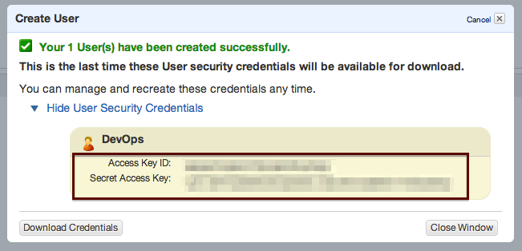
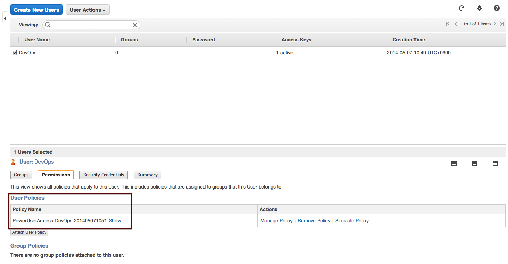
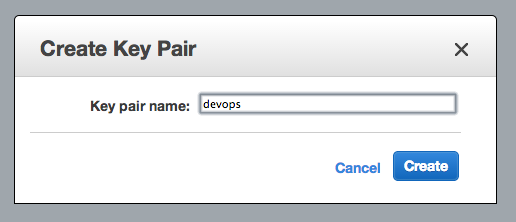

Dashboard
============

This page is the landing page once you logged in. It provides a summary of database clusters monitored under ClusterControl.

.. image:: img/cc_cluster_list.png
   :align: center

*Section 1*

ClusteControl's top menu.

* **Help**
	- Open online ClusterControl documentation, located at http://www.severalnines.com/support

* **Support**
	- Open Severalnines support page, located at http://support.severalnines.com/

* **Cluster Registrations**
	- See `Cluster Registrations`_ section.
  
* **Admin**
	- See `Admin <admin.html>`_ section.

* **Service Providers**
	- See `Service Providers`_ section.

* **Log Out**
	- Logs out from ClusterControl and return to login page.

*Section 2*

Cluster-wide alarms. It provides aggregated view of all alarms raised across all clusters monitored by ClusterControl. The alarm can be filtered by severity, category and cluster.

*Section 3*

Database cluster functions.

* **Search**
	- See `Search`_ section.

* **Add Existing Server/Cluster**
	- See `Add Existing Server/Cluster`_ section.

* **Create Database Cluster**
	- See `Create Database Cluster`_ section.

* **Create Database Node**
	- See `Create Database Node`_ section.
	
*Section 4*

List of database clusters managed under ClusterControl with overall status. Database cluster deployed by (or added into) ClusterControl will be listed in this page. See `Database Cluster List`_ section.

Cluster Registrations
---------------------

From a ClusterControl UI instance, this enables the user register a database cluster managed by ClusterControl. For each cluster, you need to provide a ClusterControl API URL and token. This effectively establishes the communication between the UI and the controller. The ClusterControl UI can connect to multiple CMON Controller servers (via the CMON REST API) and provide a centralized view of all databases. Users need to register the CMONAPI token and URL for each cluster. 

.. Note:: The CMONAPI token is critical and hidden under asterisk values. This token provides authentication access for ClusterControl UI to communicate with the CMON backend services directly. Please keep this token in a safe place.

You can retrieve the CMONAPI token manually at ``[wwwroot]/cmonapi/config/bootstrap.php`` on line which contains ``CMON_TOKEN`` value, where ``[wwwroot]`` is location of Apache document root.

Service Providers
-----------------

Manage resources and credentials for service providers.

AWS Credentials
'''''''''''''''

Manage your AWS credentials under this tab. Fully working AWS credentials requires more than just a keypair. The stored AWS credential will be used by ClusterControl to list your available Amazon instances, spin new instances when deploying a cluster, uploading backups to S3 or Glacier, etc. 

================== ============
Field              Description
================== ============
Keypair Name       Keypair name.
Access Key ID      Your AWS Access Key ID as described on this page. You can get this from AWS IAM Management console.
Secret Access Key  Your AWS Secret Access Key as described on this page. You can get this from AWS IAM Management console.
Private Key File   Upload the private keypair file.
Comment (Optional) Description of the keypair. 
================== ============

To edit, double click on an item from the list. To remove the credential, choose an item and click on the ‘-’ icon.

.. Note:: The saved key name must match the AWS keypair name in order to deploy on AWS. For example, if the keypair file is ‘severalnines.pem’, put ‘severalnines’ as keypair name.

Adding your AWS Credentials to ClusterControl
.............................................

From AWS IAM Management Console, click *Create User* button. Enter the user name:

.. image:: img/cc_aws_cre1.png
   :align: center

It will prompt for Security Credentials. Copy *Access Key ID* and *Secret Access Key* because these values are needed by ClusterControl’s AWS Credentials. You can also download the credential by clicking the Download Credentials button.

Next, select the create user, and go to *Permissions > Attach User Policy*. 

.. image:: img/cc_aws_cre3.png
   :align: center

Choose *Power User Access* and click *Apply Policy*.

.. image:: img/cc_aws_cre4.png
   :align: center

You should see the policy has been assigned correctly under *Permissions* tab:

Go back to AWS EC2 Dashboard and create a Key Pair by clicking *Create Key Pair* button:

.. image:: img/cc_aws_cre6.png
   :align: center

Enter the key pair name and click *Create*. It will force you to download the keypair file automatically:

Specify all information above under `AWS Credentials`_ window in ClusterControl. Make sure you specify the same key pair name as created on previous step and upload that key using the Browse button. The *Comment* field is optional.

.. image:: img/cc_aws_cre8.png
   :align: center

AWS Instances
'''''''''''''

Lists your AWS instances. You can perform simple AWS instance management directly from ClusterControl, which uses your defined AWS credentials to connect to AWS API.

========= ===========
Field     Description
========= ===========
KeyPair   Choose which keypair to use to access your AWS resources.
Stop      Shutdown the instance.
Reboot    Restart the instance.
Terminate Shutdown and terminate the instance.
========= ===========

AWS VPC
'''''''

This allows you to conveniently manage your VPC from ClusterControl, which uses your defined AWS credentials to connect to AWS VPC. Most of the functionalities are integrated and have the same look and feel as the AWS VPC console. Thus, you may refer to VPC User Guide for details on how to manage AWS VPC.

+-------------------+-----------------------------------------------------------------------------------------------------------------+
| Field             | Description                                                                                                     |
+===================+=================================================================================================================+
| Start VPC Wizard  | Open the VPC creation wizard. Please refer to Getting Started Guide for details on how to start creating a VPC. |
+-------------------+-----------------------------------------------------------------------------------------------------------------+
| KeyPair           | Choose which keypair to use to access your AWS resources.                                                       |
+-------------------+-----------------------------------------------------------------------------------------------------------------+
| Region            | Choose the AWS region for the VPC.                                                                              |
+-------------------+-----------------------------------------------------------------------------------------------------------------+
| VPC               | List of VPCs created under the selected region.                                                                 |
|                   |                                                                                                                 |
|                   | * Create VPC - Create a new VPC.                                                                                |
|                   | * Delete - Delete selected VPC.                                                                                 |
|                   | * DHCP Options Set - Specify the DHCP options for your VPC.                                                     |
+-------------------+-----------------------------------------------------------------------------------------------------------------+
| Subnet            | List of VPC subnet created under the selected region.                                                           |
|                   |                                                                                                                 |
|                   | * Create - Create a new VPC subnet.                                                                             |
|                   | * Delete - Delete selected subnet.                                                                              |
+-------------------+-----------------------------------------------------------------------------------------------------------------+
| Route Tables      | List of routing tables created under the selected region.                                                       |
+-------------------+-----------------------------------------------------------------------------------------------------------------+
| Internet Gateway  | List of security groups created under the selected region.                                                      |
+-------------------+-----------------------------------------------------------------------------------------------------------------+
| Network ACL       | List of network Access Control Lists created under the selected region.                                         |
+-------------------+-----------------------------------------------------------------------------------------------------------------+
| Security Group    | List of security groups created under the selected region.                                                      |
+-------------------+-----------------------------------------------------------------------------------------------------------------+
| Running Instances | List of all running instances under the selected region.                                                        |
+-------------------+-----------------------------------------------------------------------------------------------------------------+
 

On-Premise Credentials
'''''''''''''''''''''''

When deploying on-Premise, ClusterControl uses your credentials to spin up the necessary resources for the database nodes. The following options are available if you click on ‘+’ button:

================== ===========
Field              Description
================== ===========
Keypair Name       Key file name.
Private key File   Upload the private key pair file.
Comment (Optional) Description of the key pair.
Cluster Name       Assign this key to specific cluster.
================== ===========

.. Note:: Keep cluster unspecified for keys that you will use for new installation.

Search
------

Perform search on the managed database cluster based on tag. Users can define multiple custom tags on any object (node or cluster) managed by ClusterControl. This is very useful if you have large infrastructure where you can easily find objects with a specific tag. The example below shows search results for tag ‘dc1’:

.. image:: img/cc_search.png
   :align: center

Clicking on the search result will open up the related page based on the object type (`Nodes <nodes.html>`_ page for node and Cluster `Overview <overview.html>`_ page for cluster). Each of the tag contains a keyword and a number, indicating the number of objects the keyword has been assigned to.

To manage tags, go to *ClusterControl > Search > Add/Edit tags* and assign appropriate keywords for selected object, similar to screenshot below:

.. image:: img/cc_tags.png
   :align: center

A tag can be removed by clicking on ‘x’ symbol on the tag. Add more tags by separating them with a comma.

Add Existing Server/Cluster
----------------------------

Opens a single-page wizard to import the configuration of the existing database setup into ClusterControl. The following database cluster types are supported:

* Galera (MySQL Galera Cluster, Percona XtraDB Cluster and MariaDB Galera Cluster)
* MySQL Replication (master-slave)
* A pool of single-instance MySQL servers
* MongoDB/TokuMX replica set
* PostgreSQL single-instance

There are some prerequisites that need to be fulfilled prior to adding the existing setup. The existing database cluster/server must:

* Run with same MySQL port with same MySQL root password and MySQL base directory
* Run on similar OS distribution as the ClusterControl host
* Verify that sudo is working properly if you are using a non-root user
* Passwordless SSH from ClusterControl node to database nodes has been configured correctly
* You must have a running ClusterControl controller with a minimal configuration

For more details, refer to the `Requirement <../../requirements.html>`_ section. Each time you add an existing cluster or server, ClusterControl will trigger a job under *ClusterControl > Admin > Cluster Jobs*. You can see the progress and status under this page. A window will also appear with messages showing progress.

Add Existing Galera Cluster
'''''''''''''''''''''''''''

Choose *MySQL Galera Cluster* as the database type. Fill in all required information.

* **Vendor**
	- Galera Clusters database vendor:
		- Codership - MySQL Galera Cluster by Codership
		- Percona XtraDB - Percona XtraDB Cluster by Percona
		- MariaDB Galera - MariaDB Galera Cluster by MariaDB

* **MySQL Version**
	- Select the MySQL version:
		- MySQL 5.5.x
		- MySQL 5.6.x

* **MySQL User**
	- MySQL user on the target server/cluster. This user must able to perform GRANT statement. Recommended to use MySQL 'root' user.
	
* **MySQL Password** 
	- Password for *MySQL User*. The password must be the same on all nodes that you want to add into ClusterControl.

* **MySQL Server Hostname**
	- Please note that you only need to specify ONE Galera node which contains a full Galera communication URL on ``wsrep_cluster_address`` variable, for example, on 192.168.0.102, MySQL ``wsrep_cluster_address`` variable returns:

.. code-block:: mysql

	mysql> SHOW VARIABLES LIKE "wsrep_cluster_address";
	+-----------------------+------------------------------------------------------------------+
	| Variable_name         | Value                                                            |
	+-----------------------+------------------------------------------------------------------+
	| wsrep_cluster_address | gcomm://192.168.0.101:4567,192.168.0.102:4567,192.168.0.103:4567 |
	+-----------------------+------------------------------------------------------------------+

- This node (192.168.0.102) is a good candidate to be specified in *MySQL Server Hostname* field. There should be one node in the cluster that having ``wsrep_cluster_address`` value as ``gcomm://``. Do not specify that host.

* **MySQL Port**
	- MySQL port on the target server/cluster. Default to 3306. ClusterControl assumes MySQL is running on the same port on all nodes.
	
* **MySQL Basedir**
	- MySQL base directory. Default is ``/usr``. ClusterControl assumes MySQL is having the same base directory on all nodes.

* **Enable information_schema Queries**
	- Use information_schema to query MySQL statistics. This are not recommended for clusters with more than 2000 tables/databases.
	
* **Tags**
	- Specify tags for the cluster. Use space to separate between tags.
	
* **Enable Node AutoRecovery**
	- ClusterControl will perform automatic recovery if it detects any of the nodes in the cluster is down.
	
* **Enable Cluster AutoRecovery**
	- ClusterControl will perform automatic recovery if it detects the cluster is down or degraded.

* **SSH User**
	- Specify root if you have root credentials.
	- If you use 'sudo' to execute system commands, specify the name that you wish to use here. The user must exists on all nodes. See `Operating System User <../../requirements.html#operating-system-user>`_.
	
* **SSH Key Path**
	- Specify the full path of SSH key (the key must exist in ClusterControl node) that will be used by *SSH User* to perform passwordless SSH. See `Passwordless SSH <../../requirements.html#passwordless-ssh>`_.

* **SSH Port Number**
	- Specify the SSH port for target nodes. ClusterControl assumes SSH is running on the same port on all nodes.

* **Add Cluster**
	- Click the button to start the import. ClusterControl will connect to the Galera node, discover the configuration for the rest of the nodes and start managing/monitoring the cluster.

Add existing MySQL server/replication
''''''''''''''''''''''''''''''''''''''

ClusterControl is able to manage/monitor an existing set of MySQL servers (standalone or replication). Individual hosts specified in the same list will be added to the same server group in the UI. ClusterControl assumes that you are using the same MySQL root password for all instances specified in the group, and it will determine the server role (master, slave, multi or standalone).

Choose *MySQL Server* as the database type. Fill in all required information.

* **MySQL User**
	- MySQL user on the target server/cluster. This user must able to perform GRANT statement. Recommended to use MySQL 'root' user.
	
* **MySQL Password**
	- Password for *MySQL User*. ClusterControl assumes that you are using the same MySQL root password for all instances specified in the group.

* **MySQL Port**
	- MySQL port on the target server/cluster. Default to 3306. ClusterControl assumes MySQL is running on the same port on all nodes.

* **MySQL Basedir**
	- MySQL base directory. Default is ``/usr``. ClusterControl assumes all MySQL nodes are using the same base directory.

* **Tags**
	- Specify tags for the cluster. Use space to separate between tags.

* **Add Host**
	- Specify all MySQL single instances that you want to group under this cluster.

* **SSH User**
	- Specify root if you have root credentials.
	- If you use 'sudo' to execute system commands, specify the name that you wish to use here. The user must exists on all nodes. See `Operating System User <../../requirements.html#operating-system-user>`_.
	
* **SSH Key Path**
	- Specify the full path of SSH key (the key must exist in ClusterControl node) that will be used by *SSH User* to perform passwordless SSH. See `Passwordless SSH <../../requirements.html#passwordless-ssh>`_.

* **SSH Port Number**
	- Specify the SSH port for target nodes. ClusterControl assumes SSH is running on the same port on all nodes.

* **Add Cluster**
	- Click the button to start the import. ClusterControl will connect to the MySQL instances, import configurations and start managing them. 

Add existing MySQL Cluster
''''''''''''''''''''''''''

Adding existing MySQL Cluster (ndb) is not supported from the ClusterControl UI. But it is possible to use our `bootstrap script <installation.html#bootstrap-script>`_ to add MySQL Cluster into ClusterControl. In case if you are about to import multiple MySQL clusters, the `bootstrap script <installation.html#bootstrap-script>`_ is capable to add only one MySQL Cluster (cluster_id=1), so you may use it to add the primary cluster. Once imported, you will have to manually add the subsequent MySQL cluster as cluster ID 2 or higher. To achieve this, run following steps on ClusterControl node:

1. Copy CMON configuration file from cluster ID 1 as a template for cluster ID 2:

.. code-block:: bash

	mkdir /etc/cmon.d/
	cp /etc/cmon.cnf /etc/cmon.d/cmon_2.cnf

2. Update following lines inside ``/etc/cmon.d/cmon_2.cnf``:

.. code-block:: bash

	cluster_id=2
	logfile=/var/log/cmon_2.log
	mysql_server_addresses=[SQL nodes IP address or hostname in comma separated list]
	datanode_addresses=[data nodes IP address or hostname in comma separated list]
	mgmnode_addresses=[management nodes IP address or hostname in comma separated list]
	ndb_connectstring=[NDB connection string of the cluster]

.. Note:: Details on configuration options can be referred `here <components.html#configuration-options>`_.

3. Setup passwordless SSH to the all nodes in secondary cluster using following command:

.. code-block:: bash

	ssh-copy-id <IP address>

4. Restart CMON service to apply the changes:

.. code-block:: bash

	service cmon restart

At this point, ClusterControl should start provisioning all nodes defined in the CMON configuration files (both ``/etc/cmon.cnf`` and ``/etc/cmon.d/cmon_2.cnf``). Monitor the output of CMON controller for cluster ID 2 at ``/var/log/cmon_2.log``. If everything is configured correctly, you should see it listed in the ClusterControl UI as the second cluster under `Database Cluster List`_.

Add existing MongoDB/TokuMX replica set
'''''''''''''''''''''''''''''''''''''''

ClusterControl is able to manage and monitor an existing MongoDB or TokuMX replica set. Choose *Mongodb Replicaset* as the database type. Fill in all required information.

* **Vendor**
	- MongoDB database vendor:
		- 10gen - MySQL Galera Cluster by Codership
		- Tokutek MX - Percona XtraDB Cluster by Percona

* **MongoDB User**
	- MongoDB admin user. If you don't specify *Password*, ClusterControl assumes you do not use MongoDB authentication.

* **Password**
	- Specify admin password if the replica set is configured with ``--auth`` enabled.
	
* **MongoDB Server Hostname**
	- Specify one IP address or hostname of the MongoDB replica set member. ClusterControl will automatically discover the rest of the replica set members. 

* **MongoDB Port**
	- MongoDB port on the target cluster. Default to 27017. ClusterControl assumes MongoDB is running on the same port on all nodes.
	
* **Tags**
	- Specify tags for the cluster. Use space to separate between tags.

* **SSH User**
	- Specify root if you have root credentials.
	- If you use 'sudo' to execute system commands, specify the name that you wish to use here. The user must exists on all nodes. See `Operating System User <../../requirements.html#operating-system-user>`_.
	
* **SSH Key Path**
	- Specify the full path of SSH key (the key must exist in ClusterControl node) that will be used by *SSH User* to perform passwordless SSH. See `Passwordless SSH <../../requirements.html#passwordless-ssh>`_.

* **SSH Port Number**
	- Specify the SSH port for target nodes. ClusterControl assumes SSH is running on the same port on all nodes.

* **Add Cluster**
	- Click the button to start the import. ClusterControl will connect to the MongoDB node, discover the configuration for the rest of the nodes and start managing/monitoring the cluster.

Add existing PostgreSQL servers
'''''''''''''''''''''''''''''''

ClusterControl is able to manage/monitor an existing set of PostgreSQL 9.x servers (standalone). Individual hosts specified in the same list will be added to the same server group in the UI. ClusterControl assumes that you are using the same postgres password for all instances specified in the group.

Choose Postgres Server as the database type. Fill in all required information.

* **Postgres User**
	- PostgreSQL user on the target server/cluster. Recommended to use PostgreSQL 'postgres' user.

* **Postgres Password**
	- Password for *Postgres User*. ClusterControl assumes that you are using the same postgres password for all instances specified in the group.

* **Postgres Port**
	- PostgreSQL port on the target server/cluster. Default to 5432. ClusterControl assumes PostgreSQL is running on the same port on all nodes.

* **Postgres Basedir**
	- PostgreSQL base directory. Default is ``/usr``. ClusterControl assumes all PostgreSQL nodes are using the same base directory.

* **Tags**
	- Specify tags for the cluster. Use space to separate between tags.

* **Add Host**
	- Specify all MySQL single instances that you want to group under this cluster.

* **SSH User**
	- Specify root if you have root credentials.
	- If you use 'sudo' to execute system commands, specify the name that you wish to use here. The user must exists on all nodes. See `Operating System User <../../requirements.html#operating-system-user>`_.
	
* **SSH Key Path**
	- Specify the full path of SSH key (the key must exist in ClusterControl node) that will be used by *SSH User* to perform passwordless SSH. See `Passwordless SSH <../../requirements.html#passwordless-ssh>`_.

* **SSH Port Number**
	- Specify the SSH port for target nodes. ClusterControl assumes SSH is running on the same port on all nodes.

* **Add Cluster**
	- Click the button to start the import. ClusterControl will connect to the PostgreSQL instances, import configurations and start managing them. 

Create Database Cluster
------------------------

ClusterControl supports auto deployment of database clusters in different environments:

* Galera Cluster in local/on-premise
* MongoDB Replica Set in local/on-premise
* Galera Cluster in AWS
* MongoDB/TokuMX in AWS

Local/on-premise
''''''''''''''''''

Deploys a new Galera Cluster or MongoDB Replica set in the same local environment. The database cluster will be automatically added into ClusterControl once deployed.

MySQL Galera
............

* **Vendor**
	- Galera Clusters database vendor:
		- Percona XtraDB - Percona XtraDB Cluster by Percona
		- MariaDB Galera - MariaDB Galera Cluster by MariaDB

* **Version**
	- Select the MySQL version:
		- 5.5
		- 5.6

* **Server Port**
	- MySQL port for all nodes. Default is 3306.

* **Server Data Directory**
	- Location of MySQL data directory. Default is ``/var/lib/mysql``.

* **# of DB nodes**
	- Specifies the number of MySQL instances to deploy. A minimum of three servers is required to handle split brain/network partitioning.
	- You can also deploy a server for the cluster and scale out using `Add Node`_ at later stage.

* **my.cnf Template**
	- MySQL configuration template file under ``/usr/share/cmon/templates``. The default is my.cnf.galera which should be exist by default. 
	
* **Root Password**
	- Specify MySQL root password. ClusterControl will configure the same MySQL root password for all instances in the cluster.

* **DB Nodes: Enter hostname or IP address**
	- The input boxes depend on the value of *# of DB nodes*. Specify the IP address or hostname of the database nodes. ClusterControl will deploy the Galera

* **SSH User**
	- Specify root if you have root credentials.
	- If you use 'sudo' to execute system commands, specify the name that you wish to use here. The user must exists on all nodes. See `Operating System User <../../requirements.html#operating-system-user>`_.
	
* **SSH Key Path**
	- Specify the full path of SSH key (the key must exist in ClusterControl node) that will be used by *SSH User* to perform passwordless SSH. See `Passwordless SSH <../../requirements.html#passwordless-ssh>`_.

* **SSH Port Number**
	- Specify the SSH port for target nodes. ClusterControl assumes SSH is running on the same port on all nodes.

* **Need Sudo Password**
	- If you use sudo with password, click the link to input sudo password. Ignore this if *SSH User* is root or have no sudo password.

* **Disable Firewall**
	- Check the box to disable firewall (recommended).

* **Disable AppArmor/SELinux**
	- Check the box to let ClusterControl disable AppArmor (Ubuntu) or SELinux (Redhat/CentOS) if enabled.

* **Uninstall Existing MySQL Server**
	- Existing MySQL dependencies will be removed.
	
* **Deploy**
	- Starts the deployment.

MongoDB ReplicaSet Node
.......................

For MongoDB Replica Set, ClusterControl can deploy a single node replica set. You will then need to use `Actions <user-guide/mongodb/overview.html#add-node-to-replicaset>`_ function to scale out the cluster to the number of members you want.

* **Hostname**
	- The host IP address or hostname.

* **Port**
	- MongoDB replica set port. Default is 27017.
	
* **User**
	- MongoDB user. Recommended to use 'admin'. Leave blank if you don't want to have ``--auth`` enabled.
	
* **Password**
	- The password for MongoDB 'admin'. Leave blank if you did not specify *User*.

* **RS Name**
	- Replica set name without whitespace. Default is 'my_mongodb_0'.

* **Data Directory**
	- Location of MongoDB data directory. Default is ``/var/lib/mongodb``.

* **mongodb.cnf Template**
	- MongoDB configuration template file under ``/usr/share/cmon/templates``. The default is mongodb.conf.org should be provided by default. 
	
* **Need Sudo Password**
	- If you use sudo with password, click the link to input sudo password. Ignore this if *SSH User* is root or have no sudo password.

* **DB Nodes: Enter hostname or IP address**
	- The input boxes depend on the value of *# of DB nodes*. Specify the IP address or hostname of the database nodes. ClusterControl will deploy the Galera

* **SSH User**
	- Specify root if you have root credentials.
	- If you use 'sudo' to execute system commands, specify the name that you wish to use here. The user must exists on all nodes. See `Operating System User <../../requirements.html#operating-system-user>`_.
	
* **SSH Key Path**
	- Specify the full path of SSH key (the key must exist in ClusterControl node) that will be used by *SSH User* to perform passwordless SSH. See `Passwordless SSH <../../requirements.html#passwordless-ssh>`_.

* **SSH Port Number**
	- Specify the SSH port for target nodes. ClusterControl assumes SSH is running on the same port on all nodes.

* **Disable Firewall**
	- Check the box to disable firewall (recommended).

* **Disable AppArmor/SELinux**
	- Check the box to let ClusterControl disable AppArmor (Ubuntu) or SELinux (Redhat/CentOS) if enabled.

* **Uninstall Existing MongoDB Server**
	- Existing MongoDB dependencies will be removed.
	
* **Deploy**
	- Starts the deployment.

Galera Cluster in AWS
'''''''''''''''''''''

Deploys a Galera Cluster on AWS. This feature requires you to setup your cloud provider credentials under *ClusterControl > Service Providers > AWS Credentials*. Note that a ClusterControl host is required, as it will be running the another ClusterControl instance for the newly deployed cluster. Your current UI will be communicating with the controller when managing the Galera Cluster. 

The deployment will automatically:

* Launch the desire instances
* Configure the instances (Elastic IP, passwordless SSH etc)
* Generate the same database deployment package via `Severalnines Configurator <http://severalnines.com/configurator>`_
* Upload the tarball/deployment package to the ClusterControl node on AWS
* Unpack and run the deployment script on/from the ClusterControl node on AWS
* Register this new cluster to the existing ClusterControl web application where 'Create Database Cluster' was initiated.

Basically, the new cluster is monitored and managed by the ClusterControl node on AWS, not by the already existing controller node. Following architecture diagram shows how ClusterControl (on-premises) deploys a new database cluster in AWS:

.. image:: img/cc_create_dbc.png
   :align: center

.. Attention:: Deploying a cluster on AWS EC2 instances requires that you also install a complete new ClusterControl host. If you are already on AWS and want to add another cluster then please use "Local/On-premise" deployment instead.

Galera for MySQL Settings
.........................

* **Vendor**
	- Galera Clusters database vendor:
		- Codership - MySQL Galera Cluster by Codership
		- Percona XtraDB - Percona XtraDB Cluster by Percona
		- MariaDB Galera - MariaDB Galera Cluster by MariaDB

* **MySQL Version**
	- Select the MySQL version:
		- MySQL 5.5.x
		- MySQL 5.6.x

* **# of DB nodes**
	- Specifies the number of MySQL instances to deploy. A minimum of three servers is required to handle split brain/network partitioning.
	- A separate (+1) server is needed for ClusterControl.

* **Data Dir**
	- The location of data directory of the new cluster

* **Install Dir**
	- MySQL installation directory

* **Workload**
	- Expected database workload. The database configuration will be tweaked accordingly:
		- Low write/high read - 20% write, 80% read
		- Medium write/high read - 60% write, 40% read
		- High write/high read - 80% write, 20% read

* **Database Size**
	- Select the option that comes closest to the anticipated size of your database.

* **Galera Cache (gcache)**
	- The gcache can significantly speed up recovery:
		- Required disk space - same amount of the as the cache size. E.g, 8 GB cache will need 8 GB of free disk space.
		- Avoid full data synchronization (SST) between nodes where possible.
		- Optimal is set it to the same size as the database size if possible.
	- Use the default value if you are unsure. You can read more about gcache in `this blog post <http://www.severalnines.com/blog/understanding-gcache-galera>`_.

* **Max connections**
	- The number of max_connections on the MySQL server. Maximum value is limited to 2000. 200 is a good value to start with.

* **MySQL root password**
	- The password for mysql user ‘root’. Default password is ‘password’. Use only alphanumeric characters in the password string. The root password will be applied to all instances that run MySQL, including the ClusterControl host.

* **CMON user password**
	- The password for mysql user ‘cmon’. Default password is ‘cmon’. Use only alphanumeric characters in the password string.

* **InnoDB Buffer Pool (MB)**
	- The :term:`innodb_buffer_pool_size` is calculated based on the number of connections and available system memory.

* **InnoDB file per table**
	- Use one file per table or one tablespace:
		- yes - use one tablespace file per table. Good if you have a lot of tables.
		- no - use one tablespace file for all tables.

* **Skip DNS Resolve**
	- In production, you are recommended to not to use DNS to resolve. All GRANT should be based on IP address.
		- yes - use IP addresses only (recommended).
		- no - use hostnames or DNS names.

* **WAN**
	- Wide Area Network (WAN) tweaking:
	- yes - further tuning to configure WAN timeouts.
	- no - if ping times are less than 10ms and stable between your servers (regardless if you are on WAN or not).

* **Firewall**
	- By default, iptables will be disabled by the deployment scripts. If enabled, you need to manually setup the firewall ports on all nodes.
	- See `Firewall and Security Groups <requirements.html#firewall-and-security-groups>`_ section for list of required ports.

EC2 Settings
............

* **Key Pair**
	- Choose a configured key pair in *ClusterControl > Service Providers > AWS Credentials*.

* **Add Key Pair**
	- If the corresponding key pair does not exist, click this button to create a new key pair. This will open the AWS Credentials window.

* **Launch into**
	- ClusterControl supports deployment on Amazon Elastic Compute Cloud (EC2) or Amazon Virtual Private Cloud (VPC). If user chooses Virtual Private Network, ClusterControl will ask for Region and VPC ID.

* **Region**
	- The AWS VPC region (only available if you chose VPC)

* **VPC**
	- The AWS VPC ID (only available if you chose VPC). Your VPC can consist of a single public subnet or it can have both public and private subnets. Please also ensure the security group that is used for the VPC has port 22, 80 and 443 (optional) open for public.
	- Subnet selection:
		- It is important that you select a public subnet for the ClusterControl Controller Node in order for the deployment package to be uploaded and run from the Controller node.
		- The database nodes can be deployed on a private subnet however the hosts need internet access in order to perform for example and apt-get update during the deployment.

* **Create SSH Key**
	- If you check this, ClusterControl will generate key file at ~/.ssh/id_rsa_s9s. This option is immutable.

* **Select Region**
	- Choose which AWS region that you want the instance to be deployed.

* **Select Instance Type**
	- Choose the EC2 instance type.

* **Select Image**
	- Choose the EC2 images. It is advisable to use the same images across all the nodes in a cluster.

* **Select Group**
	- Choose the AWS Security Group. 
	- Please refer to Firewall and Security Groups section under ClusterControl Quick Start Guide for list of required open ports.

* **gmcast.segment #node**
	- Specify the value of segment ID (only available if you chose MySQL 5.6). If all DB nodes are located in a same region, use a same value for all nodes. The value tells Galera to segment DB nodes based on theirs location.

* **Use Elastic IP**
	- Allocate Elastic IP addresses to the checked node type.

* **OS**
	- The OS name is auto-detected by ClusterControl during Select Image.

* **Image User**
	- Specify a designated OS user that has superuser privileges. Sudo user is possible.

* **SSH Key Path**
	- The SSH key path is auto-generated by ClusterControl based on the Image User input.

* **Launch & Deploy**
	- Launch the configured instances and start deployment. A window will pop-up to show the deployment progress.

* **Launch Only**
	- Launch the configured instances but skip deployment. User needs to perform the installation separately as per instructions that are mailed separately.

MongoDB/TokuMX in AWS
''''''''''''''''''''' 

This wizard allows users to configure and deploy a MongoDB Replica Set on AWS.

* **Vendor**
	- MongoDB database vendor:
		- 10gen - MongoDB
		- Tokutek MX - TokuMX

* **Use ‘smallfiles’?**
	- MongoDB smallfiles options:
		- yes - If you have less than 10GB disk space free on the instances.
		- no - If you have more than 10GB disk space free on the instances.

* **Replica set prefix**
	- Specify the replica set prefix name.

* **MySQL root password**
	- The password for mysql user ‘root’. Default password is ‘password’. Use only alphanumeric characters in the password string. The root password will be configured on CMON DB, running on the ClusterControl host.

* **CMON user password**
	- The password mysql user ‘cmon’. Default password is ‘cmon’. Use only alphanumeric characters in the password string.

For EC2 Settings, please review the `EC2 Settings`_ section above.

Create Database Node
--------------------

Creates a new single Galera or MongoDB database node in your environment. Once a single node is deployed, it can then be managed from the ClusterControl interface. Single nodes can be scaled into clusters with a single click of a button. Percona XtraDB and MariaDB are turned into Galera Clusters and MongoDB into a Replica Set.

Galera Cluster
''''''''''''''

================================ ===========
Field                            Description
================================ ===========
Vendor                           Supported vendor is Percona XtraDB and MariaDB
Version                          Choose the MySQL version that you want to install
Data Center                      Segment ID. Database node that have the same number are on the same “data center”.
my.cnf Template                  MySQL configuration template under ``/usr/share/cmon/templates``
Hostname                         The IP address or hostname of the target node. Ensure you can perform passwordless SSH to the need using the specified SSH User, SSH Port Number and SSH Key Path
Port                             MySQL port
Data Directory                   Location of MySQL data directory
Password                         MySQL root password
SSH User                         SSH user that ClusterControl will use to remotely access the target node
SSH Port Number                  SSH port
Need Sudo Password               Click on the link and specify the sudo password for the SSH user if applicable
Disable Firewall                 Yes - Firewall will be disabled, No - Firewall will not be disabled
Disable AppArmor/SElinux         Check to disable AppArmor (Ubuntu) or SElinux (Redhat or CentOS)
Uninstall Existing MySQL Server  All existing MySQL related package will be removed before ClusterControl performs the new installation on the target node
Deploy                           Start the database deployment
================================ ===========

MongoDB Replica Set Node
'''''''''''''''''''''''''

================================== ===========
Field                              Description
================================== ===========
Hostname                           The IP address or hostname of the target node. Ensure you can perform passwordless SSH to the need using the specified SSH User, SSH Port Number and SSH Key Path
Port                               MongoDB port
User                               MongoDB user
Password                           MongoDB admin password
RS Name                            The replica set name
Data Directory                     Location of MongoDB data directory
mongodb.conf Template              MongoDB configuration template under ``/usr/share/cmon/templates``
Need Sudo Password                 Click on the link and specify the sudo password for the SSH user if applicable
SSH User                           SSH user that ClusterControl will use to remotely access the target node
SSH Port Number                    SSH port
Disable Firewall                   Yes - Firewall will be disabled, No - Firewall will not be disabled
Disable AppArmor/SElinux           Check to disable AppArmor (Ubuntu) or SElinux (Redhat or CentOS)
Uninstall Existing MongoDB Server  All existing MongoDB related package will be removed before ClusterControl performs the new installation on the target node
Deploy                             Start the database deployment
================================== ===========

Database Cluster List
-----------------------

Each row represents the summarized status of a database cluster:

+----------------------+---------------------------------------------------------------------------------------------------------------------+
| Field                | Description                                                                                                         |
+======================+=====================================================================================================================+
| Cluster Name         | The cluster name, configured under *ClusterControl > Settings > General Settings > Cluster Settings > Cluster Name* |
+----------------------+---------------------------------------------------------------------------------------------------------------------+
| Cluster Type         | The database cluster type:                                                                                          |
|                      |                                                                                                                     |
|                      | * MYSQL_SERVER - Standalone MySQL server and MySQL replication                                                      |
|                      | * GALERA - MySQL Galera Cluster, Percona XtraDB Cluster, MariaDB Galera Cluster                                     |
|                      | * MYSQL_CLUSTER - MySQL Cluster                                                                                     |
|                      | * MONGODB - MongoDB/TokuMX replica Set, MongoDB/TokuMX Sharded Cluster, MongoDB/TokuMX Replicated Sharded Cluster   |
|                      | * POSTGRESQL - Standalone PostgreSQL server                                                                         |
+----------------------+---------------------------------------------------------------------------------------------------------------------+
| Cluster Status       | The cluster status:                                                                                                 |
|                      |                                                                                                                     |
|                      | * ACTIVE - The cluster is up and running. All cluster nodes are running normally.                                   |
|                      | * DEGRADED - The full set of nodes in a cluster is not available. One or more node(s) is down or unreachable.       |
|                      | * FAILURE - The cluster is down. It can be that all or most of the nodes are down or unreachable, resulting in the  |
|                      |   cluster not being able to operate.                                                                                |
+----------------------+---------------------------------------------------------------------------------------------------------------------+
| Cluster ID           | The cluster identifier number                                                                                       |
+----------------------+---------------------------------------------------------------------------------------------------------------------+
| Auto Recovery        | The auto recovery status of Galera Cluster:                                                                         |
|                      |                                                                                                                     |
|                      | * Cluster - If sets to ON, ClusterControl will perform automatic recovery if it detects cluster failure.            |
|                      | * Node - If sets to ON, ClusterContorl will perform automatic recovery if it detects node failure.                  |
+----------------------+---------------------------------------------------------------------------------------------------------------------+
| Queries              | Database throughput (query per second) across all nodes in the cluster.                                             |
+----------------------+---------------------------------------------------------------------------------------------------------------------+
| Connections          | The aggregated number of database connections across all nodes in the cluster.                                      |
+----------------------+---------------------------------------------------------------------------------------------------------------------+
| Node Type and Status | See table on node status indicators further below.                                                                  |
+----------------------+---------------------------------------------------------------------------------------------------------------------+

Node status indicator:

==================== ============
Indicator            Description
==================== ============
Green (tick)         OK: Indicates the node is working fine.
Yellow (exclamation) WARNING: Indicates the node is degraded and not performing as expected.
Red (cross)          PROBLEMATIC: Indicates the node is down or unreachable.
==================== ============
