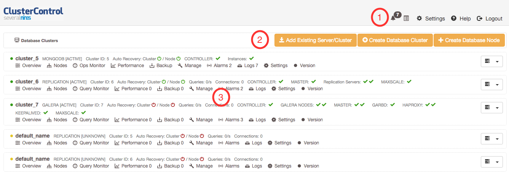

Dashboard
============

This page is the landing page once you logged in. It provides a summary of database clusters monitored under ClusterControl.

*Section 1*

ClusterControl's top menu.

* **Global Notifications**
	- Provides aggregated view of all alarms and notifications raised across all clusters monitored by ClusterControl.

* **Global Messages**
	- Global list of jobs that have been performed across clusters (e.g., deploying a new cluster, adding an existing cluster and cloning). Pick a job to see its running messages.

* **Settings**
	- See `Settings <admin_settings.html>`_ section.

* **Help**
	- Open ClusterControl online documentation page at http://www.severalnines.com/docs
	- Open Severalnines support forums at http://support.severalnines.com/forums

* **Log Out**
	- Logs out from ClusterControl and return to login page.

*Section 2*

Database server/cluster deployment functions.

* **Add Existing Server/Cluster**
	- See `Add Existing Server/Cluster`_ section.

* **Create Database Cluster**
	- See `Create Database Cluster`_ section.

* **Create Database Node**
	- See `Create Database Node`_ section.
	
*Section 3*

List of database clusters managed under ClusterControl with summarized status. Database cluster deployed by (or added into) ClusterControl will be listed in this page. See `Database Cluster List`_ section.

Add Existing Server/Cluster
----------------------------

Opens a single-page wizard to import the configuration of the existing database setup into ClusterControl. The following database cluster types are supported:

* Galera (MySQL Galera Cluster, Percona XtraDB Cluster and MariaDB Galera Cluster)
* MySQL Replication (master-slave)
* A pool of single-instance MySQL servers
* MongoDB/TokuMX replica set
* PostgreSQL single-instance

There are some prerequisites that need to be fulfilled prior to adding the existing setup. The existing database cluster/server must:

* Run with same MySQL port with same MySQL root password and MySQL base directory
* Verify that sudo is working properly if you are using a non-root user
* Passwordless SSH from ClusterControl node to database nodes has been configured correctly
* You must have a running ClusterControl controller with a minimal configuration

For more details, refer to the `Requirement <../../requirements.html>`_ section. Each time you add an existing cluster or server, ClusterControl will trigger a job under *ClusterControl > Settings > Cluster Jobs*. You can see the progress and status under this page. A window will also appear with messages showing progress.

Add Existing Galera Cluster
'''''''''''''''''''''''''''

Choose *MySQL Galera Cluster* as the database type. Fill in all required information.

* **Vendor**
	- Codership - MySQL Galera Cluster by Codership
	- Percona XtraDB - Percona XtraDB Cluster by Percona
	- MariaDB - MariaDB Galera Cluster by MariaDB

* **MySQL Version**
	- MySQL 5.5.x
	- MySQL 5.6.x

* **Need Sudo Password**
	- Specify the password if the SSH user that you specified under *SSH User* requires sudo password to run super-privileged commands.

* **Hostname**
	- Please note that you only need to specify ONE Galera node and ClusterControl will discover the rest based on wsrep_cluster_address.

* **User**
	- MySQL user on the target server/cluster. This user must able to perform GRANT statement. Recommended to use MySQL 'root' user.
	
* **Password** 
	- Password for *MySQL User*. The password must be the same on all nodes that you want to add into ClusterControl..

* **Port**
	- MySQL port on the target server/cluster. Default to 3306. ClusterControl assumes MySQL is running on the same port on all nodes.
	
* **Basedir**
	- MySQL base directory. Default is ``/usr``. ClusterControl assumes MySQL is having the same base directory on all nodes.

* **Enable information_schema Queries**
	- Use information_schema to query MySQL statistics. This is not recommended for clusters with more than 2000 tables/databases.
	
* **Enable Node AutoRecovery**
	- ClusterControl will perform automatic recovery if it detects any of the nodes in the cluster is down.
	
* **Enable Cluster AutoRecovery**
	- ClusterControl will perform automatic recovery if it detects the cluster is down or degraded.

* **SSH User**
	- Specify root if you have root credentials.
	- If you use 'sudo' to execute system commands, specify the name that you wish to use here. The user must exists on all nodes. See `Operating System User <../../requirements.html#operating-system-user>`_.
	
* **SSH Key Path**
	- Specify the full path of SSH key (the key must exist in ClusterControl node) that will be used by *SSH User* to perform passwordless SSH. See `Passwordless SSH <../../requirements.html#passwordless-ssh>`_.

* **SSH Port Number**
	- Specify the SSH port for target nodes. ClusterControl assumes SSH is running on the same port on all nodes.

* **Add Cluster**
	- Click the button to start the import. ClusterControl will connect to the Galera node, discover the configuration for the rest of the nodes and start managing/monitoring the cluster.

Add existing MySQL server/replication
''''''''''''''''''''''''''''''''''''''

ClusterControl is able to manage/monitor an existing set of MySQL servers (standalone or replication). Individual hosts specified in the same list will be added to the same server group in the UI. ClusterControl assumes that you are using the same MySQL root password for all instances specified in the group, and it will determine the server role (master, slave, multi or standalone).

Choose *MySQL Server* as the database type. Fill in all required information.

* **Need Sudo Password**
	- Specify the password if the SSH user that you specified under *SSH User* requires sudo password to run super-privileged commands. Ignore this if *SSH User* is root or have no sudo password.

* **User**
	- MySQL user on the target server/cluster. This user must able to perform GRANT statement. Recommended to use MySQL 'root' user.
	
* **Password**
	- Password for *MySQL User*. The user must have ability to perform GRANT ClusterControl assumes that you are using the same MySQL root password for all instances specified in the group.

* **Port**
	- MySQL port on the target server/cluster. Default to 3306. ClusterControl assumes MySQL is running on the same port on all nodes.

* **Basedir**
	- MySQL base directory. Default is ``/usr``. ClusterControl assumes all MySQL nodes are using the same base directory.

* **Add Host**
	- Enter the MySQL single instances' IP address or hostname that you want to group under this cluster.

* **SSH User**
	- Specify root if you have root credentials.
	- If you use 'sudo' to execute system commands, specify the name that you wish to use here. The user must exists on all nodes. See `Operating System User <../../requirements.html#operating-system-user>`_.
	
* **SSH Key Path**
	- Specify the full path of SSH key (the key must exist in ClusterControl node) that will be used by *SSH User* to perform passwordless SSH. See `Passwordless SSH <../../requirements.html#passwordless-ssh>`_.

* **SSH Port Number**
	- Specify the SSH port for target nodes. ClusterControl assumes SSH is running on the same port on all nodes.

* **Add Cluster**
	- Click the button to start the import. ClusterControl will connect to the MySQL instances, import configurations and start managing them. 

Add existing MySQL Cluster
''''''''''''''''''''''''''

Adding existing MySQL Cluster (NDB) is not supported from the ClusterControl UI. However, it is possible to add it using manually as explained in details in `this blog post <http://severalnines.com/blog/clustercontrol-tips-tricks-manage-and-monitor-your-existing-mysql-ndb-cluster>`_.

Add existing MongoDB/TokuMX replica set
'''''''''''''''''''''''''''''''''''''''

ClusterControl is able to manage and monitor an existing MongoDB or TokuMX replica set. Choose *Mongodb Replicaset* as the database type. Fill in all required information.

* **Vendor**
	- 10gen - MongoDB Server from MongoDB Inc. (formerly 10gen)
	
* **Need Sudo Password**
	- Specify the password if the SSH user that you specified under *SSH User* requires sudo password to run super-privileged commands. Ignore this if *SSH User* is root or have no sudo password.

* **Hostname**
	- Specify one IP address or hostname of the MongoDB replica set member. ClusterControl will automatically discover the rest of the replica set members. 

* **User**
	- MongoDB admin user. If you don't specify *Password*, ClusterControl assumes you do not use MongoDB authentication.

* **Password**
	- Specify admin password if the replica set is configured with ``--auth`` enabled.

* **Port**
	- MongoDB port on the target cluster. Default to 27017. ClusterControl assumes MongoDB is running on the same port on all nodes.

* **SSH User**
	- Specify root if you have root credentials.
	- If you use 'sudo' to execute system commands, specify the name that you wish to use here. The user must exists on all nodes. See `Operating System User <../../requirements.html#operating-system-user>`_.
	
* **SSH Key Path**
	- Specify the full path of SSH key (the key must exist in ClusterControl node) that will be used by *SSH User* to perform passwordless SSH. See `Passwordless SSH <../../requirements.html#passwordless-ssh>`_.

* **SSH Port Number**
	- Specify the SSH port for target nodes. ClusterControl assumes SSH is running on the same port on all nodes.

* **Add Cluster**
	- Click the button to start the import. ClusterControl will connect to the MongoDB node, discover the configuration for the rest of the nodes and start managing/monitoring the cluster.

Add existing PostgreSQL servers
'''''''''''''''''''''''''''''''

ClusterControl is able to manage/monitor an existing set of PostgreSQL 9.x servers (standalone). Individual hosts specified in the same list will be added to the same server group in the UI. ClusterControl assumes that you are using the same postgres password for all instances specified in the group.

Choose Postgres Server as the database type. Fill in all required information.

* **Need Sudo Password**
	- Specify the password if the SSH user that you specified under *SSH User* requires sudo password to run super-privileged commands. Ignore this if *SSH User* is root or have no sudo password.

* **User**
	- PostgreSQL user on the target server/cluster. Recommended to use PostgreSQL 'postgres' user.

* **Password**
	- Password for *Postgres User*. ClusterControl assumes that you are using the same postgres password for all instances specified in the group.

* **Port**
	- PostgreSQL port on the target server/cluster. Default to 5432. ClusterControl assumes PostgreSQL is running on the same port on all nodes.

* **Basedir**
	- PostgreSQL base directory. Default is ``/usr``. ClusterControl assumes all PostgreSQL nodes are using the same base directory.

* **Add Host**
	- Specify all MySQL single instances that you want to group under this cluster.

* **SSH User**
	- Specify root if you have root credentials.
	- If you use 'sudo' to execute system commands, specify the name that you wish to use here. The user must exists on all nodes. See `Operating System User <../../requirements.html#operating-system-user>`_.
	
* **SSH Key Path**
	- Specify the full path of SSH key (the key must exist in ClusterControl node) that will be used by *SSH User* to perform passwordless SSH. See `Passwordless SSH <../../requirements.html#passwordless-ssh>`_.

* **SSH Port Number**
	- Specify the SSH port for target nodes. ClusterControl assumes SSH is running on the same port on all nodes.

* **Add Cluster**
	- Click the button to start the import. ClusterControl will connect to the PostgreSQL instances, import configurations and start managing them. 

Create Database Cluster
------------------------

Deploys a new Galera Cluster in the same local environment. The database cluster will be automatically added into ClusterControl once deployed.

MySQL Galera
............

* **Vendor**
	- Percona XtraDB - Percona XtraDB Cluster by Percona
	- MariaDB - MariaDB Galera Cluster by MariaDB
	- Codership - MySQL Galera Cluster by Codership

* **Version**
	- Select the MySQL version. For Codership and Percona, 5.5 and 5.6 are available. If you choose MariaDB, 5.5, 10.0 and 10.1 will be available.

* **Server Port**
	- MySQL port for all nodes. Default is 3306.

* **Server Data Directory**
	- Location of MySQL data directory. Default is ``/var/lib/mysql``.

* **# of DB nodes**
	- Specify the number of MySQL instances to deploy. A minimum of three servers is required to handle split brain/network partitioning.
	- You can also deploy a server for the cluster using *Create Database Node > MySQL Galera* and scale out using `Add Node`_ at later stage.

* **my.cnf Template**
	- MySQL configuration template file under ``/usr/share/cmon/templates``. The default is my.cnf.galera which should be exist by default. 
	
* **Root Password**
	- Specify MySQL root password. ClusterControl will configure the same MySQL root password for all instances in the cluster.

* **DB Nodes: Enter FQDN or IP address**
	- The input boxes depend on the value of *# of DB nodes*. Specify the IP address or hostname of the database nodes. ClusterControl will deploy the Galera

* **SSH User**
	- Specify root if you have root credentials.
	- If you use 'sudo' to execute system commands, specify the name that you wish to use here. The user must exists on all nodes. See `Operating System User <../../requirements.html#operating-system-user>`_.
	
* **SSH Key Path**
	- Specify the full path of SSH key (the key must exist in ClusterControl node) that will be used by *SSH User* to perform passwordless SSH. See `Passwordless SSH <../../requirements.html#passwordless-ssh>`_.

* **SSH Port Number**
	- Specify the SSH port for target nodes. ClusterControl assumes SSH is running on the same port on all nodes.

* **Need Sudo Password**
	- If you use sudo with password, click the link to input sudo password. Ignore this if *SSH User* is root or have no sudo password.

* **Disable Firewall**
	- Check the box to disable firewall (recommended).

* **Disable AppArmor/SELinux**
	- Check the box to let ClusterControl disable AppArmor (Ubuntu) or SELinux (Redhat/CentOS) if enabled (recommended).
	
* **Repository**
	- Default Repository - Provision software by setting up and using the database vendor's preferred software repository. ClusterControl will always install the latest version of what is provided by database vendor repository.
	- Internal Repostory - Provision software by using the pre-existing software repository already setup on the nodes. User has to set up the software repository manually on each database node and ClusterControl will use this repository for deployment. This is good if the database nodes are running without internet connections.
	- Local Mirrored Repository - Create and mirror the current database vendor's repository and then deploy using the local mirrored repository. This is a preferred option when you have to scale the Galera Cluster in the future, to ensure the newly provisioned node will always have the same version as the rest of the members.

* **Uninstall Existing MySQL Packages**
	- ClusterControl expects the target hosts use clean and minimal OS. Existing MySQL dependencies will be removed.
	
* **Deploy**
	- Starts the deployment.

Create Database Node
--------------------

This page provides ability to create a new single node of following databases in your environment:

* MySQL Replication Master
* MySQL Galera
* MongoDB ReplicaSet Node
* PostgreSQL

Once a single node is deployed, it can then be managed from the ClusterControl interface. Single nodes can be scaled into clusters with a single click of a button. You can scale MySQL replication with read-copy slaves, Percona XtraDB and MariaDB Galera are turned into Galera Clusters, MongoDB into a replica set and PostgreSQL into a master-slave replication at later stage via `Add Node <user-guide/mysql/overview.html#add-node>`_.

MySQL Replication Master
''''''''''''''''''''''''

Deploy entire master-slave MySQL replication setup from ClusterControl. One would start by creating a master under this tab.

================================== ===========
Field                              Description
================================== ===========
Vendor                             Supported vendor is Percona XtraDB Server
Version                            Choose the MySQL version that you want to install. 5.6.x is recommended with GTID support
Template                           MySQL configuration template under ``/usr/share/cmon/templates``. Leave it blank if you want ClusterControl to generate the configuration file automatically.
Hostname                           The IP address or hostname of the target node. Ensure you can perform passwordless SSH to the node using the specified SSH User, SSH Port Number and SSH Key Path
Port                               MySQL port
Data Directory                     Location of MySQL data directory
Password                           MySQL root password
SSH User                           SSH user that ClusterControl will use to remotely access the target node
SSH Key Path                       Specify the full path of SSH key (the key must exist in ClusterControl node) that will be used by *SSH User* to perform passwordless SSH. See `Passwordless SSH <../../requirements.html#passwordless-ssh>`_.
SSH Port Number                    SSH port of target node
Need Sudo Password                 Click on the link and specify the sudo password for the SSH user if applicable
Disable Firewall                   Yes - Firewall will be disabled, No - Firewall will not be disabled
Disable AppArmor/SElinux           Check to disable AppArmor (Ubuntu) or SElinux (Redhat or CentOS)
Uninstall Existing MySQL Packages  All existing MySQL related package will be removed before ClusterControl performs the new installation on the target node
Enable Semi-sync Replication       Check the box to let ClusterControl configure this node with semi-sync replication plugin
Repository                         Default Repository - Provision software by setting up and using the database vendor's preferred software repository. ClusterControl will always install the latest version of what is provided by database vendor repository. Internal Repostory - Provision software by using the pre-existing software repository already setup on the nodes. User has to set up the software repository manually on each database node and ClusterControl will use this repository for deployment. This is good if the database nodes are running without internet connections. Local Mirrored Repository - Create and mirror the current database vendor's repository and then deploy using the local mirrored repository. This is a preferred option when you have to scale the Galera Cluster in the future, to ensure the newly provisioned node will always have the same version as the rest of the members.
Deploy                             Start the database deployment
================================== ===========

Then, you can add a replication slave to the setup via `Add Node <user-guide/mysql/overview.html#add-node>`_. 

.. Note:: Add node is not supported for MySQL 5.7 since Percona Xtrabackup does not support it yet.

MySQL Galera
'''''''''''''

Deploy a single Galera node. You can then use `Add Node`_ to scale out the cluster into three or more nodes. You can also use `Create Database Cluster`_ to deploy all nodes at once.

================================= ===========
Field                             Description
================================= ===========
Vendor                            Supported vendors are Codership, Percona XtraDB and MariaDB Galera
Version                           Choose the MySQL version that you want to install
Data Center                       Segment ID. Database node that have the same number are on the same “data center”.
my.cnf Template                   MySQL configuration template under ``/usr/share/cmon/templates``
Hostname                          The IP address or hostname of the target node. Ensure you can perform passwordless SSH to the node using the specified SSH User, SSH Port Number and SSH Key Path
Port                              MySQL port of target node
Data Directory                    Location of MySQL data directory
Password                          MySQL root password
SSH User                          SSH user that ClusterControl will use to remotely access the target node
SSH Key Path                      Specify the full path of SSH key (the key must exist in ClusterControl node) that will be used by *SSH User* to perform passwordless SSH. See `Passwordless SSH <../../requirements.html#passwordless-ssh>`_.
SSH Port Number                   SSH port of target node
Need Sudo Password                Click on the link and specify the sudo password for the SSH user if applicable
Disable Firewall                  Yes - Firewall will be disabled, No - Firewall will not be disabled
Disable AppArmor/SElinux          Check to disable AppArmor (Ubuntu) or SElinux (Redhat or CentOS)
Uninstall Existing MySQL Packages All existing MySQL related package will be removed before ClusterControl performs the new installation on the target node
Repository                        Default Repository - Provision software by setting up and using the database vendor's preferred software repository. ClusterControl will always install the latest version of what is provided by database vendor repository. Internal Repostory - Provision software by using the pre-existing software repository already setup on the nodes. User has to set up the software repository manually on each database node and ClusterControl will use this repository for deployment. This is good if the database nodes are running without internet connections. Local Mirrored Repository - Create and mirror the current database vendor's repository and then deploy using the local mirrored repository. This is a preferred option when you have to scale the Galera Cluster in the future, to ensure the newly provisioned node will always have the same version as the rest of the members.
Deploy                            Start the database deployment
================================= ===========

Then, you can add another Galera node to the setup via `Add Node <user-guide/mysql/overview.html#add-node>`_.

MongoDB Replica Set Node
'''''''''''''''''''''''''

Deploy a MongoDB replica set setup from ClusterControl. One would start by creating a MongoDB node (with replSet configured) under this tab. The deployment will use MongoDB packages from MongoDB Inc (formerly known as 10gen). Only version 2.x is supported at the moment.

=================================== ===========
Field                               Description
=================================== ===========
Hostname                            The IP address or hostname of the target node. Ensure you can perform passwordless SSH to the need using the specified SSH User, SSH Port Number and SSH Key Path.
Port                                MongoDB port.
User                                MongoDB user.
Password                            MongoDB admin password.
RS Name                             The replica set name.
Data Directory                      Location of MongoDB data directory.
mongodb.conf Template               MongoDB configuration template under ``/usr/share/cmon/templates``. Default is mongodb.conf.org.
Need Sudo Password                  Click on the link and specify the sudo password for the SSH user if applicable.
SSH User                            SSH user that ClusterControl will use to remotely access the target node.
SSH Key Path                        Specify the full path of SSH key (the key must exist in ClusterControl node) that will be used by *SSH User* to perform passwordless SSH. See `Passwordless SSH <../../requirements.html#passwordless-ssh>`_.
SSH Port Number                     SSH port of target node.
Disable Firewall                    Yes - Firewall will be disabled, No - Firewall will not be disabled.
Disable AppArmor/SElinux            Check to disable AppArmor (Ubuntu) or SElinux (Redhat or CentOS).
Uninstall Existing MongoDB Packages All existing MongoDB related package will be removed before ClusterControl performs the new installation on the target node.
Repository                          Default Repository - Provision software by setting up and using the database vendor's preferred software repository. ClusterControl will always install the latest version of what is provided by database vendor repository. Internal Repostory - Provision software by using the pre-existing software repository already setup on the nodes. User has to set up the software repository manually on each database node and ClusterControl will use this repository for deployment. This is good if the database nodes are running without internet connections. Local Mirrored Repository - Create and mirror the current database vendor's repository and then deploy using the local mirrored repository. This is a preferred option when you have to scale the Galera Cluster in the future, to ensure the newly provisioned node will always have the same version as the rest of the members.
Deploy                              Start the database deployment.
=================================== ===========

Then, you can add a MongoDB replica node to the setup via `Add Node <user-guide/mysql/overview.html#add-node>`_.

PostgreSQL
''''''''''

Deploy a new PostgreSQL standalone or replication cluster from ClusterControl. One would start by creating a PostgreSQL master node under this tab. Only PostgreSQL 9.x is supported in this version.

====================================== ===========
Field                                  Description
====================================== ===========
Hostname                               The IP address or hostname of the target node. Ensure you can perform passwordless SSH to the need using the specified SSH User, SSH Port Number and SSH Key Path.
User                                   PostgreSQL user. ClusterControl will create this user automatically.
Password                               PostgreSQL admin password.
SSH User                               SSH user that ClusterControl will use to remotely access the target node.
SSH Key Path                           Specify the full path of SSH key (the key must exist in ClusterControl node) that will be used by *SSH User* to perform passwordless SSH. See `Passwordless SSH <../../requirements.html#passwordless-ssh>`_.
Need Sudo Password                     Click on the link and specify the sudo password for the SSH user if applicable.
Uninstall Existing PostgreSQL Packages All existing PostgreSQL related package will be removed before ClusterControl performs the new installation on the target node.
Repository                             Default Repository - Provision software by setting up and using the database vendor's preferred software repository. ClusterControl will always install the latest version of what is provided by database vendor repository. Internal Repostory - Provision software by using the pre-existing software repository already setup on the nodes. User has to set up the software repository manually on each database node and ClusterControl will use this repository for deployment. This is good if the database nodes are running without internet connections. Local Mirrored Repository - Create and mirror the current database vendor's repository and then deploy using the local mirrored repository. This is a preferred option when you have to scale the Galera Cluster in the future, to ensure the newly provisioned node will always have the same version as the rest of the members.
Deploy                                 Start the database deployment.
====================================== ===========

Then, you can add a replication slave to the setup via `Add Node <user-guide/mysql/overview.html#add-node>`_.

Database Cluster List
---------------------

Each row represents the summarized status of a database cluster:

+----------------------+---------------------------------------------------------------------------------------------------------------------+
| Field                | Description                                                                                                         |
+======================+=====================================================================================================================+
| Cluster Name         | The cluster name, configured under *ClusterControl > Settings > General Settings > Cluster Settings > Cluster Name* |
+----------------------+---------------------------------------------------------------------------------------------------------------------+
| Database Vendor      | Database vendor                                                                                                     |
+----------------------+---------------------------------------------------------------------------------------------------------------------+
| Cluster Type         | The database cluster type:                                                                                          |
|                      |                                                                                                                     |
|                      | * MYSQL_SERVER - Standalone MySQL server and MySQL replication                                                      |
|                      | * GALERA - MySQL Galera Cluster, Percona XtraDB Cluster, MariaDB Galera Cluster                                     |
|                      | * MYSQL_CLUSTER - MySQL Cluster                                                                                     |
|                      | * MONGODB - MongoDB/TokuMX replica Set, MongoDB/TokuMX Sharded Cluster, MongoDB/TokuMX Replicated Sharded Cluster   |
|                      | * POSTGRESQL - Standalone or Replicated PostgreSQL server                                                           |
+----------------------+---------------------------------------------------------------------------------------------------------------------+
| Cluster Status       | The cluster status:                                                                                                 |
|                      |                                                                                                                     |
|                      | * ACTIVE - The cluster is up and running. All cluster nodes are running normally.                                   |
|                      | * DEGRADED - The full set of nodes in a cluster is not available. One or more nodes is down or unreachable.         |
|                      | * FAILURE - The cluster is down. Probably that all or most of the nodes are down or unreachable, resulting the      |
|                      |   cluster fails to operate as expected.                                                                             |
+----------------------+---------------------------------------------------------------------------------------------------------------------+
| Cluster ID           | The cluster identifier number                                                                                       |
+----------------------+---------------------------------------------------------------------------------------------------------------------+
| Auto Recovery        | The auto recovery status of Galera Cluster:                                                                         |
|                      |                                                                                                                     |
|                      | * Cluster - If sets to ON, ClusterControl will perform automatic recovery if it detects cluster failure.            |
|                      | * Node - If sets to ON, ClusterContorl will perform automatic recovery if it detects node failure.                  |
+----------------------+---------------------------------------------------------------------------------------------------------------------+
| Queries              | Database throughput (query per second) across all nodes in the cluster.                                             |
+----------------------+---------------------------------------------------------------------------------------------------------------------+
| Connections          | The aggregated number of database connections across all nodes in the cluster.                                      |
+----------------------+---------------------------------------------------------------------------------------------------------------------+
| Node Type and Status | See table on node status indicators further below.                                                                  |
+----------------------+---------------------------------------------------------------------------------------------------------------------+

Node status indicator:

==================== ============
Indicator            Description
==================== ============
Green (tick)         OK: Indicates the node is working fine.
Yellow (exclamation) WARNING: Indicates the node is degraded and not fully performing as expected.
Red (cross)          PROBLEMATIC: Indicates the node is down or unreachable.
==================== ============
