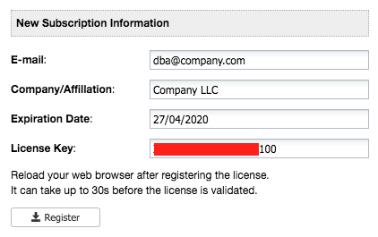

.. _Dashboard:

Dashboard
=========

This page is the landing page once you are logged in. It provides a summary of database clusters monitored by ClusterControl.

.. image:: img/cc_cluster_list_160.png
   :align: center

**Top Menu**

ClusterControl's top menu.

* **Activity**
	- Aggregated view of events happened across the clusters. See `Activity`_.
	
* **Deploy**
	- Opens the *Deploy/Import Cluster* modal dialog. See :ref:`Deploy Database Cluster`.

* **Import**
	- Opens the *Import Cluster* modal dialog. See :ref:`Import Existing Server Cluster`.

* **Global Settings**
	- ClusterControl global settings. See :ref:`Global Settings`.

* **Logout**
	- Logs out from ClusterControl and return to the login page.
	
**Sidebar**

Left-side navigation provides quick access to ClusterControl administration menu. See :ref:`Sidebar`.
	
**Cluster List**

List of database clusters managed by ClusterControl with summarized status. Database cluster deployed by (or imported into) ClusterControl will be listed in this page. See `Database Cluster List`_.

**Cluster Actions**

Provides shortcuts to main cluster functionality. Every supported database cluster has its own set of menu:
	- :ref:`MySQL's Cluster Actions <MySQL - Overview - Actions>`
	- :ref:`MongoDB's Cluster Actions <MongoDB - Overview - Actions>`
	- :ref:`PostgreSQL's Cluster Actions <PostgreSQL - Overview - Actions>`

Activity
--------

Clicking on it will expand the activity tab which consists of `Alarms`_, `Jobs`_ and `Logs`_. Click once more to collapse the content. If you rolled over the menu icon, you would see a counter summary for every component.

Alarms
++++++

Shows aggregated view of alarms raised for all clusters monitored by ClusterControl. Each alarm entry has a header, details on the issue, severity level, category, corresponding cluster name, corresponding host and timestamp. All the alarms listed here are also accessible directly under individual cluster main menu available at *Alarms > Alarms*.

Click on the alarm entry itself to see the full details and recommendation. Furthermore, you can click on the "Full Alarm Details" to see the full information, recommendation and to send out this alarm as an email to the recipients configured under *Settings > CMON Settings > Email Notification Settings*. Click "Ignore Alarm" to silent the respective alarm from appearing in the list again.

Jobs
++++++

Shows aggregated view of jobs that have been initiated and performed by ClusterControl across clusters (e.g., deploying a new cluster, adding an existing cluster, cloning, creating backup, etc). Each job entry has a job status, a cluster name, which user started the job and also timestamp. All the jobs listed here are also accessible directly under individual cluster main menu available at *Logs > Jobs*.

Click on the job entry itself to see its most recent job messages. Furthermore, you can click on the *Full Job Details* to see the full job specification and messages. Under the *Full Job Details* popup, you have the ability to see the full command sent to the controller service for that particular job by clicking on *Expand Job Specs* button. Underneath it is the full job messages in descending order (newer first) returned by the controller service. *Copy to clipboard* button will copy the content of the job messages to the clipboard.

.. Note:: Starting from v1.6, ClusterControl has a better support for parallelism, where you can perform multiple deployments simultaneously. 

The job status:

+------------+--------------------------------------+
| Job status | Description                          |
+============+======================================+
| FINISHED   | The job is successfully executed.    |
+------------+--------------------------------------+
| FAILED     | The job is executed but failed.      |
+------------+--------------------------------------+
| RUNNING    | The job is started and in progress.  |
+------------+--------------------------------------+
| ABORTED    | The job is started but terminated.   |
+------------+--------------------------------------+
| DEFINED    | The job is defined but yet to start. |
+------------+--------------------------------------+

Logs
++++++

Shows aggregated view of ClusterControl logs which require user's attention across clusters (logs with severity WARNING and ERROR). Each log entry has a message subject, severity level, component, the corresponding cluster name and also timestamp. All the logs listed here are also accessible directly under individual cluster at *Logs > CMON Logs*.

.. _Global Settings:

Global Settings
---------------

Provides interface to register clusters, repositories and subscriptions inside ClusterControl.

Repositories
+++++++++++++

Manages provider's repository for database servers and clusters. You can have three types of repository when deploying database server/cluster using ClusterControl:

1. Use Vendor Repositories
	- Provision software by setting up and using the database vendor's preferred software repository. ClusterControl will always install the latest version of what is provided by database vendor repository.
2. Do Not Setup Vendor Repositories
	- Provision software by using the pre-existing software repository already setup on the nodes. User has to set up the software repository manually on each database node and ClusterControl will use this repository for deployment. This is good if the database nodes are running without internet connections.
3. Use Mirrored Repositories (Create new repository)
	- Create and mirror the current database vendor's repository and then deploy using the local mirrored repository.
	- This allows you to "freeze" the current versions of the software packages used to provision a database cluster for a specific vendor and you can later use that mirrored repository to provision the same set of versions when adding more nodes or deploying other clusters.
	- ClusterControl sets up the mirrored repository under ``{wwwroot}/cmon-repos/``, which is accessible via HTTP at :samp:`http://{ClusterControl_host}/cmon-repos/`.

Only Local Mirrored Repository will be listed and manageable here. 

* **Remove Repositories**
	- Remove the selected repository.

* **Filter by cluster type**
	- Filter the repository list by cluster type.

For reference purpose, following is an example of yum definition if *Local Mirrored Repository* is configured on the database nodes:

.. code-block:: bash

	$ cat /etc/yum.repos.d/clustercontrol-percona-5.6-yum-el7.repo
	[percona-5.6-yum-el7]
	name = percona-5.6-yum-el7
	baseurl = http://10.0.0.10/cmon-repos/percona-5.6-yum-el7
	enabled = 1
	gpgcheck = 0
	gpgkey = http://10.0.0.10/cmon-repos/percona-5.6-yum-el7/localrepo-gpg-pubkey.asc


.. _Cluster Registrations:

Cluster Registrations
++++++++++++++++++++++

From a ClusterControl UI instance, this enables the user to register a database cluster managed by ClusterControl. For each cluster, you need to provide a ClusterControl API URL and token. This effectively establishes the communication between the UI and the controller. The ClusterControl UI can connect to multiple CMON Controller servers (via the CMON REST API) and provide a centralized view of all databases. Users need to register the CMONAPI token and URL for each cluster. 

.. Note:: The CMONAPI token is critical and hidden under asterisk values. This token provides authentication access for ClusterControl UI to communicate with the CMON backend services directly. Please keep this token in a safe place.

You can retrieve the CMONAPI token manually at ``{wwwroot}/cmonapi/config/bootstrap.php`` on line containing ``CMON_TOKEN`` value, where ``{wwwroot}`` is location of Apache document root.

.. _Subscriptions:

Subscriptions
++++++++++++++

For users with a valid subscription (Standalone, Pro, Advanced, Enterprise), enter your license information here to unlock additional features based on the subscription. 

Following screenshot shows example on filing up the license information:



.. Attention:: Make sure to copy the subscription information as they are, with no leading/trailing spaces.

The license key is validated during runtime. Reload your web browser after registering a new license.

.. Note:: When the license expires, ClusterControl defaults back to the Community Edition. For features comparison, please refer to `ClusterControl product page <http://www.severalnines.com/pricing>`_.

.. _Configure Mail Server:

Configure Mail Server
+++++++++++++++++++++

Configures how email notifications should be sent out. ClusterControl supports two options for sending email notifications, either using local mail commands via local MTA (Sendmail/Postfix/Exim) or using an external SMTP server. Make sure the local MTA is installed and verified using *Test Email* button.

Use SMTP Server (Recommended)
``````````````````````````````

* **SMTP**
	- SMTP mail server address that you are going to use to send email.

* **SMTP Port**
	- SMTP port for mail server. Usually this value is 25 or 587, depending on your SMTP mail server configuration.

* **SMTP sUsername**
	- SMTP user name. Leave empty if no authentication required.

* **SMTP Password**
	- SMTP password. Leave empty if no authentication required.

* **Reply-to/From**
	- Specify the sender of the email. This will appear in the 'From' field of mail header.

* **SMTP TLS/SSL required**
	- Check this box if you want to use TLS/SSL for extra security. The mail server must support TLS/SSL.

* **Send Test Email**
	- Test the mail settings. If successful, an email will be sent to all users in the *Email Notification Settings*. Do not forget to add a recipient before pressing this button.
	
Use Sendmail
````````````

* **Use sendmail**
	- Use this option to use sendmail to send notifications. See `Installing Sendmail`_ if you haven't installed Sendmail. If you want to use Postfix, see `Using Postfix`_.

* **Reply-to/From**
	- Specify the sender of the email. This will appear in the 'From' field of mail header.

Installing Sendmail
'''''''''''''''''''

On ClusterControl server, install the following packages:

.. code-block:: bash

	$ apt-get install sendmail mailutils #Debian/Ubuntu
	$ yum install sendmail mailx #RHEL/CentOS

Start the sendmail service:

.. code-block:: bash

	$ systemctl start sendmail #systemd
	$ service sendmail start #sysvinit

Verify if it works:

.. code-block:: bash

	$ echo "test message" | mail -s "test subject" myemail@example.com

Replace myemail@example.com with your email address.

Using Postfix
'''''''''''''

Many of Linux distributions come with Sendmail as default MTA. To replace Sendmail and use other MTA, e.g Postfix, you just need to uninstall Sendmail, install Postfix and start the service. Following example shows commands that need to be executed on ClusterControl node as root user for RHEL:

.. code-block:: bash

	$ service sendmail stop 
	$ yum remove sendmail -y 
	$ yum install postfix mailx cronie -y 
	$ chkconfig postfix on 
	$ service postfix start

.. _Runtime Configurations:

Runtime Configurations
+++++++++++++++++++++++

A shortcut to ClusterControl Controller runtime configurations per cluster. Runtime configuration shows the active ClusterControl Controller (CMON) runtime configuration parameters and displays the versions of ClusterControl Controller and ClusterControl UI packages. All parameters listed are loaded directly from ``cmon.cmon_configuration`` table, grouped by cluster ID.

Clicking on any of the list will redirect user to the *Runtime Configurations* page for that particular cluster.

Database Cluster List
---------------------

Each row represents the summarized status of a database cluster:

+----------------------+---------------------------------------------------------------------------------------------------------------------+
| Field                | Description                                                                                                         |
+======================+=====================================================================================================================+
| Cluster Name         | The cluster name, configured under *ClusterControl > Settings > General Settings > Cluster Settings > Cluster Name* |
+----------------------+---------------------------------------------------------------------------------------------------------------------+
| ID                   | The cluster identifier number                                                                                       |
+----------------------+---------------------------------------------------------------------------------------------------------------------+
| Version              | Database server major version                                                                                       |
+----------------------+---------------------------------------------------------------------------------------------------------------------+
| Database Vendor      | Database vendor icon                                                                                                |
+----------------------+---------------------------------------------------------------------------------------------------------------------+
| Cluster Type         | The database cluster type:                                                                                          |
|                      |                                                                                                                     |
|                      | * MYSQL_SERVER - Standalone MySQL server                                                                            |
|                      | * REPLICATION - MySQL Replication                                                                                   |
|                      | * GALERA - MySQL Galera Cluster, Percona XtraDB Cluster, MariaDB Galera Cluster                                     |
|                      | * GROUP REPLICATION - MySQL Group Replication                                                                       |
|                      | * MYSQL CLUSTER - MySQL Cluster (NDB)                                                                               |
|                      | * MONGODB - MongoDB ReplicaSet, MongoDB Sharded Cluster, MongoDB Replicated Sharded Cluster                         |
|                      | * POSTGRESQL - PostgreSQL Standalone or Replication                                                                 |
+----------------------+---------------------------------------------------------------------------------------------------------------------+
| Cluster Status       | The cluster status:                                                                                                 |
|                      |                                                                                                                     |
|                      | * ACTIVE - The cluster is up and running. All cluster nodes are running normally.                                   |
|                      | * DEGRADED - The full set of nodes in a cluster is not available. One or more nodes is down or unreachable.         |
|                      | * FAILURE - The cluster is down. Probably that all or most of the nodes are down or unreachable, resulting the      |
|                      |   cluster fails to operate as expected.                                                                             |
+----------------------+---------------------------------------------------------------------------------------------------------------------+
| Auto Recovery        | The auto recovery status of Galera Cluster:                                                                         |
|                      |                                                                                                                     |
|                      | * Cluster - If sets to ON, ClusterControl will perform automatic recovery if it detects cluster failure.            |
|                      | * Node - If sets to ON, ClusterControl will perform automatic recovery if it detects node failure.                  |
+----------------------+---------------------------------------------------------------------------------------------------------------------+
| Node Type and Status | See table on node status indicators further down.                                                                   |
+----------------------+---------------------------------------------------------------------------------------------------------------------+

Node status indicator:

==================== ============
Indicator            Description
==================== ============
Green (tick)         OK: Indicates the node is working fine.
Yellow (exclamation) WARNING: Indicates the node is degraded and not fully performing as expected.
Red (wrench)         MAINTENANCE: Indicates that maintenance mode is on for this node.
Dark red (cross)     PROBLEMATIC: Indicates the node is down or unreachable.
==================== ============
