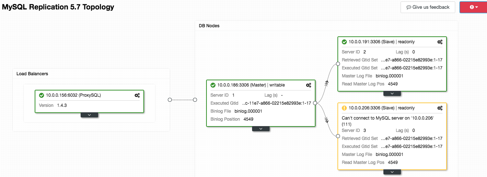

.. _mysql-topology:

Topology
---------

.. Note:: This feature is introduced in version 1.5.1.

Overview of MySQL-based clusters topology including load balancers deployed by or imported into ClusterControl. All nodes are grouped together under two major categories - Load Balancers and DB Nodes. Within the DB Nodes area, the arrow represents the replication flow from one node to another.

This page also provides shortcuts to related functionalities with drag and drop gesture. You can use drag and drop to perform supported node actions, for example drag a replication slave on top of a master node which will prompt you to either rebuild the slave or change the replication master. The gear icon (top right of the box) will list out the node's menu similar to `Node Actions <nodes.html#node-actions>`_ and `Cluster-Specific Node Actions <nodes.html#cluster-specific-node-actions>`_. If there is alarm raised for this cluster, it will be listed on the top right of the Topology board (with exclamation mark icon).

The box which represents the host under this cluster can be expanded for more detailed information related to the node's role. 

.. Attention:: This feature is still in beta. Please use the 'Give us feedback' button to send use feedback, comments, suggestions and issues related to this functionality.