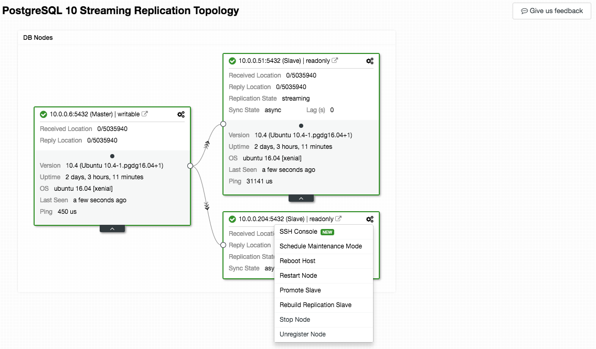

.. _TimeScaleDB - Topology:

Topology
---------

.. Note:: This feature is introduced in version 1.5.1.

Shows all the different nodes that form part of your database cluster (whether database nodes, load balancers or arbitrators), as well as the connections between them. All nodes are grouped together under two major categories - Load Balancers and DB Nodes. Within the DB Nodes area, the arrow represents the replication flow from one node to another.

The nodes, connections, and their statuses are discovered by ClusterControl. Since ClusterControl is continuously monitoring the nodes and keeps state information, any changes in the topology are reflected in the web interface. If a node is failed, it would be shown as offline.

From the topology view, you can manage the nodes, change masters by dragging and dropping the object on the desired master, restart nodes and synchronize data. For example, you can drag a replication slave on top of a master node which will prompt you to either rebuild the slave or change the replication master. The gear icon (top right of the box) will list out the node's menu similar to :ref:`TimeScaleDB - Nodes - Nodes Actions`. If there was an alarm raised for this cluster, it would be listed on the top right of the Topology board (with exclamation mark icon).

The box which represents the host under this cluster can be expanded for detailed information related to the node's role. 

We have covered this feature in details in `Visualizing your Cluster Topology in ClusterControl <https://severalnines.com/blog/visualizing-your-cluster-topology-clustercontrol>`_.